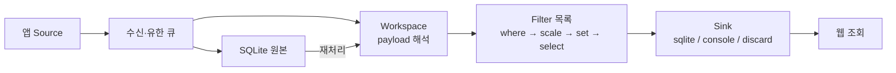

# DSN

앱 Source가 보내는 다양한 payload를 **Source → Filter → Sink**로 처리하는 C#/.NET 10 프로그램이다. 로컬 PC에서 수집·원본 보존·Workspace 해석·조건 처리·SQLite 저장·웹 조회·재처리까지 실행한다. C++·Python Source SDK와 C# Workspace/Filter 계약을 제공한다. 검증은 앱 Source 기준이며 드라이버 연동은 담당자 영역이다.

## 릴리즈로 실행

[GitHub Releases](https://github.com/south-hive/project-dsn/releases)의 portable ZIP은 Host·웹 UI·Mock·SQLite native 파일·앱 예제·Python/C# SDK를 포함한다. ASP.NET Core Runtime 10 또는 .NET SDK 10을 설치한 뒤 압축을 풀고 `dotnet host/Dsn.Host.dll settings.pipeline.json`으로 실행한다. 런타임은 포함하지 않으며 Termux 외 OS 실행 검증은 아직 하지 않았다. 상세 실행·제약은 릴리즈 노트를 따른다.

## 개발 환경 / 오프라인 빌드

Make 명령은 `.dev`의 Python venv와 전용 NuGet 캐시를 사용한다. SDK는 `global.json`의 **10.0.1xx 계열**로 제한하고(OS별 patch 차이는 허용), 프로젝트별 NuGet lock을 유지한다. `make env`, `make doctor`, `make build`, `make check`로 준비·확인·빌드·검증한다. SDK는 `make -f make/sdk.mk sdk-pack`, 배포는 `make -f make/deploy.mk deploy`로 나눠 실행할 수도 있다. 기존 루트 명령도 유지한다.

인터넷 가능한 PC에서 `make offline-pack`으로 의존 패키지 ZIP을 준비하고, 망 분리 PC의 저장소 루트에 풀어 `make build OFFLINE=1`로 빌드한다. 빈 캐시 검증은 `make offline-check DSN_BUILD_JOBS=1`이다. SDK와 기본 개발 도구는 별도 설치가 필요하며 패키지 ZIP은 Git에 포함하지 않는다. [구성과 전체 명령](docs/development-environment.md).

## 자동 데이터로 End-to-End 확인

`make demo DSN_BUILD_JOBS=1`이면 Host와 DUT별 합성 앱 Source가 함께 실행된다. 출력되는 `/demo` 주소에서 정상 → 지연 증가 → 오류 → 회복 추세를 자동으로 볼 수 있다. 기본 4 DUT가 약 2분간 데이터를 생성하고, 이후 웹은 Ctrl+C까지 유지된다. `make demo-check DSN_BUILD_JOBS=1`은 수집·Workspace·Filter·SQLite·HTTP·재시작까지 자동 검증한다. [데모 설정과 상세 설명](samples/e2e/README.md). 현재 소스에 추가된 기능이며 v0.1.0 ZIP에는 포함되지 않는다.

## 로컬 실행

```sh
# Termux 환경 준비
pkg install dotnet-sdk-10.0 make libsqlite
make check DSN_BUILD_JOBS=1
# 터미널 1: 필터 예제와 웹 Presenter
make pipeline-host DSN_BUILD_JOBS=1
# 터미널 2: telemetry-app / test-app / orchestrator 합성 Source
make bench-sources
```

브라우저에서 `http://127.0.0.1:7071/` → 연결 → bench → 처음 조회를 선택한다. 화면에 현재 처리 경로가 표시된다. [로컬 파이프라인 설정과 규칙](samples/pipeline/README.md), [여러 앱 Source 예제](samples/bench/README.md).



Source의 `workspace`가 처리 경로를 선택한다. 설정이 없으면 기존처럼 Workspace 결과를 저장한다. 다음 설정처럼 순서를 연결할 수 있다.

```json
{"pipelines":{"bench":{"filters":[
  {"type":"scale","options":{"field":"value_latency_us","output":"latency_ms","factor":0.001}},
  {"type":"where","options":{"field":"latency_ms","op":"gte","value":0.09}}
],"sinks":["sqlite"]}}}
```

Source publish 성공은 로컬 큐 접수이며 서버 저장 ACK가 아니다. 필터로 제외한 기록도 `retainRaw=true`이면 원본이 남는다. 재처리는 현재 설정으로 새 결과를 추가하고 `message_id`, `replay_id`, `pipeline_revision`으로 원본·실행·설정을 구분한다. SQLite가 부여하는 `node_id`/`record_id`는 재시작 뒤에도 유지된다.

## 저장과 기존 데이터

기본 저장은 데이터 디렉터리의 `dsn.db`다. 원본 BLOB, 결과 JSON field, field 목록, View 정의를 SQLite에 보관한다. WAL + FULL 동기화, 단일 DSN 소유, SQL 페이지 조회를 사용한다. 수신 원본과 결과는 별도 트랜잭션이며 다중 Sink 간 원자성은 없다.

기존 `records.ndjson`, `raw.ndjson`, `views.json`은 최초 시작에 한 번만 가져오며 원본 파일을 그대로 둔다. 이전 실패는 전체 롤백한다. 이전 후 기준 저장소는 SQLite다. 정상 종료한 뒤 데이터 디렉터리 전체를 백업한다. 가동 중 `dsn.db` 하나만 복사하지 않는다.

`journalBytes`와 `rawBytes`는 각각 결과·원본의 논리 데이터 상한이고 DB/WAL 파일 크기 상한은 아니다. 용량 초과는 진단하며 자동 삭제·기간별 회전·중앙 자동 동기화는 아직 제공하지 않는다.

## 설정과 사무 PC 접속

Host의 첫 인자로 설정 파일을 전달한다. [settings.example.json](settings.example.json)이 기본값이다.

```sh
dotnet run --project src/Dsn.Host -c Release --no-build -- settings.example.json
```

`bind`는 웹, `ingressBind`는 TCP 입력 주소이며 기본은 모두 loopback이다. 사무 PC에서 접속하려면 웹 주소와 `users`의 토큰·Workspace 권한을 설정하고 네트워크/HTTPS reverse proxy를 준비한다. 웹을 공개해도 TCP 입력은 기본적으로 로컬에 남는다. 재처리 권한은 `canReplay=true`로 별도 부여한다. 중앙 수신기로 같은 Host를 배치할 수 있지만 현재 TCP 입력에는 인증/TLS가 없으며 로컬과 중앙 간 자동 복제도 없다.

웹은 field 선택·현재 페이지 Source 필터·숫자 추세·JSON 다운로드·원본 확인·단건 재처리를 제공한다. 차트는 전체 이력 집계가 아닌 현재 페이지의 저장 순서다. [HTTP API](docs/02-system-overview.md).

네트워크가 차단된 사무 PC에서는 직접 접속 대신 **DB snapshot 이관 → 사무 PC의 읽기 전용 Viewer → localhost 웹**을 후속 옵션으로 계획한다. 현재 Host에는 조회 전용 모드가 없으며 아직 구현된 기능은 아니다. [망 분리 열람 설계](docs/04-top-level-design.md#후속-배포-옵션-망-분리-환경의-사무-pc-열람-미구현), [단일 PC 우선 과제](docs/06-architecture-evaluation.md#단일-pc-우선-과제-2026-09-10-미구현-backlog).

## SDK와 개발

[SDK 안내](sdk/README.md), [Workspace·Filter 개발](sdk/workspace/README.md). payload 스키마는 Source와 해당 Workspace가 합의하며 공통 서버에 업무 의미를 강제하지 않는다. 새 Workspace는 `EmitAsync`로 독립 field를 출력한다. 기존 `WorkspaceServices.Records` 직접 저장도 동일 Filter/Sink 경로를 거친다.

```sh
make sample-host       # temperature Workspace
make sample-python     # Python 앱 예제
make sample-cpp        # C++ 앱 예제
make sdk-check         # 앱 SDK·외부 NuGet plugin 연동 검사
make pipeline-check DSN_BUILD_JOBS=1
make bench-check DSN_BUILD_JOBS=1
make publish
```

기본 C++ SDK 대상은 Linux/Termux다. `make check`는 C# 검사이며 `tests/presenter.mjs`의 선택적 브라우저 검사 방법은 [tests/README.md](tests/README.md)에 있다. 현재 실행은 순차이며 수천 PC 부하 인수는 별도다.

## Docker / CI

**Docker 빌드는 온라인 환경을 전제로 하며 기본 이미지와 NuGet 패키지를 다운로드한다.** Linux Docker Engine + Compose v2에서 `make deploy`, `make logs`, `make down`을 사용한다. `make docker-config`는 임의 토큰과 echo/hex/bench 권한을 가진 `settings.docker.json`을 처음 한 번 생성한다. 기존 파일은 보존하며 컨테이너 포트 전달에는 `ingressBind=0.0.0.0`이 필요하다. 생성 파일의 토큰은 HTTP Bearer로 전달한다.

이미지는 Host·plugin과 대상 아키텍처의 SQLite native library를 포함하고 SDK·Mock·소스·PDB는 제외한다. ASP.NET Chiseled Extra runtime을 사용한다. Compose는 호스트 loopback에만 포트를 열고 `/data` volume을 보존한다. 외부 웹 공개는 별도 HTTPS proxy가 필요하다. Docker build/run 자체는 이 Termux 검증에 포함하지 않는다.

`make ci`는 검사 후 Docker build, `make docker-push IMAGE=...`는 이미지 push, `make deploy-image IMAGE=...`는 게시된 이미지 실행이다. [아키텍처 문서](docs/README.md)는 Project Overview → System Overview → Architectural Drivers → Top Level Design → Component Design → Architecture Evaluation 순서다.
