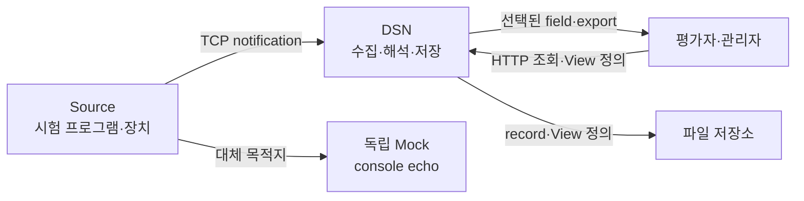

# 2. System Overview

## 시스템 경계

Source는 DSN에 메시지를 발행하고 사용자는 저장된 결과를 조회한다. Mock은 Source 연동 시험용 대체 수신기다. 아래 화살표는 외부 요청과 결과 데이터 흐름이다.



현재 테스트 Source는 network write를 기다리는 CLI다. notification에 응답이 없다는 사실은 원래 시험 프로그램의 비대기 발행을 보장하지 않는다.

## 데이터와 외부 인터페이스

| 개념 | 의미 |
| --- | --- |
| Envelope | `version`, `source_id`, 선택적 `source_description`, `time`, `event_type`, 대상 `workspace[]` |
| Payload | Source와 Workspace가 의미를 합의한 불투명 bytes |
| Workspace | payload를 해석하여 scalar field의 record를 만드는 plugin |
| Record | 저장소가 부여한 id, Workspace 이름, field 값. 원본과 독립 |
| View | 허용된 Workspace의 record에서 선택할 field를 정의. 사용자별 보존 |

RPC는 UTF-8 JSON 한 개와 LF를 보내는 `dsn.publish` notification이다. 완전한 JSON-RPC 서버가 아니며 request/id/batch를 지원하지 않는다. transport 상태는 관찰 가능하지만 메시지 처리·저장 응답은 없다.

```json
{"jsonrpc":"2.0","method":"dsn.publish","params":{"version":1,"source_id":"sample","time":"2026-09-08T00:00:00Z","event_type":"normal","workspace":["echo","hex"],"payload":"aGVsbG8="}}
```

| HTTP API | 기능 |
| --- | --- |
| `GET /health`, `GET /fields` | 준비 상태, 접근 가능한 저장 field 목록 |
| `GET /view?workspaces=echo,hex&fields=id,workspace,payload_utf8,payload_hex` | 선택한 field 조회 |
| `GET /export?workspaces=echo` | 원래 record의 NDJSON export |
| `PUT /views/{name}` | `{"workspaces":["echo"],"fields":["id","payload_utf8"]}` 정의 저장 |
| `GET /views`, `GET /views/{name}` | 자기 정의 목록, 정의에 따른 결과 조회 |

조회와 export는 `afterId`와 `limit`으로 페이지를 지정한다. View 조합은 여러 record를 동일 column 집합에 투영하는 방식이다. 같은 입력에서 파생된 echo/hex record는 `message_id`가 같지만 자동 join하지 않는다.

## 운영 환경

기본 RPC/HTTP 포트는 7070/7071, Mock은 7072다. 기본 바인딩은 loopback이며 인증 없는 로컬 조회를 허용한다. 원격 바인딩은 사용자별 bearer token과 허용 Workspace 설정을 요구한다. HTTP를 외부에 노출하는 배치는 TLS reverse proxy를 전제로 한다. Source별 ACL과 RPC 인증은 구현하지 않았다.

설정은 JSON 파일 하나 또는 코드 기본값을 사용한다. 상대 경로는 실행 디렉터리 기준이고 알 수 없는 키·잘못된 범위는 시작 시 거부한다. 상세 기본값은 [settings.example.json](../settings.example.json), 검증 규칙은 [Settings.cs](../src/Dsn.Host/Settings.cs)가 기준이다.
