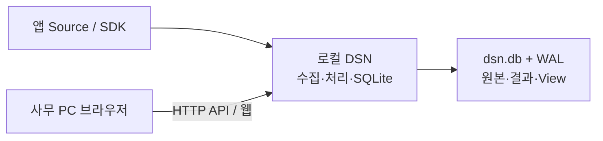

# 2. System Overview

## 경계와 데이터



| 개념 | 의미 |
| --- | --- |
| Envelope | version, source_id, source_description, time, event_type, workspace[] |
| Payload | Source와 Workspace가 의미를 합의한 opaque bytes |
| Workspace | payload를 scalar field로 해석하는 첫 Filter |
| Pipeline | Workspace별 후속 Filter 순서와 Sink 목록 |
| Raw | message_id·수신 시각·Envelope·payload BLOB |
| Record | Workspace·field와 저장 ID. SQLite가 node_id/record_id 부여 |
| View | 허용 Workspace의 선택 field. 같은 API/정의로 조회 |

입력은 UTF-8 JSON+LF의 dsn.publish notification이다. 완전한 JSON-RPC 서버가 아니며 request/id/batch는 지원하지 않는다. Source publish의 true는 로컬 큐 접수, DSN TrySubmit의 true는 수용 결과이며 저장 완료 ACK가 아니다.

```json
{"jsonrpc":"2.0","method":"dsn.publish","params":{"version":1,"source_id":"app-1","time":"2026-09-09T00:00:00Z","event_type":"normal","workspace":["bench"],"payload":"e30="}}
```

## API

| 경로 | 동작 |
| --- | --- |
| GET / | 공개된 빈 웹 UI. 데이터는 인증된 API로만 접근 |
| GET /health | 준비 상태 |
| GET /workspaces, /fields | 허용 Workspace·저장 field 목록 |
| GET /pipelines | 허용 처리 경로의 Filter/Sink 이름과 revision |
| GET /view?workspaces=bench&fields=id,role | 선택 field 조회. afterId/limit 페이지 |
| GET /export?workspaces=bench | 저장 결과 NDJSON export |
| GET /views, /views/{name}; PUT /views/{name} | 사용자별 View 정의 조회·저장 |
| GET /raw?afterId=0&limit=20 | 원본과 nextAfterId. limit 1–100 |
| POST /raw/{id}/replay | {"workspaces":["bench"]}를 기존 큐로 제출, 202 접수·503 포화 |

원본은 원래 대상 Workspace 모두의 권한이 필요하다. 원본 페이지의 cursor는 보이지 않는 항목도 넘어가므로 빈 items만으로 끝을 판단하지 않는다. 재처리는 canReplay 권한을 추가로 확인한다. 원본 보존 off는 원본 API 409, 무인증 401, 범위 밖 요청 403이다. 반복 재처리 요청은 별도 실행이며 결과를 추가한다.

웹의 Source 필터와 차트는 현재 페이지에만 적용된다. 저장 ID 순서이며 join·전체 이력 집계는 제공하지 않는다.

## 운영 환경

bind는 웹, ingressBind는 TCP이며 기본 loopback이다. 원격 웹 bind는 사용자 토큰·Workspace 권한을 요구하고 HTTPS proxy는 배치에서 구성한다. TCP 입력에는 인증/TLS가 없으므로 신뢰 경계가 필요하다. 기본 포트는 7070/7071, Mock은 7072다.

SQLite는 데이터 디렉터리에 한 DSN만 접근한다. 기존 journal/view 파일은 최초에 한 번만 이전하며 그대로 보존한다. 상한은 논리 byte/record 수이며 파일 크기 제한·자동 삭제가 아니다. [기본 설정](../settings.example.json), [실행 예제](../samples/pipeline/README.md).
