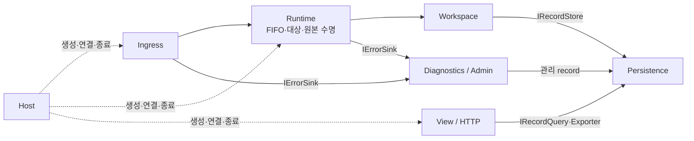
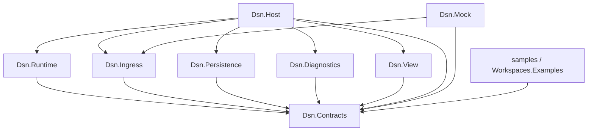
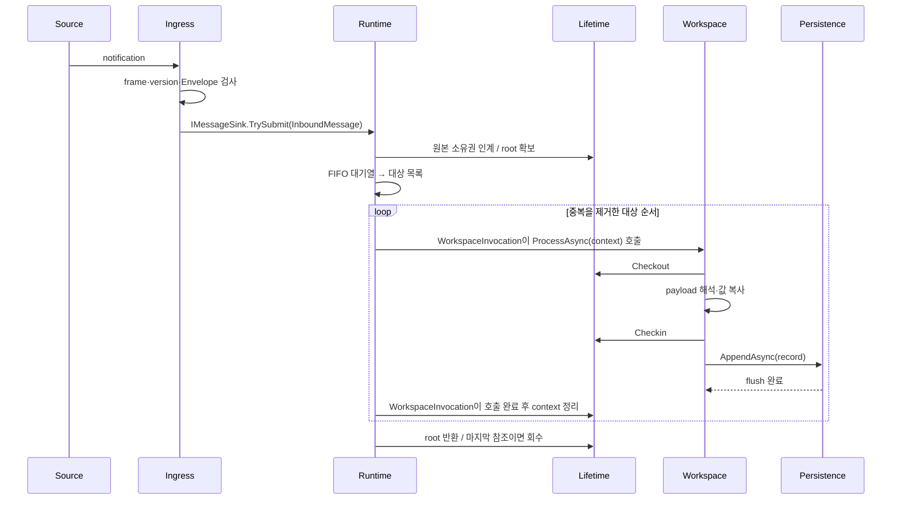
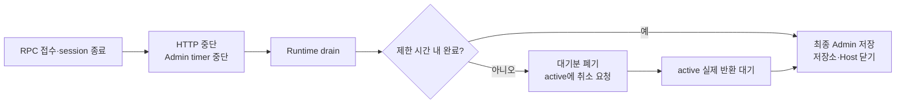
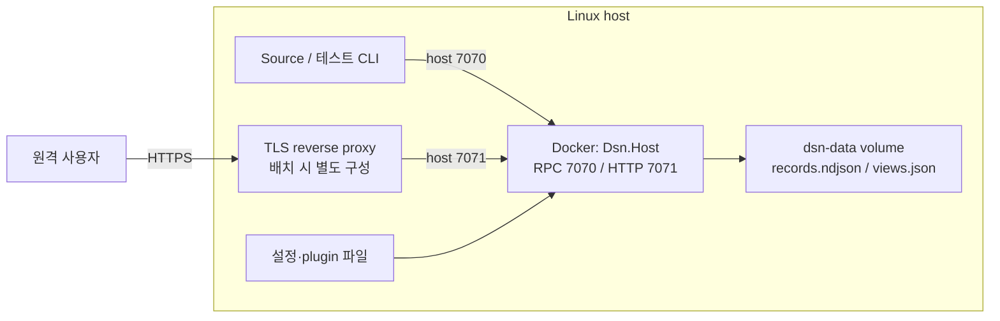

# 4. Top Level Design Description

## Structure View

DSN은 한 Host 프로세스 안에 수신, 실행, 해석, 저장, 조회 기능을 조립한다. 화살표는 호출/의존 관계다. record 결과는 조회 요청의 반대 방향으로 반환된다.

실제 프로젝트 참조는 아래와 같다. 기능 assembly는 Contracts만 참조하고, Host가 생성·연결한다. Mock도 Runtime/Persistence/View에 의존하지 않는다.

최상위는 `DSN.sln`이며 운영 프로젝트 8개, 예제 1개, 테스트 3개로 구성한다. Host는 예제 DLL을 build/publish에 포함하지만 C# 참조는 하지 않고 다른 plugin과 동일하게 동적 로딩한다. [Directory.Build.targets](../Directory.Build.targets)가 허용하지 않은 프로젝트 참조를 빌드 오류로 처리하며, 전이 프로젝트 참조도 비활성화했다. Contracts에는 모듈 경계를 통과하는 모델·인터페이스·이름 규칙만 둔다. JSON 설정과 저장 구현 도우미는 각 구현 assembly 내부에 둔다.

Ingress는 `IMessageSink`, plugin loader는 `IWorkspaceRegistration`, View는 `IRecordQuery`로 연결된다. 내부 원본·queue·호출 context는 Runtime의 internal 타입이며 Host에도 공개하지 않는다. [상세 컴포넌트 구조](05-component-design.md)

## Behavior View

### 메시지 처리와 원본 수명

없는 대상과 실패한 Workspace는 진단하고 다음 대상으로 진행한다. 앞 Workspace가 Checkin해도 root가 뒤 대상을 위해 원본을 유지한다. Source에 처리 결과를 응답하지 않는다. queue/memory 초과는 TrySubmit 단계에서 신규 입력을 거부한다.

### 조회와 종료

조회는 사용자 식별 → Workspace scope 확인 → View 정의/field 검증 → Persistence Query → field 투영 순서다. 인증 없는 로컬 모드 외에는 `/health`를 포함한 HTTP 요청에 토큰이 필요하다.

원본 안전성을 위해 active 호출의 강제 회수는 하지 않는다. 시작은 설정 검증·저장 복구·plugin 등록 후 Runtime/HTTP/RPC를 열며, 준비 중 실패하면 확보 자원을 정리한다.

실행 범위는 순차 호출로 고정한다. `SequentialScheduler`는 호출 순서만 제어하고 `WorkspaceInvocation`은 ProcessAsync 완료 후 context를 정리한다. Runtime은 전체 dispatch가 끝난 뒤 root를 반환한다. 스케줄러에 원본 해제 권한을 주지 않으며 범용 `IWorkspaceExecutor` 교체 API를 제공하지 않는다. 병렬화는 재진입·순서·완료·drain 계약과 별도 검증을 요구하는 후속 설계다.

## Deployment View

아래는 목표 Linux 배포다. 실선은 네트워크 또는 파일 접근이다. Termux 검증에서는 컨테이너 없이 같은 DLL을 직접 실행했다.

[Dockerfile](../Dockerfile)은 .NET SDK로 Host와 예제 plugin을 publish하고 ASP.NET Chiseled Extra runtime에 배치한다. Mock·SDK·소스·디버그 심볼은 이미지에서 제외하며 ICU·시간대 지원과 동적 plugin 로딩은 유지한다. [Compose](../compose.yaml)는 호스트 loopback에만 포트를 공개한다. [Makefile](../Makefile)의 `deploy`는 설정 생성·이미지 빌드·실행, `deploy-image`는 게시된 이미지 실행을 수행한다. 컨테이너 설정은 `bind=0.0.0.0`, `dataDirectory=/data`, 사용자 토큰을 지정한다. 추가 plugin은 경로 설정과 파일 배치가 필요하다. reverse proxy는 Compose에 포함돼 있지 않다.

## Design Decision

| ID | 결정과 근거 | 대안·trade-off | 관련 driver |
| --- | --- | --- | --- |
| D1 | TCP JSON notification: 언어 독립 fixture와 Mock을 단순하게 공유 | gRPC 등 대신 framing/session을 직접 관리. 완전한 JSON-RPC 아님 | UC1/4, C2 |
| D2 | 공통 계층의 opaque payload, 버전 decoder와 plugin 분리 | 업무 스키마를 중앙에서 검증하지 못함 | QA7, C3/6 |
| D3 | 순차 스케줄러·호출 정리·root 소유권 분리: 완료 책임을 명확히 함 | 병렬 교체 API 없음. 느린 plugin/flush의 지연 전파는 유지 | QA1/2/5, C5 |
| D4 | root와 lease, 유효성 검사 façade: 원본 공유와 반납 후 접근 통제 | Workspace별 복사 대비 수명 관리 비용. 실제 GC 시점은 별개 | QA2/5, C4 |
| D5 | BCL 기반 append journal: 추가 DB 의존성 없이 flush·재시작 검증 | DB 대비 조회/보존 기능 제한, 동기 flush·메모리 index 비용 | QA4, C1/7 |
| D6 | ErrorSink와 Admin 변환 분리: 오류 접수가 저장 완료에 의존하지 않음 | snapshot 이력 중복·저장 quota 소모, 완전한 오류 보존 불가 | QA8, UC3 |
| D7 | record 투영과 사용자별 정의: 저장 모델에서 조회를 분리 | join·실시간 Workspace 상태·Source별 ACL 없음 | QA6, C7 |
| D8 | 협력 취소 후 active 반환 대기: 사용 중 원본의 조기 회수 방지 | 강제 종료 대비 종료시간 상한 없음 | QA5, C4 |

| D9 | 기능별 assembly와 Contracts 의존 강제: 구현 간 우발적 결합 방지 | 프로젝트 수 증가, Host의 명시적 조립/예제 패키징 필요 | QA7, C6/7 |

선택의 타당성과 잔여 위험은 [Architecture Evaluation](06-architecture-evaluation.md)에서 위 driver에 연결해 평가한다.
