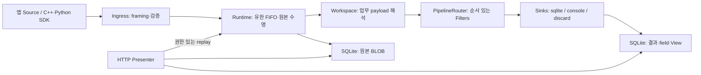
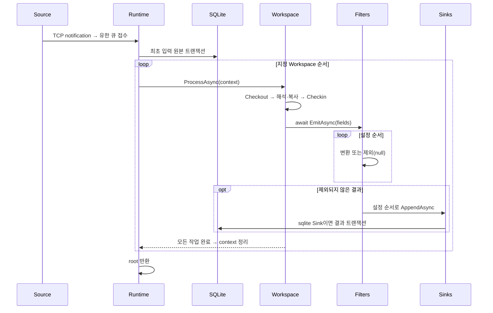
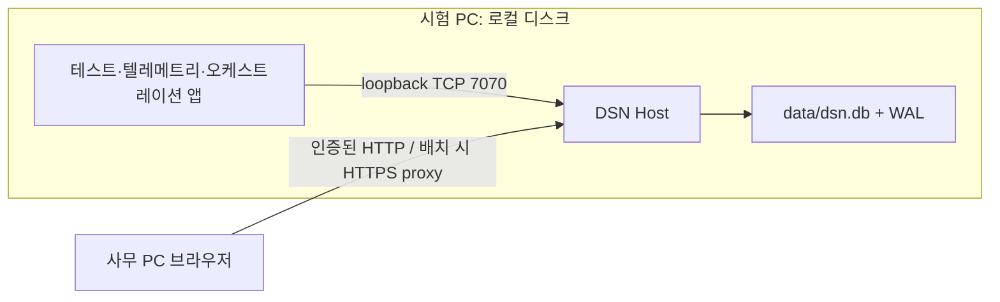
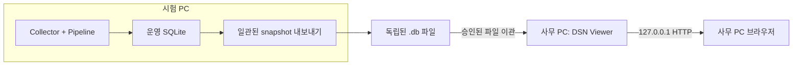

# 4. Top Level Design Description

## Structure View

Host가 위 요소를 생성·연결한다. Runtime의 PipelineRouter는 `IRecordStore`를 구현하므로 `EmitAsync`와 기존 `WorkspaceServices.Records` 출력 모두 같은 경로를 탄다. 설정이 없으면 Filter 없이 SQLite로 저장한다. Admin 진단 record는 사용자 Filter를 거치지 않고 SQLite에 저장한다.

최상위 `DSN.sln`과 기존 프로젝트 경계를 유지한다. 기능 assembly(Runtime, Ingress, Persistence, Diagnostics, View)는 Contracts만 참조하고 Host가 구현을 조립한다. Mock은 Ingress/Contracts에만 의존한다. 예제 Workspace DLL은 동적으로 로딩한다. [Directory.Build.targets](../Directory.Build.targets)가 금지된 프로젝트 참조를 빌드 오류로 처리한다. 새 Filter·SQLite 때문에 프로젝트를 추가하지 않았다.

## Behavior View

원본 보존 실패는 해당 dispatch를 중단한다. Workspace/Filter/Sink 실패는 진단하고 다음 대상·메시지 처리를 이어간다. 여러 결과, 여러 Sink, 원본과 결과를 하나의 트랜잭션으로 묶지 않는다. 뒤 Sink가 실패해도 앞 Sink의 성공을 되돌리지 않는다. Source 발행 성공은 로컬 SDK 큐 접수이며 서버 내구 저장 ACK가 아니다.

Filter는 record 한 건을 한 건 또는 제외로 변환한다. `where`, `scale`, `set`, `select`를 제공하고 `IFilterPlugin`으로 확장한다. Filter마다 독립된 scalar 사본을 전달하고 Workspace scope·시스템 provenance를 보호한다. `pipeline_revision`은 설정과 Filter 타입/assembly 버전의 hash다. 사용자 Filter 변경 시 assembly 버전을 갱신한다.

재처리는 원본 bytes를 같은 FIFO에 다시 제출한다. 원래 `message_id`를 유지하고 `processing_id`, `replay_id`, SQLite `record_id`를 새로 만든다. 원본은 중복 저장하지 않으며 기존 결과도 수정하지 않는다. 재처리 요청 반복은 별도 실행이다.

종료는 새 접수를 중단하고 Runtime을 drain한다. 제한 시간이 지나면 대기분을 폐기하고 active 호출에 협력 취소를 요청한 뒤 실제 반환을 기다린다. 원본을 조기 회수하지 않으므로 비협력 plugin의 종료시간 상한은 없다.

## Deployment View

HTTP와 입력 TCP의 bind를 분리한다. 원격 View를 열어도 입력은 loopback으로 유지할 수 있다. `/` UI shell만 공개하고 API에는 사용자 토큰·Workspace scope를 적용한다. 원본 조회/재처리는 모든 원래 대상의 권한을 요구한다. 입력 TCP 인증은 제공하지 않는다.

SQLite는 PC별 단일 Host가 소유한다. 결과·원본·사용자 View를 같은 DB에 저장하며 WAL/FULL을 사용한다. Termux에서는 system sqlite3, 일반 .NET 배포에서는 번들 native SQLite를 사용한다. [공급자 구성 근거](https://learn.microsoft.com/en-us/dotnet/standard/data/sqlite/custom-versions). WAL은 로컬 디스크 사용을 전제로 한다([SQLite WAL](https://www.sqlite.org/wal.html)). 실행 중 DB 파일 하나만 복사하면 최신 내용을 놓칠 수 있으므로 현재는 Host 정상 종료 후 데이터 디렉터리를 보존한다.

Docker는 target RID의 SQLite native 파일을 포함한 framework-dependent Host를 Chiseled Extra runtime에 배치하고 `/data` volume에 보존한다. Docker 실행은 현재 Termux 검증 범위 밖이다. 중앙 이관·동기화는 구현하지 않았고, 안정적인 `node_id`·`record_id`와 원본 식별자를 향후 공통 조회/이관의 기반으로 남긴다.

## Design Decision

| 결정 | 근거 | 비용·한계 |
| --- | --- | --- |
| Workspace decoder 뒤 ordered Filter | opaque payload 계약과 기존 plugin 유지, 업무 분석을 조합 | FFmpeg의 임의 그래프·분기·병렬 실행 전체를 구현하지 않음 |
| SQLite 기본 Sink | 외부 DB 없이 원본/결과/View 트랜잭션과 SQL 페이지 조회 | 단일 writer, native 의존성, 메시지별 저장 비용 |
| 원본을 Filter 전에 별도 보존 | 제외·실패 데이터도 새 조건으로 재처리 | 디스크 추가 사용, 결과와 원자성 없음 |
| 논리 quota와 쓰기 거부 | 임의 자동 삭제 없이 보존 범위를 명시 | DB/WAL 물리 크기 상한은 아니며 자동 회전 없음 |
| legacy 파일 일회성 트랜잭션 이전 | 기존 데이터를 유지하며 새 기본 저장으로 전환 | 초기 이전 시간·여유 공간 필요; 손상 시 전체 롤백 |
| 순차 실행·명시적 소유권 | Checkout/Checkin·완료·drain 계약 보존 | 느린 Filter/Sink의 지연 전파; 병렬 executor 교체 API 없음 |
| 동일 로컬 저장/조회 계약 | 단일 PC 사용에 중앙 서버가 필수가 되지 않음 | 중앙 통합·전송 보장은 별도 후속 구현 |

## 후속 배포 옵션: 망 분리 환경의 사무 PC 열람 (미구현)

2026-09-10 요구: 시험 PC와 사무 PC 사이 네트워크 연결이 차단될 수 있다. 직접 웹 접속은 허용된 경로가 있을 때만 사용하며, 차단 환경의 기본 후속 옵션은 DB snapshot을 승인된 파일 반출 경로로 옮겨 사무 PC에서 열람하는 방식이다.

권장 구현은 기존 Host의 **viewer 모드**로 시작한다. 별도 프로젝트를 늘리지 않고 같은 View/API/Presenter를 재사용하며, 실행 경로에서 Ingress·Runtime·plugin·Admin writer·자동 이전을 생성하지 않는다. SQLite는 읽기 전용으로 열고 HTTP는 loopback만 사용한다. 원본 재처리와 입력 API는 제공하지 않으며, 열람 중 View 편집 설정은 원본 DB와 별도 사용자 파일에 저장한다. 기록된 Workspace/field를 DB에서 발견하므로 결과 열람에 업무 plugin이 필요 없어야 한다. 기존 DB의 사용자별 View는 별도의 명시적 선택으로 읽고, snapshot에 접근 가능한 사용자는 반출된 DB 전체를 읽을 수 있다는 파일 배포 경계를 따른다.

사무 PC에는 OS에 맞는 Viewer를 한 번 배포하고 이후 데이터 전달은 DB 파일만으로 가능하게 한다. 외부 CDN·인터넷 설치 없이 UI를 포함한 실행 묶음을 제공한다. 브라우저가 SQLite 파일을 직접 여는 구현은 별도 대안이며 우선 채택하지 않는다. 먼저 사무 PC OS와 로컬 실행/loopback 허용 여부를 확인해야 한다.

Snapshot은 SQLite Online Backup API 등으로 운영 DB에서 독립된 파일을 생성한다([SQLite Backup](https://www.sqlite.org/backup.html)). WAL 사용 중 운영 .db 하나만 복사하는 방식은 사용하지 않는다([WAL](https://www.sqlite.org/wal.html)). 임시 출력 → 무결성 검사 → 완료 파일 확정 순서로 불완전한 반출을 막는다. DB 내부에 schema 버전·원래 node_id·snapshot ID·생성 시각을 보존하고, 완료 전 오류 시 기존 snapshot을 덮어쓰지 않는다. 라이브 snapshot은 완료된 DB 트랜잭션 기준이며 큐 안의 입력이나 처리 중인 결과까지 완료했다는 뜻은 아니다. 완결된 시험 구간이 필요하면 Source 중단·Runtime drain 뒤 생성한다.

Viewer는 원본 node_id/record_id를 유지하며 새 수집 PC처럼 사용하지 않는다. 여러 PC 파일은 우선 선택하여 개별 열람하고, 병합·통합 cursor·중복 제거는 이후 별도 항목으로 둔다. snapshot 조회는 반출 시점 데이터이며 실시간 원격 조회가 아니다. 현재 Host는 수집·관리 기록·DB 변경을 포함하므로 읽기 전용 Viewer의 대체물로 안내하지 않는다.
