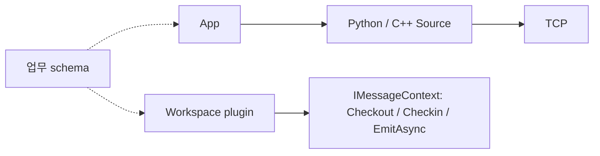
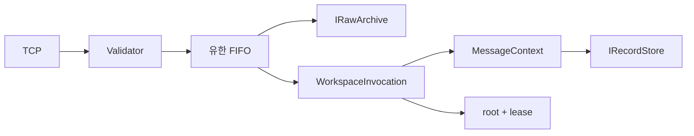
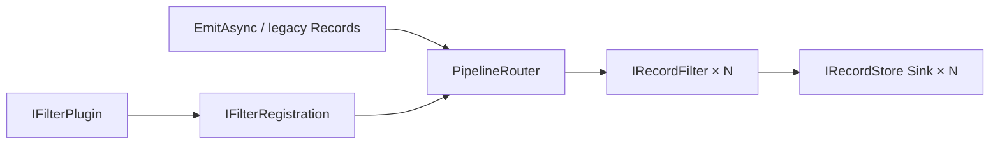
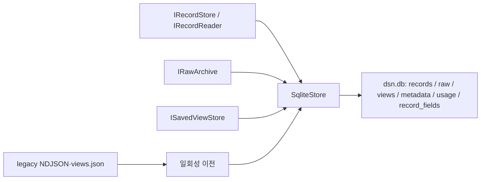
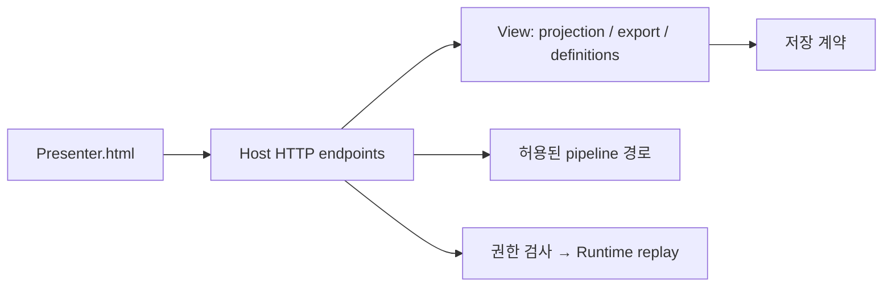
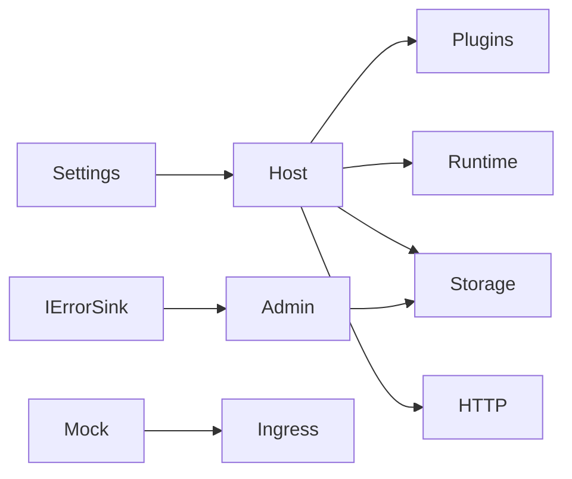

# 5. Component Level Design Description

각 컴포넌트는 기존 assembly의 책임 단위다. 구현은 Contracts의 공개 계약을 통해 연결하고 Host가 조립한다.

## Source SDK / 업무 Workspace

**Overview:** Source SDK는 bytes를 전송하고 Workspace는 업무 규격을 scalar record로 해석한다.

| Element | 책임 |
| --- | --- |
| Python/C++ Source SDK | 제한된 송신 큐, 복사, 연결·로컬 통계 |
| IWorkspacePlugin / IWorkspace | 시작 시 factory, 이름·비동기 처리 계약 |
| IMessageContext / IPayloadLease | 호출별 원본 접근과 완료 수명, 독립 결과 출력 |
| DemoWorkspace | dsn-demo.v1 측정값 검증, 데모 상태·API 빈도 계산 |
| BenchWorkspace / temperature 예제 | 앱 역할별 합성 데이터 / 공유 버전 규격 예제 |

**Design rationale:** 서버 공통 계층에 NVMe나 특정 업무 schema를 넣지 않는다. Source와 Workspace가 이름·schema·단위를 합의한다. Workspace SDK는 Dsn.Contracts NuGet을 재사용한다. 모든 lease 사용은 호출 완료 안에 끝내며 detached 작업을 금지한다.

## Ingress / Runtime

**Overview:** 입력 검증, 유한 접수, 순차 대상 실행과 원본 수명을 책임진다.

| Element | 책임 |
| --- | --- |
| Ingress | LF JSON framing, Envelope·버전·session·길이 검사 |
| DsnRuntime / SequentialScheduler | 큐·메모리 admission, 원본 보존, 대상 순서·재처리 |
| WorkspaceInvocation / MessageContext | 완료 후 context 정리, Emit 시 provenance 추가 |
| Lifetime | dispatch root와 Checkout lease, 반납 후 접근 거부 |

**Design rationale:** 실행 순서와 메모리 해제 권한을 분리한다. 실패 Workspace를 격리하되 느린 plugin의 시간 격리는 제공하지 않는다. 현재 전송은 notification이며 내구 ACK가 없다.

## Pipeline

**Overview:** Workspace 출력을 설정된 Filter와 Sink에 전달한다.

| Element | 책임 |
| --- | --- |
| PipelineDefinition / FilterDefinition | Workspace별 순서·옵션·Sink 이름 |
| PipelineRouter | 시작 시 검증, immutable 설정, revision·통계·오류 보고 |
| where / scale / set / select | 조건 제외 / 단위 변환 / 값 추가 / field 투영 |
| IRecordFilter / IFilterPlugin | 1→0 또는 1 record 계약, 추가 Filter factory |
| sqlite / console / discard | 영속 저장 / stderr 진단 출력 / 결과 폐기 |

**Design rationale:** 기존 출력 계약을 받아 plugin 이전 비용을 줄인다. 각 Filter 이후 scope·provenance를 복원하여 다음 Filter도 신뢰 가능한 식별자를 본다. 기본 경로는 sqlite이고 여러 Sink는 순차 실행한다. 집계 window·fork/join·병렬 graph는 현재 계약에 포함하지 않는다.

## Persistence

**Overview:** 로컬 원본·결과·View와 재시작 가능한 식별자를 저장한다.

| Element | 책임 |
| --- | --- |
| SqliteStore | 단일 연결·소유 lock, WAL/FULL, 행별 transaction, SQL 페이지 조회 |
| records / raw | JSON scalar 결과와 원본 BLOB; 독립 byte/count quota |
| metadata / usage / record_fields | node ID·schema/이전 상태·quota·field catalog |
| SqliteMigration | 기존 numeric ID 유지, 전체 이전 rollback, 원본 파일 비수정 |
| JournalStore / RawArchive | legacy 형식·호환 adapter 검증; Host 기본 경로에서는 미사용 |

**Design rationale:** 전체 journal을 메모리에 복구하는 기본 경로를 SQL 조회로 대체한다. `record_id`는 전역 식별용 UUID, numeric ID는 로컬 페이지 cursor다. 논리 quota는 파일 크기 제한이 아니며 자동 삭제/동기화는 아직 없다. 기존 파일의 불완전한 마지막 행만 건너뛰고 다른 손상은 이전을 중단한다.

## View / Presenter

**Overview:** 같은 SQLite 결과를 로컬 또는 사무 PC 브라우저에서 조회한다.

| Element | 책임 |
| --- | --- |
| View query / Exporter | 허용 Workspace 조회, field 투영, 내보내기 |
| ViewDefinitions | 사용자별 정의를 ISavedViewStore에 저장 |
| ViewEndpoints | 인증·scope·replay 권한, API·저장 오류 응답 |
| Demo.html | telemetry-demo의 저장 결과 자동 조회·DUT 카드·추세 |
| Presenter.html | 경로 표시, 표·현재 페이지 필터/차트, 원본·재처리 |

**Design rationale:** 저장 데이터를 읽는 UI를 실행 중 plugin 상태에서 분리한다. 차트는 현재 페이지이며 전체 기간 검색·집계 엔진을 대신하지 않는다. 원본에는 여러 대상의 정보가 있으므로 모든 원래 Workspace에 대한 접근을 요구한다.

## Host / Diagnostics / Mock

**Overview:** 구성·수명과 운영 관측, 수신 모사를 제공한다.

| Element | 책임 |
| --- | --- |
| DsnApplication / Settings | 저장 이전·plugin/filter 검증 후 시작, 실패 rollback·종료 |
| PluginLoader | 신뢰하는 DLL의 Workspace/Filter factory 등록 |
| ErrorSink / Admin | 오류 identity·count 집계와 별도 관리 record |
| Mock | Host 저장/해석 없이 입력 bytes 관찰 |

**Design rationale:** 조립 의존은 Host에 집중한다. Admin은 사용자 Filter가 오류 자체를 없애지 못하도록 SQLite에 직접 기록한다. plugin은 in-process 신뢰 코드이며 보안 sandbox가 아니다.
