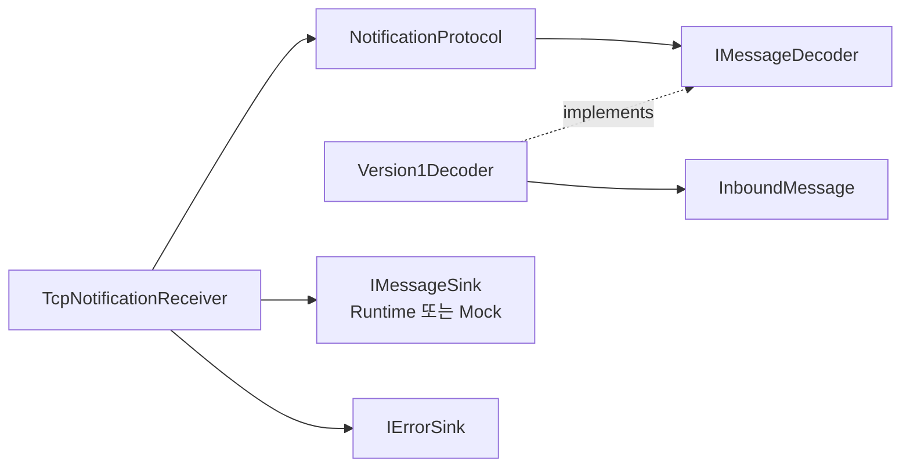
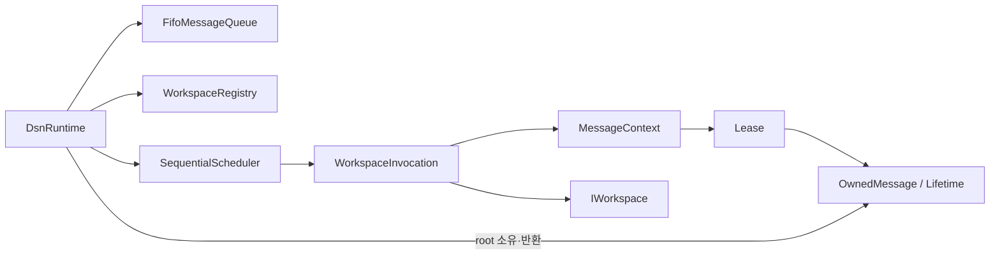
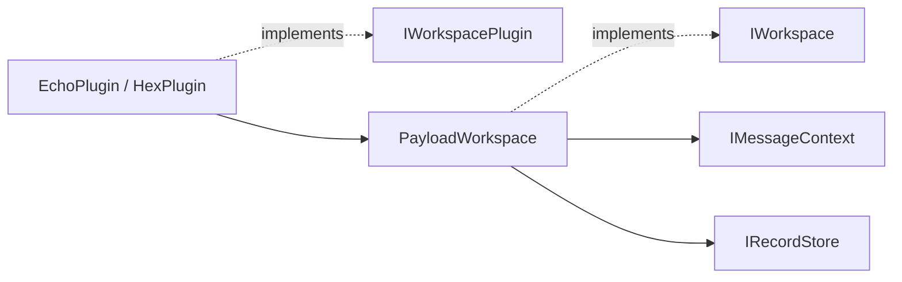
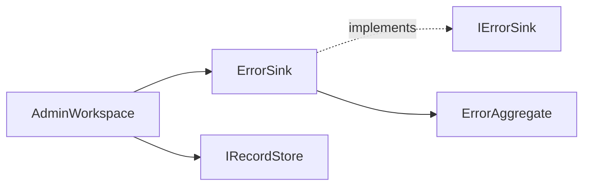
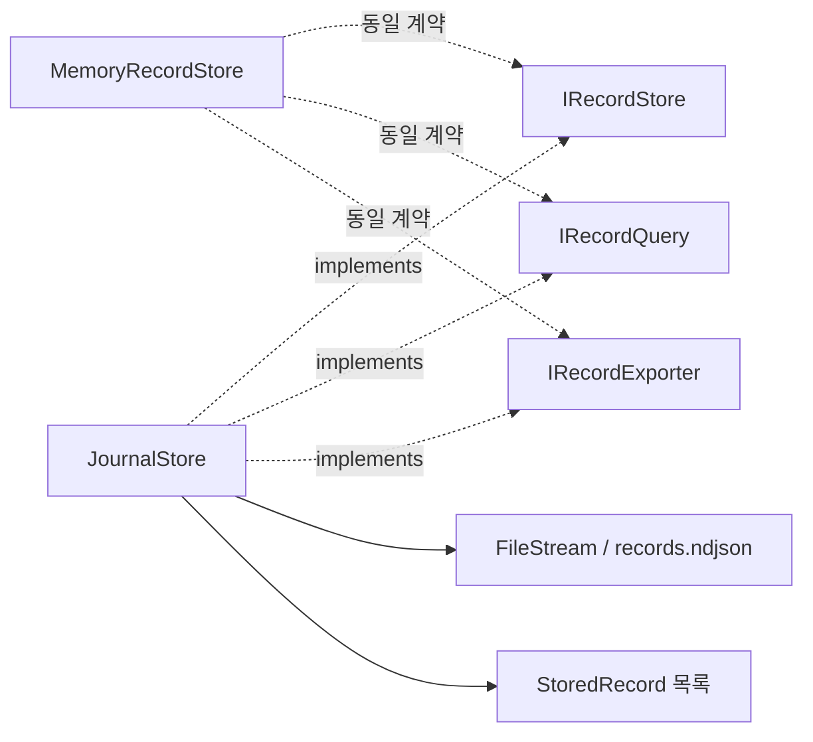
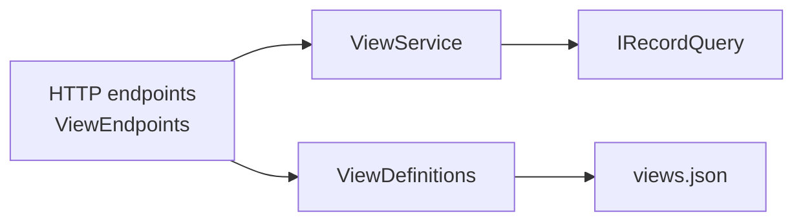
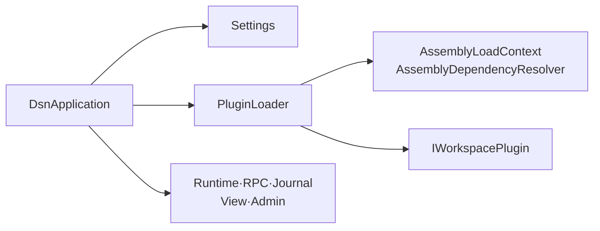

# 5. Component Level Design Description

컴포넌트는 코드의 책임 경계로 묶었다. 모든 static structure diagram에서 실선은 의존/호출, 점선은 인터페이스 구현이다. 내부 요소는 기본 internal이고 외부 조립에 필요한 서비스와 계약만 공개한다. 공통 모델과 인터페이스의 정확한 시그니처는 [메시지](../src/Dsn.Contracts/Messages.cs)·[Workspace](../src/Dsn.Contracts/Workspaces.cs)·[record](../src/Dsn.Contracts/Records.cs)·[진단](../src/Dsn.Contracts/Diagnostics.cs) 계약가 기준이다.

## 5.1 Ingress / Mock

### Overview

TCP 프레임과 session을 관리하고 버전에 맞게 Envelope를 검사한다. payload 의미는 해석하지 않는다. Mock은 같은 수신기를 사용해 envelope와 앞 256 bytes hex를 출력한다.

### Static Structure Diagram

### Element List

| 요소 | 책임·주요 규칙 |
| --- | --- |
| [TcpNotificationReceiver](../src/Dsn.Ingress/TcpNotificationReceiver.cs) | LF framing, 연결당 source_id 하나, Source당 활성 연결 하나. Source 변경/중복 접속 시 해당 session 종료 |
| [NotificationProtocol / IMessageDecoder](../src/Dsn.Ingress/NotificationProtocol.cs) | notification 검사, 정수 version으로 decoder 선택 |
| Version1Decoder / InboundMessage | 공통 Envelope와 decoded bytes. canonical base64, 빈 payload 허용, timezone 있는 ISO 시각 |
| [Mock](../src/Dsn.Mock/Program.cs) | 유한 출력 queue, 초과 출력 폐기 및 진단 |

기본 frame 65,536 bytes, payload 16,384 bytes, JSON depth 32다. source_id는 공백만 아닌 최대 128 UTF-16 units, event_type은 최대 64, time은 최대 40이다. Workspace는 1–32개이며 이름은 `[a-z][a-z0-9-]{0,63}`이다. description은 임의 JSON이며 추가 필드는 무시한다. version/envelope 오류는 폐기·집계 후 연결 유지, RPC/framing 오류는 해당 연결 종료다.

### Design Rationale

연결 처리와 버전 검사를 분리해 Mock과 Host의 입력 계약 차이를 줄인다(D1/D2). Source별 session은 선택적 연결 종료를 단순하게 하지만 한 연결에서 여러 Source를 중계할 수 없다. RPC에 인증을 넣지 않았으므로 신뢰하는 호스트 경계가 필요하다.

## 5.2 Runtime / Message Lifetime

### Overview

수용된 메시지를 FIFO로 꺼내 이름으로 대상을 찾아 순차 호출한다. queue와 executor가 root를 보유하고, 각 호출 context가 lease를 관리한다.

### Static Structure Diagram

### Element List

| 요소 | 책임·주요 규칙 |
| --- | --- |
| [DsnRuntime](../src/Dsn.Runtime/DsnRuntime.cs) | IMessageSink/IWorkspaceRegistration, Start/Drain/Stop, dispatch root 소유, 읽기 전용 LifetimeStats |
| [FifoMessageQueue](../src/Dsn.Runtime/Queue/FifoMessageQueue.cs) / [WorkspaceRegistry](../src/Dsn.Runtime/Registry/WorkspaceRegistry.cs) | 유한 FIFO, 시작 전 등록, 중복 대상 제거·대상 결정 |
| [SequentialScheduler](../src/Dsn.Runtime/Execution/SequentialScheduler.cs) | 순차 호출과 시작 전 취소 확인. 원본·context 해제 권한 없음 |
| [WorkspaceInvocation](../src/Dsn.Runtime/Invocation/WorkspaceInvocation.cs) | 한 호출의 ProcessAsync 완료·실패 후 context 정리, 중복 실행 거부 |
| [Lifetime / OwnedMessage](../src/Dsn.Runtime/Lifetime/Lifetime.cs) | 원본 소유·ref count·한도·회수. TrySubmit 이후 호출자는 인계한 bytes를 수정하지 않음 |
| MessageContext / Lease | Checkout/Checkin과 호출 종료 정리, 동시 읽기/반납 동기화, 반납 후 접근 거부 |

중복 Checkin은 false이고 다른 context의 lease는 거부한다. 원본 Span/Memory를 공개하지 않으며 Copy/문자열 변환은 명시적 복사다. `references = created + checkouts - checkins`이고 0에서 bytes 참조를 해제한다. 실제 GC 시점은 보장하지 않는다. 종료 timeout은 대기 원본을 반환하고 active 호출에는 취소를 요청한다.

### Design Rationale

호출 완료는 ProcessAsync에서 시작한 모든 원본 접근의 종료를 뜻한다. 호출 객체가 이 완료 뒤 context를 정리하고, Runtime이 dispatch 완료 뒤 root를 반환한다(D3/D4/D8). 단순 interface 교체로 병렬화를 지원한다고 가정하지 않으며 detached 원본 접근은 금지한다. 느린 저장 동안 root가 남고 뒤 메시지가 지연되는 비용을 수용한다.

## 5.3 Workspace

### Overview

업무 payload를 해석하여 독립된 scalar record를 만든다. 현재 echo/hex는 변환 예제이며 다른 Workspace 결과에 의존하지 않는다.

### Static Structure Diagram

### Element List

| 요소 | 책임·주요 규칙 |
| --- | --- |
| [IWorkspacePlugin / WorkspaceServices](../src/Dsn.Contracts/Workspaces.cs) | API version 1 factory, record 저장·진단 의존성 제공 |
| [PayloadWorkspace](../samples/Dsn.Workspaces.Examples/Workspaces.cs) | Checkout → 해석/값 복사 → finally Checkin → AppendAsync |
| EchoPlugin / HexPlugin | 각각 UTF-8/hex record 생성. source/time/event_type/payload_bytes/message_id 포함 |

### Design Rationale

해석 로직을 plugin으로 두어 Core에서 업무 스키마를 제거했다(D2). 저장 대기 전에 lease를 반납하고 필요한 값만 복사한다(D4). 호출 종료 뒤 원본을 사용하는 background 작업은 계약에 포함하지 않는다.

## 5.4 Diagnostics / Admin

### Overview

ErrorSink는 오류를 독립 집계하고 AdminWorkspace는 snapshot을 관리용 record로 변환한다. 현재 Admin은 Host가 호출하는 구성 요소이며 일반 `IWorkspace` plugin이 아니다.

### Static Structure Diagram

### Element List

| 요소 | 책임·주요 규칙 |
| --- | --- |
| [ErrorSink](../src/Dsn.Diagnostics/Diagnostics.cs) | ErrorBody 전체 값으로 동일성 비교, first/last/count, 유한 종류 수와 dropped |
| ErrorBody / ErrorAggregate | Code/Component/SourceId/Workspace/Detail과 별도 집계 시각·count |
| AdminWorkspace | 변경 revision의 snapshot을 `admin` record로 변환. 원본 payload 첨부 없음 |

Host가 1초 주기로 Publish를 호출한다. 변경 없는 revision은 재출력하지 않고 과거 snapshot은 append 이력으로 남긴다. count는 누적값이므로 snapshot 간 합산하면 중복 계산이 된다. dropped 증가만으로는 revision이 바뀌지 않는다.

### Design Rationale

오류 접수가 저장 완료나 Admin 준비에 의존하지 않게 했다(D6). 집계가 포화되면 신규 오류 종류를 잃고, Admin snapshot은 journal 용량을 소모한다. 원자적 snapshot 전송이나 완전한 오류 보존을 보장하지 않는다.

## 5.5 Persistence

### Overview

scalar record를 저장·조회·export한다. Host는 single-writer append journal을 사용하고 테스트에는 비영속 MemoryRecordStore를 제공한다.

### Static Structure Diagram

### Element List

| 요소 | 책임·주요 규칙 |
| --- | --- |
| [JournalStore](../src/Dsn.Persistence/JournalStore.cs) | 값 복사·id 부여·append·Flush(true)·재시작 복구, 성공 후 조회 가시성 |
| [MemoryRecordStore](../src/Dsn.Persistence/MemoryRecordStore.cs) | 같은 record/query 규칙의 비영속 대역. Journal 클래스 대신 내부 RecordValidation을 공유 |
| RecordInput / StoredRecord | Workspace 이름과 1–128개 scalar field, 저장 id. 중복 Append는 별도 record |
| RecordQuery / Export | Workspace 필터, id 오름차순, `afterId` exclusive, limit 1–1000, NDJSON |

field 이름은 `[a-z][a-z0-9_]{0,63}`, 값은 string/JSON number/bool/null이며 id/workspace는 예약 column이다. record 최대 1 MiB, 전체 기본 한도 100,000건/256 MiB다. quota 초과는 기존 record를 지우지 않고 새 저장을 거부한다. I/O 실패 후 journal은 재시작 전까지 쓰기를 거부한다. Append는 시작 전 취소만 검사하며 flush 중간 취소는 하지 않는다.

복구 시 마지막 LF 없는 frame만 절단한다. 완성된 record가 손상되면 시작을 실패시킨다. Query/Fields는 복구된 record 목록을 사용한다.

### Design Rationale

BCL만으로 저장 성공과 재시작 의미를 명확히 했다(D5). 대신 매 Append의 동기 flush와 전체 record 메모리 index가 병목이 될 수 있다. 현재 한도는 RSS 상한이 아니며 회전/보존 정책도 없다.

## 5.6 View

### Overview

저장된 record의 field를 선택하고 사용자별 정의를 보존한다. ViewService는 `IRecordQuery`만 의존하고 HTTP 계층은 인증과 허용 Workspace를 확인한다.

### Static Structure Diagram

### Element List

| 요소 | 책임·주요 규칙 |
| --- | --- |
| [ViewService](../src/Dsn.View/Views.cs) | field 존재 검사·record 투영. 해당 row에 없는 값은 null |
| ViewDefinition / ViewDefinitions | Workspace/field 목록, 사용자별 이름 공간, temp flush 후 rename 저장 |
| [HTTP adapter](../src/Dsn.Host/Http/ViewEndpoints.cs) | bearer token, Workspace scope, View/목록/export/오류 응답 |

정의당 Workspace/field 각 최대 32, 사용자당 정의 128개, 정의 파일 4 MiB 한도다. field 목록은 저장된 record에서 얻으므로 첫 데이터 전에는 payload field를 검증할 수 없다. HTTP body 기본 한도는 16 KiB, 저장/조회 I/O 실패는 503이다.

### Design Rationale

record 생성과 조회를 분리하고 같은 데이터에 여러 사용자 정의를 적용한다(D7). 행 결합 의미를 임의로 만들지 않도록 column 투영으로 한정했다. 인증과 HTTP wiring은 Host의 별도 ViewEndpoints adapter에 두고, View assembly에는 ASP.NET 의존성을 넣지 않는다.

## 5.7 Host / Plugin Loading

### Overview

설정, 저장소, Runtime, HTTP, RPC, Admin을 조립하고 lifecycle을 관리한다. 명시한 plugin은 필수이며 미지정 시 기본 echo/hex를 등록한다.

### Static Structure Diagram

### Element List

| 요소 | 책임·주요 규칙 |
| --- | --- |
| [Settings](../src/Dsn.Host/Settings.cs) | 키·범위·token/scope·바인딩 검사 |
| [DsnApplication](../src/Dsn.Host/DsnApplication.cs) | 초기화/rollback, endpoint, Admin timer, drain·최종 저장·종료 |
| [PluginLoader](../src/Dsn.Host/Plugins/PluginLoader.cs) | factory 검색, API version 검사, 의존 assembly 해석, Contracts assembly 공유, IWorkspaceRegistration으로 등록 |
| [Program](../src/Dsn.Host/Program.cs) | 설정 경로, ready 출력, Ctrl+C/SIGTERM 처리 |

### Design Rationale

구체 구현의 선택과 조립을 Host에 모아 plugin의 의존성을 제한한다. 시작 시 등록을 완료해 실행 중 registry 변경을 없앴다(C6). 로컬 DLL은 신뢰 대상으로, 버전 검사가 실행 격리나 보안 sandbox를 제공하지 않는다. 종료는 자원 안전을 우선해 비협력 plugin에 의한 무기한 지연 가능성을 남긴다(D8).
