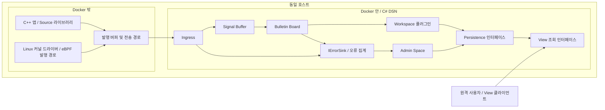

# 아키텍처

## 시스템 범위와 우선순위

DSN은 C#으로 구현하며 Docker 이미지로 배포한다. Source는 원 프로젝트의 언어와 실행 환경에 맞는 라이브러리 형태로 제공한다. 현재 대상은 CentOS 9의 C++ 앱과 Linux 커널 드라이버이며, 드라이버에서 eBPF로 발행하는 경로도 포함한다.

Source 호출자의 지연과 CPU 부담을 최소화하는 것이 전달 보장보다 우선이다. 발행은 내부 fire gun의 탄창에 메시지를 적재하는 것으로 끝낸다. 연결과 실제 전송은 별도 실행 흐름이 담당한다. 발행 호출은 대기하지 않으며, 실패를 오류나 예외로 호출자에게 전파하지 않는다. 메시지 손실을 허용하고 ACK/NACK을 요구하지 않는다.

payload는 DSN 공통 계층에 블랙박스다. Source와 Workspace가 인코딩과 스키마를 합의하며, Workspace가 payload를 해석한다. 이상 발생 이력 확인과 TC 진행 상황 조회는 사용 예시이고 시스템의 지원 범위를 제한하지 않는다.

모듈 간 의존성은 공개 인터페이스로 제한한다. 각 계약은 데이터 소유권, 수명, 순서 및 실패 동작을 정의한다. 모듈별 제공·소비 인터페이스는 [모듈 경계와 검증](04-delivery.md)에 명시한다.

## 배포 경계 — 확정

이 그림은 논리적 경계를 나타낸다. 실제 전송 기술, 커널과 사용자 공간 사이의 중계 방식, 저장소의 프로세스 및 배치 위치는 미정이다. 원격 연결은 View를 기준으로 하며, 원격 Source 지원을 첫 구현의 전제로 두지 않는다.

## 구성 요소

| 구성 요소 | 책임 |
| --- | --- |
| Source / Message Builder | 환경에 맞는 API로 envelope과 payload를 구성 |
| Source / Fire Gun | 메시지를 탄창에 적재하고 호출자에게 즉시 반환; 실제 전송 실행 흐름과 분리 |
| Ingress / Sink | 전송 입력 수신, 버전별 decoder 선택, envelope의 구조 검증 |
| Signal Buffer | 수신한 메시지를 보유하고 기본 FIFO 순서로 제공 |
| Bulletin Board | 등록된 Workspace 이름으로 분배하는 Facade, registry와 dispatcher 제공 |
| Workspace | 읽기 전용 공유 메시지를 참조하고 payload를 record로 변환 |
| Admin Space | IErrorSink로 전달된 오류와 관리 정보를 다루는 특별한 Workspace |
| Persistence | record 저장, 조회 및 export 인터페이스 제공 |
| View | 여러 Workspace의 record field를 조합하여 원격 사용자에게 제공 |
| DSN Mock | 실제 Source의 메시지를 수신하여 console에 echo하는 개발용 대체 수신기 |

## 실행과 분배 — 확정

DSN 시작 시 Workspace 플러그인을 동적으로 로딩한다. 각 Workspace는 정해진 인터페이스를 구현하고 Bulletin Board에 하나의 이름으로 등록된다. 이름은 조직 내부에서 관리한다. 중복 이름은 후발 등록을 거부하고 IErrorSink에 기록한다.

메시지의 `workspace[]`가 전달 대상이다. 별도 topic은 두지 않는다. Workspace 자체가 topic과 유사한 분배 단위이며, `test.started` 같은 이벤트의 의미는 payload 안에서 처리한다.

Workspace 간 처리 의존성은 없다. Workspace별 스레드나 병렬 실행은 필수 조건이 아니다. DSN의 CPU 부하를 줄이면서 동작하는 실행 방식을 선택한다. 느린 Workspace의 격리, 스케줄러, 실행 동시성은 추후 결정한다.

## 수용과 손실 — 확정 및 구현 제약

DSN은 논리적으로 수신량의 상한을 두지 않고 지속적으로 수신을 시도한다. 실제 자원의 수용 한계를 초과하면 메시지를 폐기하고 IErrorSink로 Admin Space에 오류를 남긴다. 버퍼와 메모리의 물리적 한도는 별도로 설정한다.

Source의 탄창은 넉넉하게 마련하되, 적재할 수 없으면 대기하거나 호출자에게 실패를 전파하지 않는다. 용량과 구체적 폐기 선택은 미정이다. DSN이 관측하지 못한 Source 내부 손실을 DSN의 ErrorSink가 자동으로 기록할 수 있다고 가정하지 않는다.

`source_id`별 단위 시간당 메시지 수를 관측하고, 추후 Admin Space에 경고를 남길 수 있게 한다. 필요하면 폐기 정책을 적용할 수 있다. 측정 주기, 임계값, 폐기 조건은 운영 중 결정한다.
