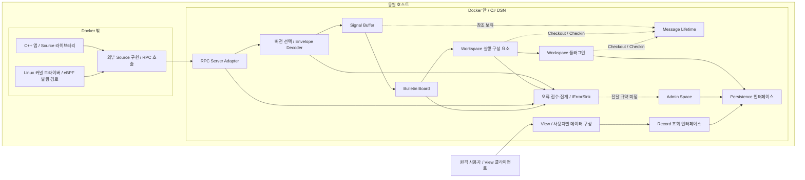

# 아키텍처

> 상세 설계 참조입니다. 처음 읽는 부서원은 [전체 → 기능 → 담당 작업 안내](../development/README.md)에서 시작하세요. 아래 초기 설계의 미정/제안과 현재 구현 선택은 [구현 계약](../implementation/contracts.md)을 함께 확인합니다.

## 시스템 범위와 우선순위

DSN은 C#으로 구현하며 Docker 이미지로 배포한다. Source 구현은 각 Source 담당자의 책임이다. DSN은 Source에 RPC 연동 인터페이스를 제공한다. 현재 대상은 CentOS 9의 C++ 앱과 Linux 커널 드라이버이며, 드라이버에서 eBPF로 발행하는 경로도 포함한다.

Source 호출자의 지연과 CPU 부담을 최소화하는 것이 전달 보장보다 우선이다. 발행은 내부 fire gun의 탄창에 메시지를 적재하는 것으로 끝낸다. 연결과 실제 전송은 별도 실행 흐름이 담당한다. 발행 호출은 대기하지 않으며, 실패를 오류나 예외로 호출자에게 전파하지 않는다. 메시지 손실을 허용하고 ACK/NACK을 요구하지 않는다.

payload는 DSN 공통 계층에 블랙박스다. Source와 Workspace가 인코딩과 스키마를 합의하며, Workspace가 payload를 해석한다. 이상 발생 이력 확인과 TC 진행 상황 조회는 사용 예시이고 시스템의 지원 범위를 제한하지 않는다.

Source–DSN 경계는 우선 RPC로 한정한다. RPC framework와 호출 형태는 미정이다. Source 내부 구현은 외부 책임이며 DSN은 RPC 수신부터 내부 처리를 담당한다.

모듈 간 의존성은 공개 인터페이스로 제한한다. 각 계약은 데이터 소유권, 수명, 순서 및 실패 동작을 정의한다. 모듈별 제공·소비 인터페이스는 [모듈 경계와 검증](04-delivery.md)에 명시한다.

## 배포 경계 — 확정

이 그림은 논리적 경계를 나타낸다. RPC 세부 기술과 저장소 배치는 미정이며, 커널/사용자 공간 중계는 Source 담당자가 결정한다. 원격 연결은 View를 기준으로 하며, 원격 Source 지원을 첫 구현의 전제로 두지 않는다.

## 구성 요소

| 구성 요소 | 책임 |
| --- | --- |
| Source / Message Builder — 외부 | Source 담당자가 내부 API·메시지 준비 방식을 결정 |
| Source / Fire Gun — 외부 | 발행 비대기·실패 비전파 계약 구현; 내부 구조는 Source 담당 범위 |
| RPC Server Adapter | RPC 요청·session·종료와 DSN 내부 입력 인계 |
| Envelope Decoder | 최소 공통 헤더에서 버전 선택, 버전별 구조 검증 및 공통 메시지 표현 제공 |
| Signal Buffer | 수신한 메시지를 보유하고 기본 FIFO 순서로 제공 |
| Bulletin Board | Workspace registry와 전달 대상 결정; 수신 큐·dispatcher는 내부 계약 |
| Workspace 실행 구성 요소 | Workspace 호출, 실행 흐름, 실패 처리 및 참조 반납 보장; 교체 가능한 실행 계약 |
| Message Lifetime | 원본 버퍼, Checkout·Checkin, ref count와 회수 관리 |
| 오류 접수·집계 | IErrorSink 구현, 동일 오류 집계 및 최초·최근 시각과 count 관리 |
| Workspace | 읽기 전용 공유 메시지를 참조하고 payload를 record로 변환 |
| Admin Space | 오류·운영 정보를 관리용 record로 변환하는 특별한 Workspace |
| Persistence | record 저장, 조회 및 export 인터페이스 제공 |
| View | 조회 인터페이스로 record에 접근하고 사용자별 field 선택·조합을 제공; Workspace 직접 조회 없음 |
| DSN Mock | 실제 Source의 메시지를 수신하여 console에 echo하는 개발용 대체 수신기 |

## 실행과 분배 — 확정

DSN 시작 시 Workspace 플러그인을 동적으로 로딩한다. 각 Workspace는 정해진 인터페이스를 구현하고 Bulletin Board에 하나의 이름으로 등록된다. 이름은 조직 내부에서 관리한다. 중복 이름은 후발 등록을 거부하고 IErrorSink에 기록한다.

메시지의 `workspace[]`가 전달 대상이다. 별도 topic은 두지 않는다. Workspace 자체가 topic과 유사한 분배 단위이며, `test.started` 같은 이벤트의 의미는 payload 안에서 처리한다.

Workspace 간 처리 의존성은 없다. Bulletin Board는 전달 대상을 결정하며, 별도 실행 구성 요소가 Workspace를 호출한다. 초기 구현은 단일 실행 루프에서 FIFO로 메시지를 꺼내 대상 Workspace를 순차 호출한다. Workspace별 큐나 전용 스레드는 기본 구성에 두지 않는다. 느린 Workspace는 후속 처리를 지연시킬 수 있으며, 격리나 병렬 실행은 실행 인터페이스를 통해 추후 변경한다. 실행 방식과 queue policy는 별개다.

Message Lifetime은 Bulletin Board와 분리한다. Workspace는 Checkout한 참조를 파싱·복사 직후 Checkin하고, 원본과 독립적인 record를 저장한다. 실행 구성 요소는 실패 경로에서도 미반납 참조가 회수되도록 관리한다.

오류 접수·집계는 Admin Space의 로딩·처리 완료에 의존하지 않는다. Admin Space는 record 변환을 담당하며 저장소·조회 cache·사용자 View 역할을 겸하지 않는다. Persistence는 저장·조회·export, View는 사용자별 데이터 선택·조합을 담당한다. Admin 전달 형식과 원본 첨부 규약은 미정이다.

## 수용과 손실 — 확정 및 구현 제약

DSN은 논리적으로 수신량의 상한을 두지 않고 지속적으로 수신을 시도한다. 실제 자원의 수용 한계를 초과하면 메시지를 폐기하고 IErrorSink로 Admin Space에 오류를 남긴다. 버퍼와 메모리의 물리적 한도는 별도로 설정한다.

Source의 탄창은 넉넉하게 마련하되, 적재할 수 없으면 대기하거나 호출자에게 실패를 전파하지 않는다. Source 내부 용량과 구현 선택은 Source 담당자가 정한다. DSN이 관측하지 못한 Source 내부 손실을 DSN의 ErrorSink가 자동으로 기록할 수 있다고 가정하지 않는다.

`source_id`별 단위 시간당 메시지 수를 관측하고, 추후 Admin Space에 경고를 남길 수 있게 한다. 필요하면 폐기 정책을 적용할 수 있다. 관측 후보는 QA 등록부에 기록하며 상세 monitoring 구현·측정 주기·임계값·운영 조치는 1차 완료 이후에 결정한다.
