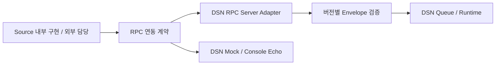

# Source 연동 인터페이스와 DSN Mock

> 상세 설계 참조입니다. 처음 읽는 부서원은 [전체 → 기능 → 담당 작업 안내](../development/README.md)에서 시작하세요. 아래 초기 설계의 미정/제안과 현재 구현 선택은 [구현 계약](../implementation/contracts.md)을 함께 확인합니다.

## 책임 경계 — 확정

Source의 구체 구현은 각 Source 담당자가 결정한다. DSN은 **RPC 연동 인터페이스, envelope 계약, 서버 수신부, Mock과 계약 검증 자료**를 제공한다. 현재 연동 대상은 CentOS 9 C++ 앱과 Linux driver/eBPF 경로이며 이 환경의 내부 구현·라이브러리 배포는 DSN 개발 범위 밖이다.

| Source 담당 | DSN 담당 |
| --- | --- |
| 원 프로젝트에 적합한 언어별 API·ABI | RPC 서비스·메서드·요청 계약 |
| Fire Gun·탄창·직렬화 위치·thread·메모리 수명 | Envelope version과 구조 검증 |
| Kernel/eBPF 발행·필요한 중계·attach/unload | RPC endpoint·수신 session·DSN 내부 입력 인계 |
| 전송 호출·실패 처리 및 원 프로젝트 비대기 보장 | RPC 입력 fixture·Mock·호환성 검증 |

Source 발행의 fire-and-forget, no blocking/no error/no exception, 손실 허용 요구는 유지한다. 이를 만족시키는 탄창·sender 등 내부 구조는 Source 담당자가 선택한다. DSN은 Source 내부 API를 C# 인터페이스로 정의하거나 공통 native SDK 구현을 요구하지 않는다.

## RPC 경계

DSN과 Mock은 같은 RPC 입력 계약을 사용하며 Source가 목적지를 선택한다. 현재는 RPC 경계만 설계한다. 특정 RPC 제품·framework, unary/streaming 등 호출 형태, IDL·직렬화·endpoint 규격은 F-02에서 결정한다. RPC라는 선택만으로 gRPC·Protocol Buffers·특정 포트를 확정하지 않는다.

RPC framework의 전송 상태·응답이 존재할 수 있지만 그것을 메시지 저장·Workspace 처리 성공의 ACK/NACK으로 정의하지 않는다. Source 호출자가 네트워크 완료를 기다리거나 실패를 처리하게 하는 API를 요구하지 않는다. 개별 업무 ACK/NACK·자동 재전송·전달 보장은 추가하지 않는다. 구체 반환/종료 의미는 RPC 선택 시 명시한다.

## Source 전달물

| 산출물 | 내용 | Task |
| --- | --- | --- |
| RPC 인터페이스 규격 | 서비스·호출·요청·상태/응답 의미, session/source_id 매핑 | F-02 |
| Envelope v1 | 필드·타입·version·크기·payload bytes 및 호환성 | F-02 |
| IDL 또는 동등 계약 | 선택한 RPC 방식에서 소비 가능한 정의; 생성 binding 제공 여부 명시 | F-02, F-03 |
| 연동 예제·fixture | 정상·잘못된 요청과 기대 결과, endpoint 설정 예시 | F-03 |
| Console Mock | RPC 요청 수신·검증·echo 및 자체 진단 | I-04 |
| 계약 검증 절차 | 최소 검증 RPC client와 재현 명령; production Source SDK와 구분 | X-01 |

DSN 측 계약 검증용 client는 RPC 요청을 생성하는 테스트 도구다. 원 프로젝트에 통합할 Source 라이브러리 구현이나 kernel/eBPF 중계를 대신하지 않는다.

## DSN Mock

Mock은 전체 DSN·Workspace·Persistence·View 없이 동일 RPC 입력을 수신하여 envelope과 payload 원시 표현을 console에 출력한다. payload 업무 스키마를 해석하지 않는다. 임의 bytes의 hex 표시와 출력 길이 제한은 구현안이며 I-04에서 확정한다.

출력 자원은 유한하게 관리하고 출력 완료·폐기 시 보유한 참조를 회수한다. 느린 console은 Source 전달 성공 보장이나 DSN 성능 지표가 아니다. Mock의 실행·종료·endpoint 예제를 제공한다.

## 검증 책임

- DSN: 실제 RPC 요청 수신·버전 검증·잘못된 요청 처리·session 종료·원본 인계·Mock echo를 검증한다.
- Source 담당: 원 프로젝트의 발행 비대기, 탄창·메모리·thread·driver/eBPF 수명과 RPC 호출 연동을 검증한다.
- 경계 협의: 요청/응답 의미·호환성·최대 크기·Source 식별·endpoint 등 RPC 계약이 달라질 때 수행한다.

DSN 1차 인수는 검증용 RPC client로 수행할 수 있다. 실제 Source가 준비되면 같은 계약으로 연동 검증하며, Source 내부 구현의 완료를 DSN 1차 개발의 선행 조건으로 두지 않는다.
