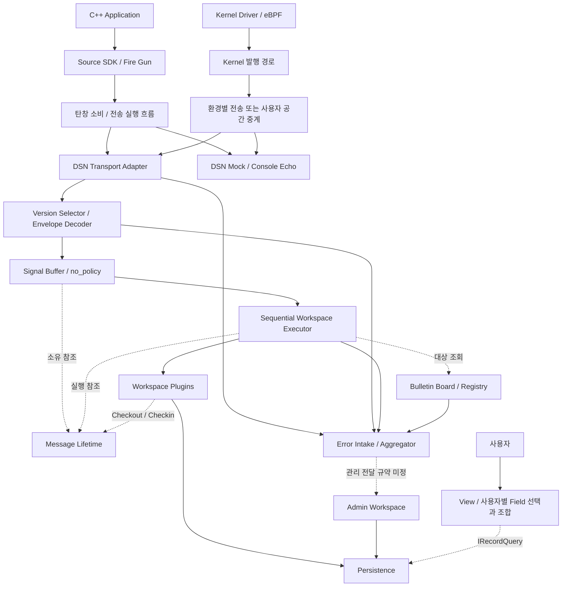
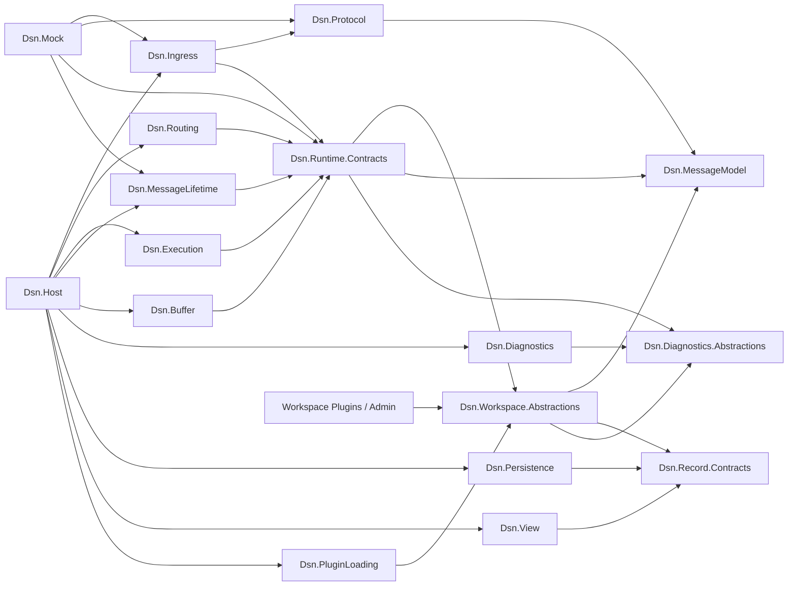
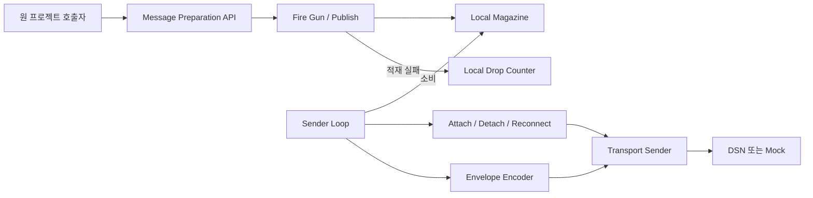
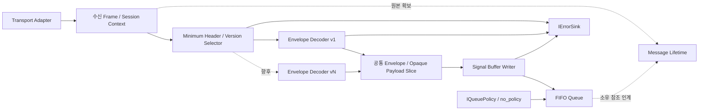
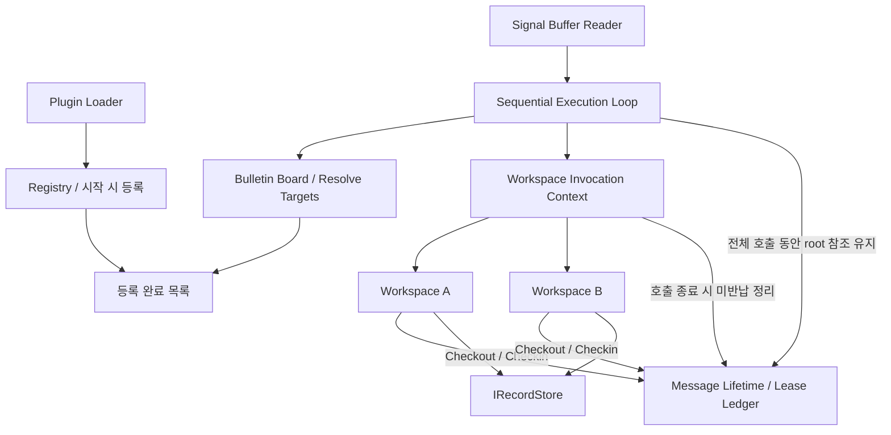
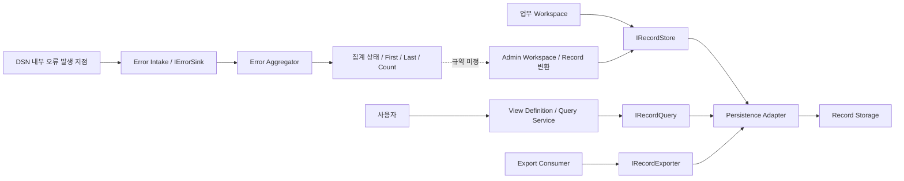
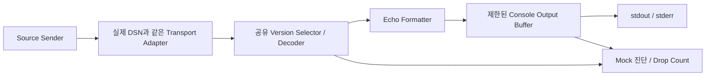

# 시스템·패키지·컴포넌트 구조

## 표기와 설계 상태

필수 동작은 [설계 기준 D01–D25](05-decisions.md)를 따른다. 아래 패키지·클래스 이름과 내부 배치는 **구현 설계안**이다. 패키지는 논리 모듈이며 각각 별도 프로세스나 배포 단위를 뜻하지 않는다. 화살표 의미는 각 그림에서 정의한다.

## SYS-01. 전체 시스템

실선은 메시지 또는 record 흐름, 점선은 참조·조회 또는 상세 규약이 미정인 연결이다.

Mock은 Source의 대체 목적지다. 그림의 두 목적지 화살표가 동일 메시지의 동시 이중 전송을 요구하지 않는다. Admin은 Workspace의 특별한 구현이며, 일반 메시지 경로를 통한 Admin 전달 여부는 미정이다.

## PKG-01. 패키지 의존성

화살표 `A → B`는 **A가 B의 타입 또는 계약에 의존**함을 뜻한다. 데이터 흐름과 다르다. 각 구현은 필요한 계약 부분만 참조하며 Host만 실제 구현을 조립한다.

`Dsn.Runtime.Contracts`는 DSN 내부 모듈 사이의 계약 패키지다. C#에서 다른 assembly가 참조할 수 있다는 사실과 외부 플러그인에 지원하는 API인지는 구분한다. Workspace 프로젝트의 참조 목록에 Runtime·Ingress·Execution 구현을 포함하지 않는 검증을 둔다. 인터페이스별 제공자·소비자는 [IF-01](07-types-and-interfaces.md)에 정의한다.

Native Source는 C# assembly를 참조하지 않는다. 별도 SDK와 wire format 규격 및 공통 입력 fixture로 상호 운용한다. 실제 프로젝트 디렉터리와 assembly 분할은 작업 F-01에서 고정한다.

## CMP-01. Source와 전송

- `Publish`의 외부 계약은 탄창 적재 시도로 끝난다. 탄창 내부의 성공·실패 결과는 호출자에게 오류로 노출하지 않는다.
- Encoder가 호출 경로와 전송 경로 중 어디에 위치할지는 F-03에서 결정한다. 위 그림은 전송 경로에서 encoding하는 안이다.
- Builder가 만든 데이터의 수명, 슬롯의 소유권, producer 동시성은 SDK 계약에 포함한다. Source 전체 zero-copy는 확정 사항이 아니다.
- Attach·Detach는 전송 실행 흐름의 상태 전환이다. 메시지별 ACK/NACK이 아니다.

## CMP-02. Ingress와 Queue

소유 참조는 Decoder 성공 이후에도 동일 원본을 가리킨다. framing을 위해 필요한 조립·복사는 전송 기술 결정에 따른다. 검증 실패나 큐 적재 실패에서는 현재 소유자가 참조를 반납한다. `source_id`가 아직 검증되지 않은 입력 오류는 수신 session 문맥으로 기록할 수 있어야 한다. session과 Source의 매핑 규칙은 F-02에서 결정한다.

## CMP-03. Routing·Execution·Memory

A와 B는 병렬 실행을 나타내지 않는다. 한 메시지에 대한 대상 목록을 얻은 뒤 순차 호출한다. 실행 루프의 root 참조는 마지막 대상 호출까지 유지한다. Workspace가 자신의 lease를 일찍 반납해도 뒤의 대상이 사용할 원본이 남아 있어야 한다. 대상 배열 내 호출 순서와 중복 목적지 처리는 F-04에서 확정한다.

## CMP-04. 오류·Admin·Persistence·View

View는 field 선택·조합 정의를 소유한다. 실제 query 실행을 저장소에 위임할 수 있다. 조회용 cache와 실시간 상태 조회는 기본 구성에 포함하지 않는다. Admin 원본 메시지 wrapping, 첨부 및 집계 결과 갱신 규약은 A-01에서 결정한다.

## CMP-05. DSN Mock

Mock은 Bulletin Board, Workspace, record 저장소, View 없이 실행한다. Echo 데이터가 원본 참조를 보유한다면 출력 완료·폐기 시 반납한다. 초기 구현은 짧은 출력 표현으로 복사한 뒤 원본을 반납하는 안을 우선 검증한다. 출력 용량과 표시 형식은 I-04에서 명시한다.
