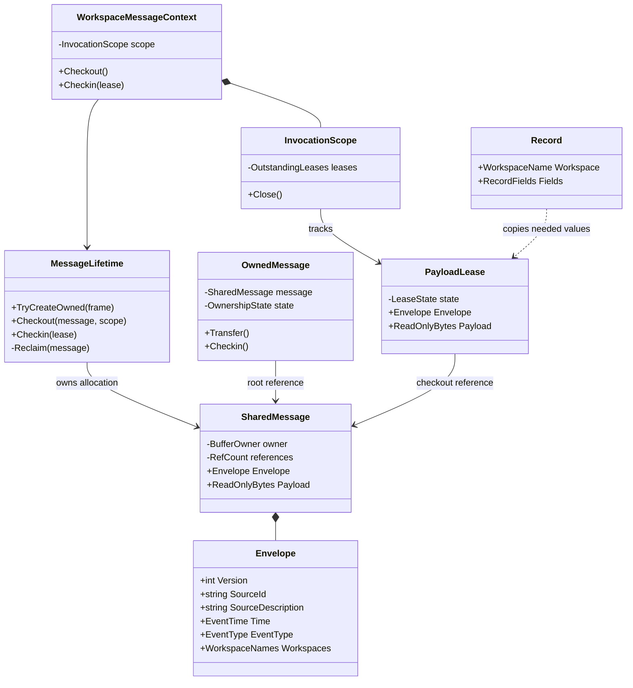
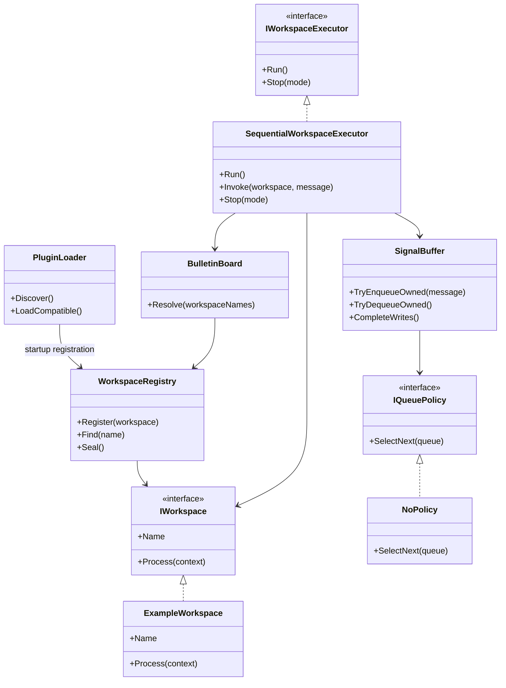
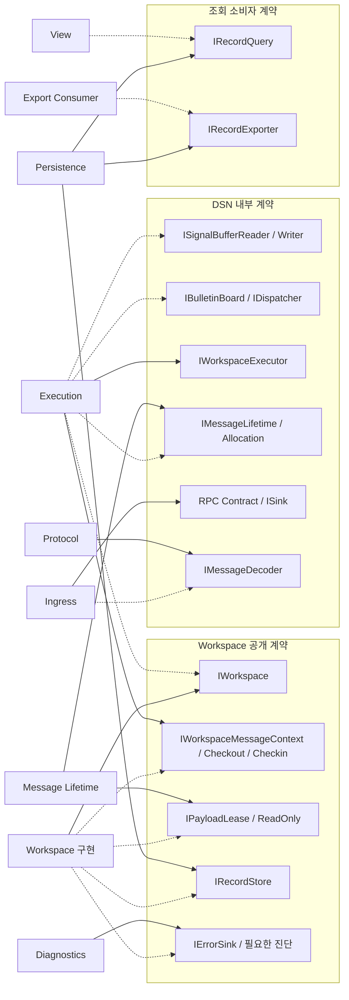
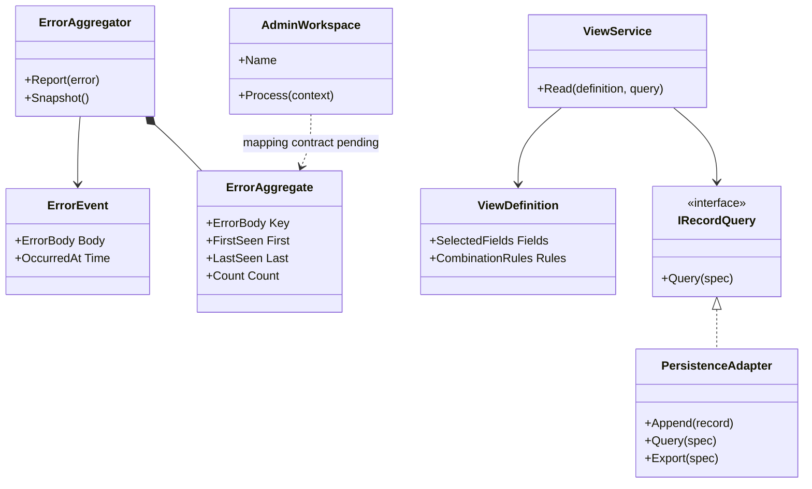

# 클래스와 인터페이스 계약

## 설계 상태

Source–DSN은 RPC 계약을 사용한다. Source 내부 타입·API는 이 문서의 구현 대상이 아니다. RPC의 응답·상태는 업무 처리 ACK/NACK과 구분하며 상세 방식은 F-02에서 정의한다.

아래는 구현을 위한 타입·연산 초안이다. 실제 C# 시그니처, RPC IDL, 동기·비동기 반환 타입과 구체 오류 타입은 F-02–F-05에서 고정한다. `Try*`의 실패 결과는 DSN 내부 제어용이며 Source 호출자에 대한 no error 계약과 구별한다. 추가 내부 인터페이스 이름은 아직 확정된 SDK 이름이 아니다.

## CLS-01. 메시지와 참조 수명



`BufferOwner`, `ReadOnlyBytes`, `EventTime` 등은 의미를 나타내는 이름이다. 특정 메모리 API나 wire 타입을 지정하지 않는다. root 참조는 Ingress → Queue → Executor로 인계되고, 인계 자체는 ref count를 증가시키지 않는다. Workspace Checkout은 별도 참조를 증가시킨다. `OwnedMessage`와 할당 API는 플러그인에 노출하지 않는다.

| 상태 전이 | 필수 조건 |
| --- | --- |
| 원본 확보 → root 보유 | 현재 소유자 하나와 유효한 버퍼 범위가 존재 |
| root 인계 | 이전 소유자가 이후 Checkin하거나 재인계하지 않음 |
| Checkout | 호출 문맥과 원본이 유효하고 새로운 lease의 소유자가 식별됨 |
| Checkin | 해당 lease는 한 번만 count를 감소시킴; 이후 읽기 금지 |
| 호출 문맥 종료 | 실행 중인 사용이 끝난 뒤 미반납 lease를 정리 |
| ref count 0 | Message Lifetime만 원본을 회수; 재사용 전 참조가 없어야 함 |

scope 종료는 실행 중인 코드를 중단시키는 기능이 아니다. 처리 함수가 반환하거나 협력적으로 종료했을 때만 정리한다. timeout만으로 살아 있는 Workspace의 메모리를 재사용하지 않는다. 호출 종료 후 background 작업에 원본을 넘기지 않는 기본 모델을 사용한다.

## CLS-02. 라우팅과 실행



`Seal()`은 시작 시 등록을 완료한 뒤 실행 중 registry 변경을 차단하는 구현안이다. `SelectNext`는 확장점의 의미를 나타내며 실제 API에서 큐 전체를 복사하거나 매번 delegate를 할당할 필요는 없다. `NoPolicy`는 timestamp·event_type을 이용해 순서를 바꾸지 않는다.

## IF-01. 공개·내부 인터페이스 다이어그램

점선은 소비 관계, 실선은 구현체가 제공하는 계약이다.



## 연산별 계약 초안

| ID / 연산 | 제공자 → 소비자 | 입력·출력과 소유권 | 순서·실패·동시성 |
| --- | --- | --- | --- |
| IF-S01 외부 Source 발행 | Source 담당 → 원 프로젝트 | 내부 API·ABI·탄창·메모리 수명은 외부 담당 | 발행 비대기·오류 비전파·손실 허용 요구 유지; DSN 제공 API가 아님 |
| IF-T01 `Attach/Detach` | 전송 adapter → sender/Host | session 자원 수명 관리 | 발행 호출 밖에서 수행; 메시지 ACK/NACK 없음; 원격 전달 성공을 뜻하지 않음 |
| IF-T02 `Receive(frame, session)` | Transport → Ingress sink | 수신 frame 수명과 인계 시점 명시 | 부분 frame·연결 종료 처리는 F-02 규격에 따름 |
| IF-D01 `TryDecode(frame)` | Protocol → Ingress/Mock | 검증된 envelope와 payload 범위 또는 내부 진단 결과 | 공통 헤더보다 짧은 입력, 미지원 버전, 잘못된 범위 검사; payload 해석 없음 |
| IF-M01 `TryCreateOwned(frame)` | Lifetime → Ingress | 성공 시 root 하나, 실패 시 확보한 자원 정리 | 부족 자원은 내부 실패 결과; 호출자가 소유권을 얻었는지 명확히 표시 |
| IF-Q01 `TryEnqueueOwned(root)` | Buffer → Ingress | 성공할 때만 소유권 이전; 실패 시 호출자 소유 유지 | 기본 FIFO; 실패 경로에서 호출자가 Checkin |
| IF-Q02 `TryDequeueOwned()` | Buffer → Executor | dequeue 성공 시 root를 Executor에 인계 | 기본 소비자 하나; 빈 큐 대기 전략은 구현·측정 항목 |
| IF-R01 `Resolve(names)` | Bulletin Board → Executor | 호출 대상 목록; message 원본 소유권 변경 없음 | 이름 유일 등록; 미등록·중복 목적지 정책은 F-04 |
| IF-W01 `Process(context)` | Workspace → Executor | 현재 메시지로 제한된 context; record는 필요한 값의 복사본 | 초기에는 순차 호출, 동시 재진입 없음; 처리 실패는 Executor가 내부 오류로 관측 |
| IF-M02 `Checkout()` | Context/Lifetime → Workspace | 유효한 읽기 전용 lease 반환, count 증가 | 활성 문맥에서만 가능; 무제한 재획득의 운영 한도는 미정 |
| IF-M03 `Checkin(lease)` | Context/Lifetime → Workspace | lease 소유권 반납, count 감소 | 명시적 호출; 종료 정리와 중복 감소 금지; 반납 후 읽기 금지 |
| IF-P01 `Append(record)` | Persistence → Workspace | 원본과 독립적인 record | Checkin 이후 호출; 반환이 메모리 접수인지 영속 완료인지는 F-05에서 명시 |
| IF-P02 `Query(spec)` | Persistence → View | 선택 field·조건·페이지 범위 → record 결과 | Workspace 호출 없음; query 결과 일관성·pagination은 F-05 |
| IF-P03 `Export(spec)` | Persistence → export 소비자 | 저장 record의 export 결과 | 범위·형식·취소·부분 실패 계약은 F-05 |
| IF-E01 `Report(error)` | Diagnostics → 내부 발생 지점 | 오류 본문 및 발생 시각; message 원본 보유를 암묵적으로 요구하지 않음 | 동일 본문 집계; 재귀적인 오류 보고 방지; Admin 실행 대기 없음 |

## IF-02. Workspace 처리 예시

다음은 순서 설명용 의사 코드이며 최종 C# API가 아니다.

```text
Process(context):
    lease = context.Checkout()
    try:
        record = ParseAndCopyNeededFields(lease.Envelope, lease.Payload)
    finally:
        context.Checkin(lease)

    recordStore.Append(record)
```

실행 구성 요소는 호출 문맥 종료 시 미반납 참조를 정리한다. Workspace의 정상 Checkin과 executor의 정리가 동일 참조를 두 번 감소시키지 않아야 한다. 파싱 실패 시 record 저장은 수행하지 않는다. 저장 실패 시 원본을 재획득하거나 재전송하는 동작을 기본으로 추가하지 않는다.

## CLS-03. 오류와 사용자 View



Admin 도식의 점선은 구현 의존성을 확정하지 않는다. 관리 메시지 형식과 전달 계약은 A-01에 남긴다. `ViewDefinition`의 사용자별 보존 위치, record 결합 키, 조회 권한과 API 형식은 F-05·V-01에서 정의한다.
