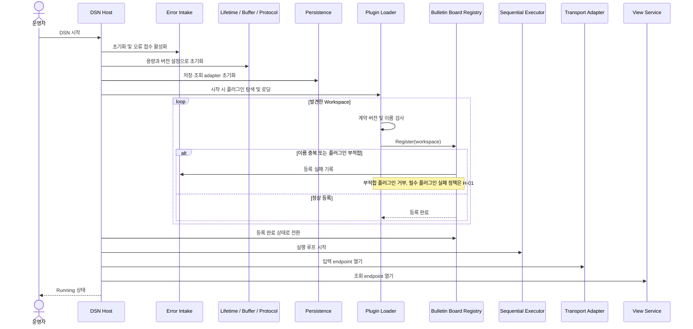
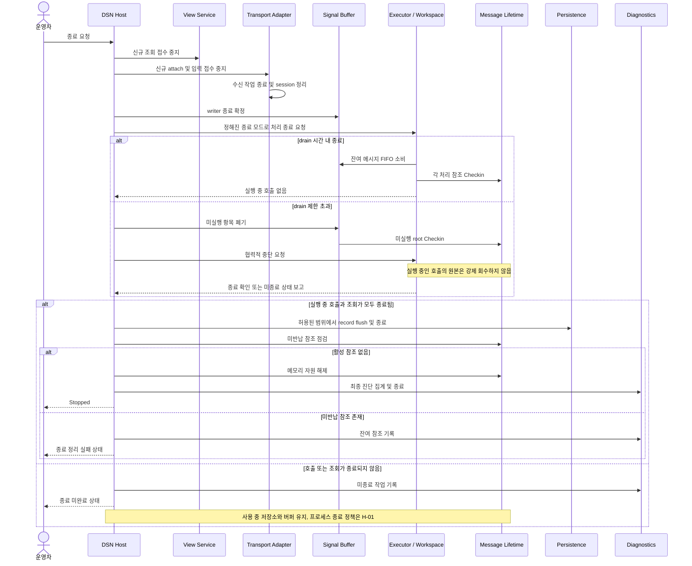
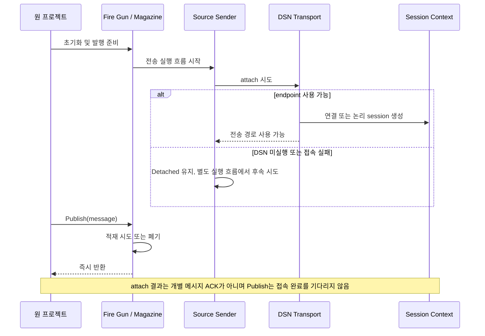
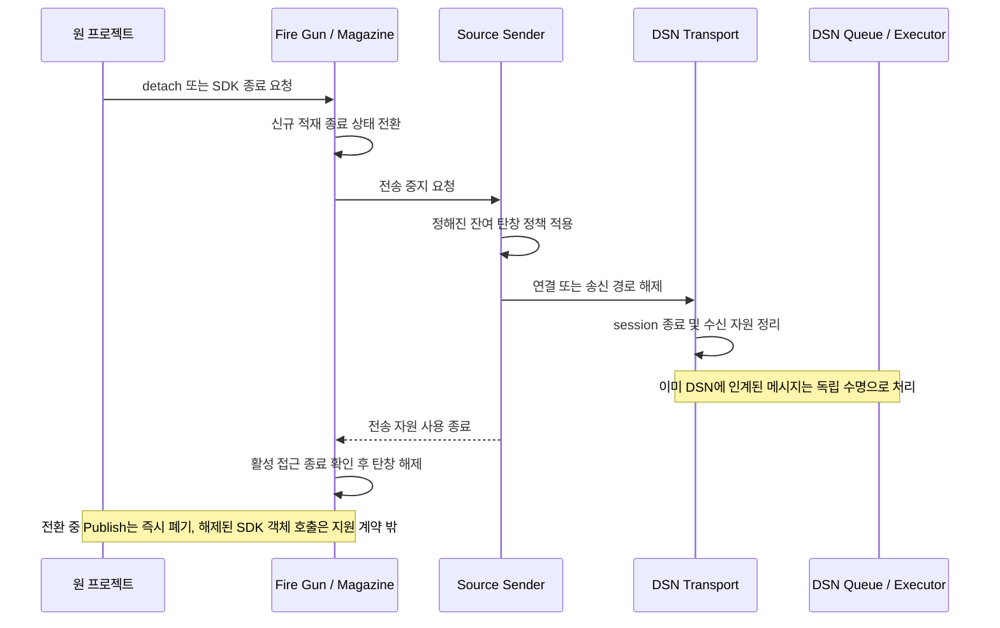
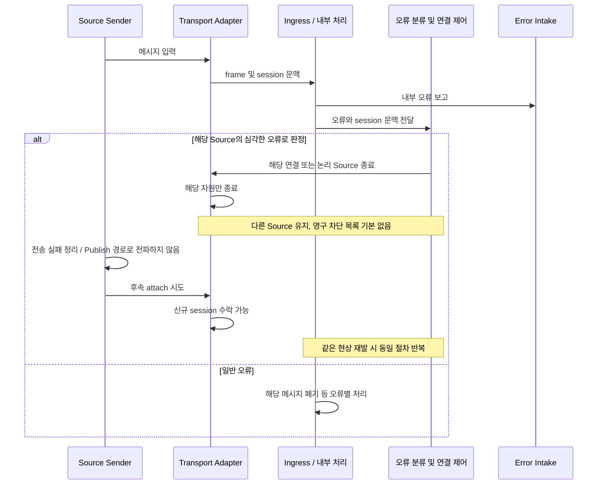
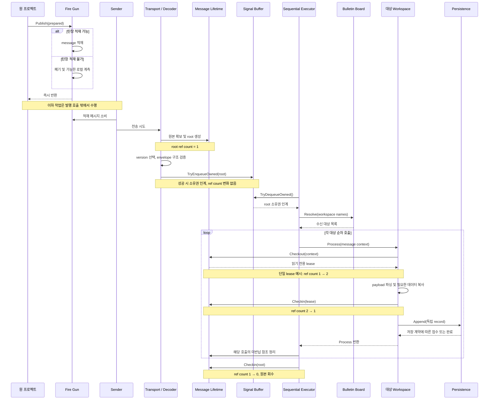
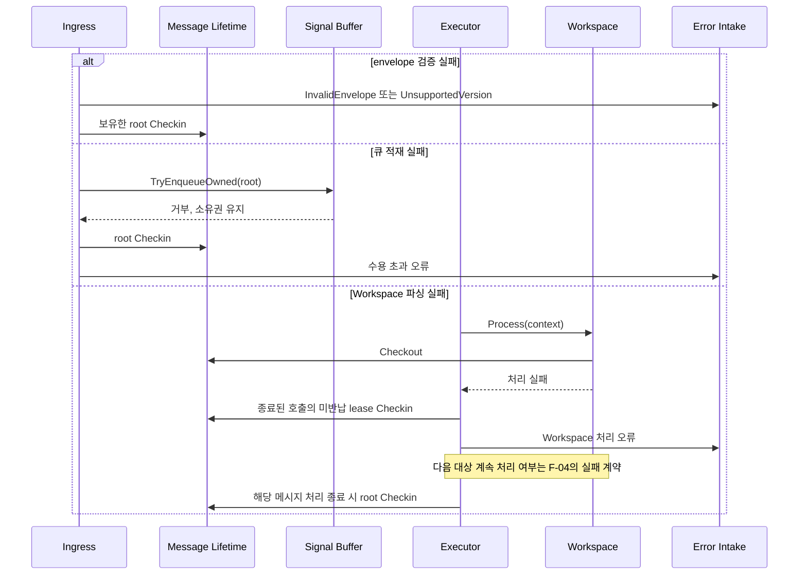
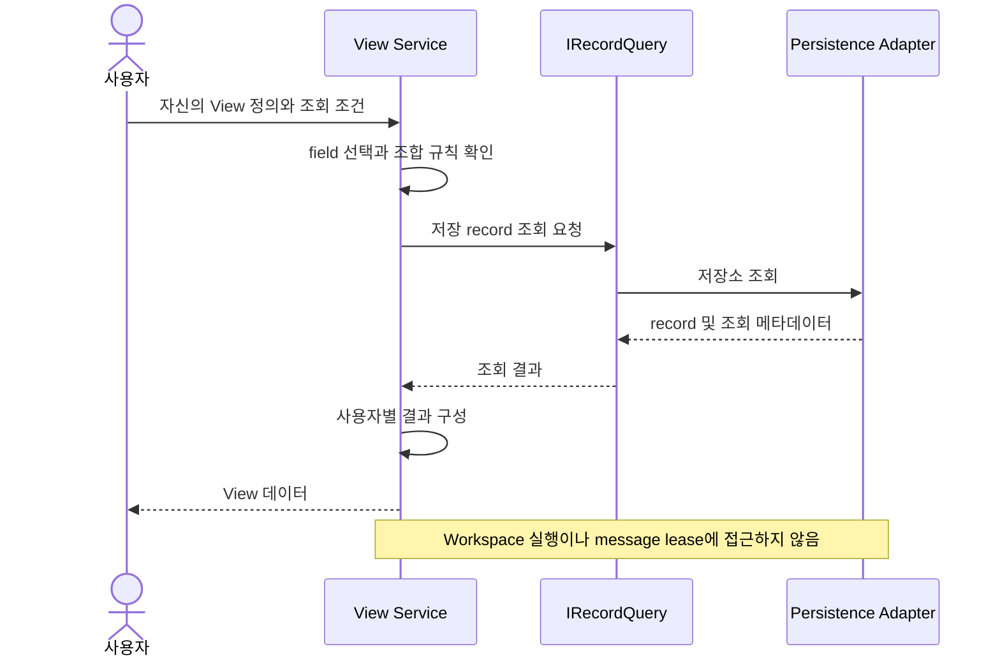

# 주요 실행 시퀀스

아래는 확정된 책임을 연결한 **수명주기 구현안**이다. DSN 시작·종료 정책, Source 재접속·잔여 탄창 정책은 F-03·H-01에서 구체화한다. 메시지 ACK/NACK은 추가하지 않는다. 시간 제한의 수치는 미정이다.

## SEQ-01. DSN 실행

오류 접수는 플러그인 로딩 전에 준비한다. 실행 루프와 registry가 준비되기 전에 입력을 수락하지 않는 순서를 제안한다. 중간 초기화 실패 시 이미 열린 자원을 역순으로 정리하고 Running으로 표시하지 않는다. Admin 로딩 실패가 오류 접수 자체를 막아서는 안 된다.

## SEQ-02. DSN 정상 종료 및 제한 시간 초과

writer 종료는 진행 중인 enqueue까지 정리된 시점을 뜻한다. 정상 drain과 즉시 폐기 중 기본 모드, flush 보장, 제한 시간 및 프로세스 종료 정책은 H-01에서 결정한다. 종료 중 Source는 수신 측 완료를 기다리지 않는다. 큐 폐기와 오류 기록도 항상 완료된다고 가정하지 않는다. Source 연결 재허용 정책은 Running 상태의 오류 대응에 적용하며, DSN 종료 중 신규 연결 수락을 요구하지 않는다.

## SEQ-03. Source attach

attach는 전송 기술에 따라 연결 생성 또는 논리 송신 경로 활성화를 뜻한다. 별도 DSN 등록 handshake를 요구하지 않는다. 연결과 `source_id` 매핑은 F-02에서 정하며, envelope을 보기 전에는 source_id가 알려지지 않을 수 있다. 초기화 자체의 실패 보고 방식은 발행 API와 분리하여 F-03에서 정의한다.

## SEQ-04. Source 정상 detach

detach 시 미송신 메시지를 폐기하는 것을 초기안으로 두되 F-03에서 고정한다. 종료 호출의 동기화와 unload 순서는 발행 호출과 구분한다. DSN이 인계받은 메시지를 Source detach만으로 강제 해제하지 않는다.

## SEQ-05. Source 오류에 따른 연결 종료 및 재attach

심각도와 임계값은 운영 항목이다. 연결 제어 계약의 실제 구현 위치와 다중 Source 중계의 선택적 차단 방식은 F-02·E-03에서 정한다. 테스트에서는 주입된 판정으로 해당 Source만 종료되는지를 검증한다.

## SEQ-06. 메시지 발행·수신·다중 Workspace 처리

그림의 정상 후반 경로는 적재·전송·수신에 성공한 메시지에만 적용한다. Workspace가 자신의 참조를 반납해도 Executor의 root는 마지막 호출까지 유지된다. 따라서 저장이 느리면 root 보유 시간은 여전히 늘어날 수 있다. 별도 record 쓰기 큐를 현재 계약에 암묵적으로 추가하지 않으며 P-01·P-02에서 저장 반환 의미를 정하고 X-04에서 측정한다.

## SEQ-07. 수신 실패와 Workspace 실패

메모리 확보 전에 실패한 경우 존재하지 않는 root를 반납하지 않는다. 오류 보고는 원본 메모리 수명을 암묵적으로 늘리지 않는다. 원본 첨부는 Admin 후속 결정 항목이다.

## SEQ-08. 사용자 View 조회

View 정의의 저장, 사용자 식별, 조회 범위 및 결합 의미는 F-05·V-01에서 고정한다. 원본 이벤트가 저장되기 전 상태는 기본 조회 대상이 아니다.
