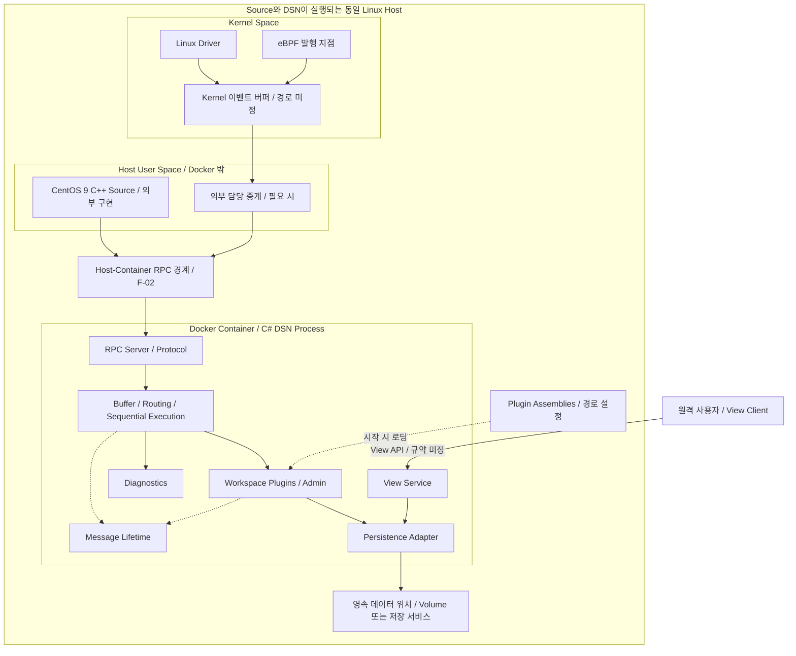
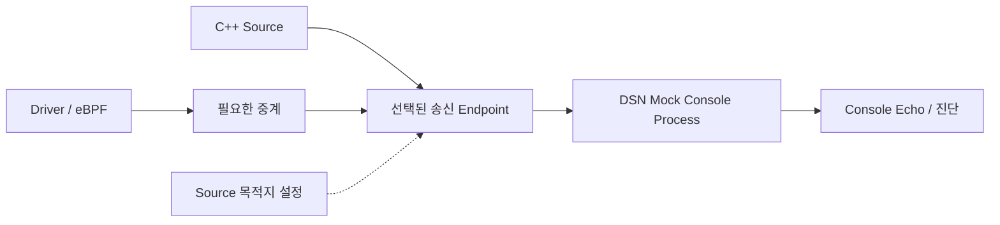

# 배포 View와 수명주기 경계

> 상세 설계 참조입니다. 처음 읽는 부서원은 [전체 → 기능 → 담당 작업 안내](../development/README.md)에서 시작하세요. 아래 초기 설계의 미정/제안과 현재 구현 선택은 [구현 계약](../implementation/contracts.md)을 함께 확인합니다.

## DEP-01. 목표 배포

같은 호스트의 Source는 Docker 밖, C# DSN은 Docker 안에서 실행한다. 원격 연결은 View 조회 경로다. 중계는 외부 Source 담당 범위이며 DSN과의 경계는 RPC다. 저장소 배치는 미정이다.

같은 호스트에서 실행하더라도 Source와 DSN의 주소 공간은 별개다. Message Lifetime의 공유 참조는 DSN 내부에서만 적용한다. 커널 버퍼를 C# Workspace가 직접 참조한다는 의미가 아니다. RPC framework·호출 형태·endpoint는 F-02에서 결정한다. 비RPC 전송 경로 설계는 현재 범위에 포함하지 않는다.

## DEP-02. Source 개발용 Mock 배치

Mock은 DSN 대신 실행한다. 호스트 실행 또는 Docker 실행 제공 범위는 I-04·H-03에서 고정한다. 동일 endpoint를 사용하면 DSN과 Mock을 동시에 binding하지 않는다. 별도 endpoint를 구성할 경우 Source 설정으로 대상을 선택한다.

## 배포 산출물

| 산출물 | 포함 내용 | 생성 task |
| --- | --- | --- |
| DSN Docker 이미지 | Host와 공통 runtime, protocol, 기본 no_policy, 선택한 Persistence·View adapter | H-03 |
| Workspace 계약 패키지 | 공개 API, 호환 버전 정보, 최소 예제 | F-04, R-04 |
| 업무용·Admin 플러그인 | IWorkspace 구현과 의존성 목록 | R-04, A-02 |
| Source RPC 전달물 | RPC 인터페이스·IDL 또는 동등 규격·fixture·호출 예시 | F-02, F-03 |
| DSN Mock | console 프로그램, endpoint 설정, 실행 예제 | I-04 |
| 실행 설정 예제 | 전송 endpoint, 플러그인 경로, 용량, 저장·View 설정 | H-03 |
| 1차 배포·검증 보고 | 지원 환경, 실행 절차, 기능 결과, 미평가 QA 위험 | X-05 |
| 후속 QA 보고 | 1차 이후 관측·평가 결과 및 조치 검토 | E-02, X-04 |

## 설정 경계 초안

아래는 필요한 설정 영역이며 최종 키 이름·기본값은 아니다.

| 영역 | 설정 내용 | 결정 task |
| --- | --- | --- |
| Runtime | .NET 대상, 이미지 기반, CPU architecture | F-01 |
| Transport | endpoint, frame 한도, session 매핑, container 접근 방식 | F-02 |
| Source — 외부 | 내부 탄창·슬롯·재접속 설정은 Source 담당; DSN은 RPC endpoint 규격 전달 | F-03 |
| Buffer / Memory | byte·message 한도, pool 회수, 수용 실패 방식 | F-04, R-01, R-02 |
| Plugins | 발견 경로, 호환성, 필수 플러그인, 중복 등록 | F-04, H-01 |
| Diagnostics | 기본 집계 용량은 1차; 운영 관측·시간 단위·임계값 상세화는 이후 | E-01; 후속 E-02 |
| Persistence / View | 저장 위치, query·export 계약, 원격 endpoint, 사용자 View 정의 | F-05, P-02, V-01 |
| Shutdown | drain·폐기 모드, flush·협력 종료·프로세스 종료 기준 | H-01 |

## 자원과 종료 책임

| 자원 | 생성·종료 책임 | 종료 조건 |
| --- | --- | --- |
| Source 탄창 | SDK / sender | 발행·전송 측 활성 접근이 끝난 뒤 해제 |
| kernel/eBPF 발행 자원 | 해당 adapter 및 중계 | 발행 지점과 소비자의 detach 순서 확인 후 해제 |
| 수신 session | Transport Adapter | 새로운 입력 차단 및 진행 중인 수신 작업 종료 |
| Queue root 참조 | 현재 Queue 또는 Executor | 처리·폐기 경로의 명시적 Checkin |
| Workspace lease | 호출 문맥 / Workspace | 정상 Checkin 또는 반환된 호출의 미반납 정리 |
| 원본 메모리 | Message Lifetime | ref count 0에서만 회수 |
| record 쓰기 자원 | Persistence Adapter | 정의된 flush·종료 계약에 따름 |
| 오류 집계 상태 | Diagnostics | 다른 종료 오류를 관측한 뒤 가능한 범위에서 종료 |

## 배포 전 확인

- DSN host·CPU·.NET·RPC 검증 도구를 기록한다. Source kernel·eBPF 검증 환경은 해당 담당자가 관리한다. 환경별 지원 여부는 실행 증거로 구분한다.
- 선택된 transport에 필요한 mount·권한·endpoint만 배포 설정에 명시한다. 전송 방식 결정 전에 고정 포트나 privileged 실행을 전제하지 않는다.
- 플러그인 계약 assembly 중복 로딩, 의존성 해석, 부적합 버전의 시작 동작을 확인한다.
- container 재시작 시 유지되는 record와 소멸하는 queue·집계 상태를 구분한다. 재전송이나 메시지 복구를 보장하지 않는다.
- 원격 View에 필요한 사용자 식별과 접근 범위는 노출 환경에 맞춰 V-01에서 결정한다. Source 데이터 전송 endpoint를 원격 View endpoint와 혼용하지 않는다.
