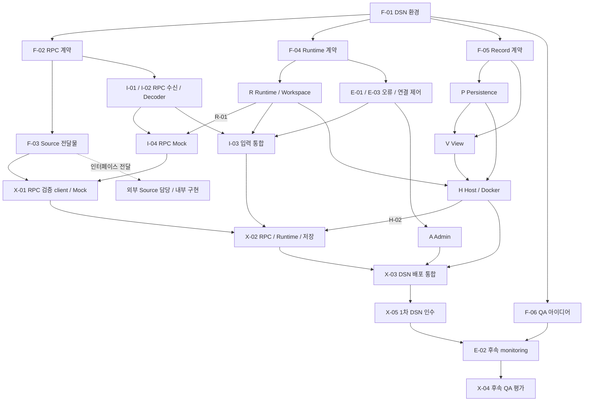

# 구현 작업과 병렬 진행 순서

> 상세 설계 참조입니다. 처음 읽는 부서원은 [전체 → 기능 → 담당 작업 안내](../development/README.md)에서 시작하세요. 아래 초기 설계의 미정/제안과 현재 구현 선택은 [구현 계약](../implementation/contracts.md)을 함께 확인합니다.

## 작업 단위

DSN 계획은 **9개 track, 35개 task, 105개 하위 작업**이다. 33개는 1차 개발, E-02·X-04는 후속 평가로 보류한다. Source 내부 구현은 외부 담당 범위다. 기존 S/K 문서는 외부 책임 표식으로 유지하며 DSN task 수나 선행 조건에 포함하지 않는다.

`F-04.2`는 F track의 네 번째 task에 속한 두 번째 하위 작업이다. 의존성은 task 단위로 관리한다. 각 task 안에서는 하위 작업 순서를 따르되 구현과 검증의 반복은 허용한다. 외부 모듈이 준비되기 전에는 명시된 계약과 대역으로 개발하며, 실제 경로 검증은 X track에서 수행한다.

## Track별 전달 문서

| Track | 범위 | 주요 인터페이스·산출물 | 상세 task |
| --- | --- | --- | --- |
| F | 공통 규격과 기준 | 환경, RPC/session, Source 전달 규격, Workspace·Record 계약, QA·관측 아이디어 | [F-01–06](planning/track-f.md) |
| I | Ingress·Mock | Transport, Version Selector, Decoder, Queue 인계, echo | [I-01–04](planning/track-i.md) |
| R | Runtime | Message Lifetime, Queue/no_policy, Registry, Executor, Workspace SDK | [R-01–06](planning/track-r.md) |
| E | 오류·계측 | IErrorSink·기본 집계·연결 제어; E-02 monitoring은 후속 | [E-01–03](planning/track-e.md) |
| A | Admin Workspace | 전달 규약과 관리용 record 변환 | [A-01–02](planning/track-a.md) |
| P | Persistence | 저장·조회·export, 대역과 실제 adapter | [P-01–03](planning/track-p.md) |
| V | View | 사용자별 정의, field 조합, 원격 query API | [V-01–03](planning/track-v.md) |
| H | Host·배포 | lifecycle, plugin loading, Docker 구성 | [H-01–03](planning/track-h.md) |
| X | 통합·인수 | RPC Mock·실제 DSN·View 기능 인수; X-04 QA 평가는 후속 | [X-01–05](planning/track-x.md) |

Task 상세의 선행 목록이 착수 조건의 기준이다. [task-index.json](planning/task-index.json)은 같은 ID·선행 관계·상태의 기계 판독용 색인이다. task의 ID나 선행 조건을 수정하면 색인과 아래 단계 표도 함께 갱신한다.

## 결정 범위

각 task의 **담당자 결정**은 기존 계약을 유지하는 내부 선택이다. **협의 조건**은 제공자·소비자가 의존하는 계약을 새로 정하거나 변경하는 경우에 적용한다. **협의 대상·관련 경계**는 해당 변경의 직접 영향 범위이며 전원이 모든 구현 결정을 논의할 필요는 없다. 구체 기준은 [담당자 결정과 경계 계약 협의](14-decision-boundaries.md)를 따른다.

Task 착수 조건과 협의 대상은 다르다. 선행 계약이 완료되어 있으면 그 계약을 구현하는 내부 선택은 담당자가 진행한다. 새로운 경계 변경이 생길 때만 해당 제공자·소비자와 변경 내용을 정리한다. task 색인의 `decision_scope`에도 같은 구분을 기록한다.

## PLAN-01. 병렬 흐름 요약

그림은 주요 연결만 표시한다. 모든 필수 선행 조건은 track 문서에 명시한다. 점선이나 생략된 연결을 의존성 면제로 해석하지 않는다.




## 착수 순서와 병렬 가능 범위

1. F-01에서 DSN build·host 환경을 정한다.
2. F-02 RPC 계약, F-04 Runtime, F-05 Record, F-06 QA 아이디어는 병렬로 구체화한다. F-03은 F-02를 바탕으로 Source 전달물을 작성한다.
3. I/R/E/P/V/H는 각 계약과 대역을 기준으로 진행한다. 외부 Source 내부 구현을 기다리지 않는다.
4. I-04와 X-01에서 계약 검증 RPC client로 Mock을 확인한다.
5. X-02·X-03에서 RPC부터 Runtime·저장·Admin·View·Docker까지 검증한다.
6. X-05로 1차 DSN 산출물을 인수한다. E-02·X-04는 이후이며 실제 Source 통합은 준비된 Source 담당자와 같은 RPC 계약으로 수행한다.

아래 L 단계는 task 의존성 그래프의 깊이다. 기간·인원·달력 일정이 아니며, 같은 단계의 다른 task 완료를 기다릴 필요는 없다. 자신에게 지정된 선행 task가 모두 완료되면 착수한다.

### 1차 DSN 개발

| 의존 단계 | 착수 가능한 task |
| --- | --- |
| L0 | [F-01](planning/track-f.md#f-01) |
| L1 | [F-02](planning/track-f.md#f-02), [F-04](planning/track-f.md#f-04), [F-05](planning/track-f.md#f-05), [F-06](planning/track-f.md#f-06) |
| L2 | [F-03](planning/track-f.md#f-03), [I-01](planning/track-i.md#i-01), [I-02](planning/track-i.md#i-02), [R-01](planning/track-r.md#r-01), [R-03](planning/track-r.md#r-03), [E-01](planning/track-e.md#e-01), [P-01](planning/track-p.md#p-01), [V-01](planning/track-v.md#v-01), [H-01](planning/track-h.md#h-01) |
| L3 | [I-04](planning/track-i.md#i-04), [R-02](planning/track-r.md#r-02), [R-04](planning/track-r.md#r-04), [E-03](planning/track-e.md#e-03), [A-01](planning/track-a.md#a-01), [P-02](planning/track-p.md#p-02), [V-02](planning/track-v.md#v-02) |
| L4 | [I-03](planning/track-i.md#i-03), [R-05](planning/track-r.md#r-05), [A-02](planning/track-a.md#a-02), [P-03](planning/track-p.md#p-03), [V-03](planning/track-v.md#v-03), [X-01](planning/track-x.md#x-01) |
| L5 | [R-06](planning/track-r.md#r-06), [H-02](planning/track-h.md#h-02) |
| L6 | [H-03](planning/track-h.md#h-03), [X-02](planning/track-x.md#x-02) |
| L7 | [X-03](planning/track-x.md#x-03) |
| L8 | [X-05](planning/track-x.md#x-05) |

### 1차 완료 이후 — 보류

| 의존 단계 | 착수 가능한 task |
| --- | --- |
| L9 | [E-02](planning/track-e.md#e-02) |
| L10 | [X-04](planning/track-x.md#x-04) |

## 통합 지점과 인수 조건

| 지점 | 완료 task | 인수 조건 |
| --- | --- | --- |
| G1 공통 계약 | F-01–05 | 각 구현 경계와 fixture 확보; 세부 운영 임계값 결정은 필요 없음 |
| G2 RPC 연동 경로 | X-01 | 검증 RPC client와 Mock의 계약 호환성 |
| G3 실제 DSN 기본 경로 | X-02 | 다중 Workspace FIFO 처리, 공유 원본 회수, 실제 record 저장 |
| G4 전체 배포 | X-03 | Docker, 시작·종료, attach/detach, 해당 Source 종료, Admin, 원격 View |
| G5 1차 인수 | X-05 | 기능 결과·지원 범위·패키지·절차 일치; QA 위험은 미평가 상태로 인계 |
| G6 후속 품질 평가 | E-02, X-04 | 1차 완료 이후 관측·평가·조치 검토; 현재 세부 설계 보류 |

G1–G5는 1차 인수 점검 묶음이며 G6는 후속 평가다. 실제 Source 내부 구현은 DSN 인수의 선행 조건이 아니다. 순차 실행 loop가 느린 저장에 의해 지연될 수 있으므로 G3에서 원본 수명 동작을 확인하고 G6에서 성능 영향을 평가한다. F-06은 현재 QA·위험·관측 아이디어 기록만 담당하고 수치 목표·도구·주기·monitoring 구현은 확정하지 않는다.

## 작업 완료 기록

각 task 완료 시 다음 정보를 남긴다. 설계 결정 task는 구현 테스트 대신 결정 규격·fixture·검토 결과를 증거로 사용한다.

```text
Task ID:
변경 위치 또는 commit:
구현한 계약 / 적용 버전:
검증 환경 및 실행 명령:
실제 결과 또는 결과 파일:
완료 기준 충족 여부:
남은 제약 / 후속 task:
```

진행 중 구현이 선행 계약 변경을 요구하면 해당 F 또는 A/H/V 결정 task에 영향을 기록한다. 임계값·재정렬·Workspace 격리 같은 후속 운영 정책을 현재 확정 요구사항으로 추가하지 않는다.

## 일정 산정

현재 인일·완료 날짜는 지정하지 않는다. 검증 장비와 전송·저장 기술이 정해진 뒤 task별 추정치를 추가한다. 전체 완료 시점은 의존 경로와 병렬 자원에 따라 산정해야 하며, L 단계 수를 작업 일수로 환산하지 않는다.

## 개발 준비도와 QA 범위

[개발 계약 점검](12-engineering-readiness.md)의 GAP-01–10을 기존 결정 task에서 완료한다. [Quality Attribute 등록부](13-quality-attributes-and-risks.md)는 위험과 관측 후보를 기록하며 상세 구현을 추가하지 않는다. 정확한 Checkin·FIFO·오류 기본 처리·종료 기능의 검증과 결함 수정은 1차 범위다.
