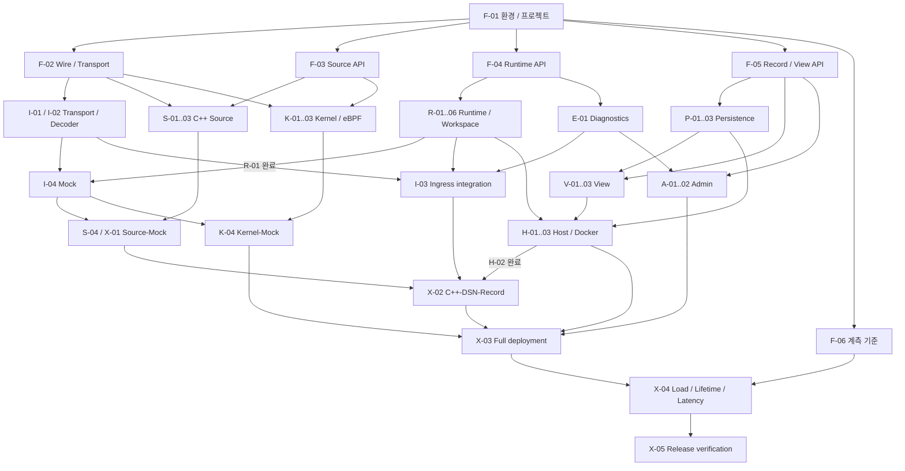

# 구현 작업과 병렬 진행 순서

## 작업 단위

계획은 **11개 track, 43개 task, 129개 하위 작업**으로 구성한다. Track은 기술 영역이고 인원 배정 단위가 아니다. 각 task는 선행 task, 입력 문서, 하위 작업, 산출물, 완료 기준을 가진다. 구현 상태는 모두 미착수이며 설계 문서 작성 완료와 구분한다.

`F-04.2`는 F track의 네 번째 task에 속한 두 번째 하위 작업이다. 의존성은 task 단위로 관리한다. 각 task 안에서는 하위 작업 순서를 따르되 구현과 검증의 반복은 허용한다. 외부 모듈이 준비되기 전에는 명시된 계약과 대역으로 개발하며, 실제 경로 검증은 X track에서 수행한다.

## Track별 전달 문서

| Track | 범위 | 주요 인터페이스·산출물 | 상세 task |
| --- | --- | --- | --- |
| F | 공통 규격과 기준 | 환경, wire/session, Source API, Workspace·Record 계약, 계측 계획 | [F-01–06](planning/track-f.md) |
| S | C++ Source SDK | Fire Gun, Magazine, Encoder, Sender, SDK 패키지 | [S-01–04](planning/track-s.md) |
| K | Kernel·eBPF Source | 환경별 adapter, 중계, detach와 unload | [K-01–04](planning/track-k.md) |
| I | Ingress·Mock | Transport, Version Selector, Decoder, Queue 인계, echo | [I-01–04](planning/track-i.md) |
| R | Runtime | Message Lifetime, Queue/no_policy, Registry, Executor, Workspace SDK | [R-01–06](planning/track-r.md) |
| E | 오류·계측 | IErrorSink, 동일 오류 집계, Source 수신량, 연결 제어 | [E-01–03](planning/track-e.md) |
| A | Admin Workspace | 전달 규약과 관리용 record 변환 | [A-01–02](planning/track-a.md) |
| P | Persistence | 저장·조회·export, 대역과 실제 adapter | [P-01–03](planning/track-p.md) |
| V | View | 사용자별 정의, field 조합, 원격 query API | [V-01–03](planning/track-v.md) |
| H | Host·배포 | lifecycle, plugin loading, Docker 구성 | [H-01–03](planning/track-h.md) |
| X | 통합·인수 | Mock, 실제 DSN, kernel, View, 장애·부하, Release 검증 | [X-01–05](planning/track-x.md) |

Task 상세의 선행 목록이 착수 조건의 기준이다. [task-index.json](planning/task-index.json)은 같은 ID·선행 관계·상태의 기계 판독용 색인이다. task의 ID나 선행 조건을 수정하면 색인과 아래 단계 표도 함께 갱신한다.

## PLAN-01. 병렬 흐름 요약

그림은 주요 연결만 표시한다. 모든 필수 선행 조건은 track 문서에 명시한다. 점선이나 생략된 연결을 의존성 면제로 해석하지 않는다.



## 착수 순서와 병렬 가능 범위

1. **F-01**로 환경과 프로젝트 경계를 먼저 고정한다.
2. **F-02·03·04·05·06**은 병렬로 구체화할 수 있다. 각 계약이 완료되는 즉시 해당 구현 task를 시작하며 F 전체 완료를 기다리지 않는다.
3. Source·Ingress·Runtime·오류·Persistence·View는 계약 및 대역을 기준으로 병렬 구현한다. 예를 들어 I-01과 I-02, R-01과 R-03, K-02와 K-03은 서로 독립이다.
4. **I-04 Mock**은 C++ 및 kernel Source의 초기 통합 지점이다. Admin 상세나 원격 View가 완료될 때까지 Source 검증을 미루지 않는다.
5. **X-02**에서 C++ 입력→공유 메시지→다중 Workspace→실제 저장을 검증한다. Admin·kernel 경로는 **X-03** 전체 통합에 합류한다.
6. **X-04**에서 부하와 자원 수명을 측정하고, **X-05**에서 배포 산출물·문서·검증 증거를 인수한다.

아래 L 단계는 task 의존성 그래프의 깊이다. 기간·인원·달력 일정이 아니며, 같은 단계의 다른 task 완료를 기다릴 필요는 없다. 자신에게 지정된 선행 task가 모두 완료되면 착수한다.

| 의존 단계 | 착수 가능한 task |
| --- | --- |
| L0 | [F-01](planning/track-f.md#f-01) |
| L1 | [F-02](planning/track-f.md#f-02), [F-03](planning/track-f.md#f-03), [F-04](planning/track-f.md#f-04), [F-05](planning/track-f.md#f-05), [F-06](planning/track-f.md#f-06) |
| L2 | [S-01](planning/track-s.md#s-01), [K-01](planning/track-k.md#k-01), [I-01](planning/track-i.md#i-01), [I-02](planning/track-i.md#i-02), [R-01](planning/track-r.md#r-01), [R-03](planning/track-r.md#r-03), [E-01](planning/track-e.md#e-01), [P-01](planning/track-p.md#p-01), [V-01](planning/track-v.md#v-01), [H-01](planning/track-h.md#h-01) |
| L3 | [S-02](planning/track-s.md#s-02), [K-02](planning/track-k.md#k-02), [K-03](planning/track-k.md#k-03), [I-04](planning/track-i.md#i-04), [R-02](planning/track-r.md#r-02), [R-04](planning/track-r.md#r-04), [E-03](planning/track-e.md#e-03), [A-01](planning/track-a.md#a-01), [P-02](planning/track-p.md#p-02), [V-02](planning/track-v.md#v-02) |
| L4 | [S-03](planning/track-s.md#s-03), [K-04](planning/track-k.md#k-04), [I-03](planning/track-i.md#i-03), [R-05](planning/track-r.md#r-05), [A-02](planning/track-a.md#a-02), [P-03](planning/track-p.md#p-03), [V-03](planning/track-v.md#v-03) |
| L5 | [S-04](planning/track-s.md#s-04), [R-06](planning/track-r.md#r-06), [E-02](planning/track-e.md#e-02), [H-02](planning/track-h.md#h-02) |
| L6 | [H-03](planning/track-h.md#h-03), [X-01](planning/track-x.md#x-01) |
| L7 | [X-02](planning/track-x.md#x-02) |
| L8 | [X-03](planning/track-x.md#x-03) |
| L9 | [X-04](planning/track-x.md#x-04) |
| L10 | [X-05](planning/track-x.md#x-05) |

## 통합 지점과 인수 조건

| 지점 | 완료 task | 인수 조건 |
| --- | --- | --- |
| G1 공통 계약 | F-01–05 | 각 구현 경계와 fixture 확보; 세부 운영 임계값 결정은 필요 없음 |
| G2 Source 개발 경로 | X-01, K-04 | 실제 C++·kernel·eBPF 발행을 Mock에서 검증 |
| G3 실제 DSN 기본 경로 | X-02 | 다중 Workspace FIFO 처리, 공유 원본 회수, 실제 record 저장 |
| G4 전체 배포 | X-03 | Docker, 시작·종료, attach/detach, 해당 Source 종료, Admin, 원격 View |
| G5 계측·전달 | X-04, X-05 | 결과·지원 범위·패키지·실행 절차 일치; 미정 목표는 미정으로 표시 |

G1–G5는 인수 점검 묶음이다. G2의 kernel 검증이 남아 있어도 task 선행 조건을 충족한 X-02는 진행할 수 있다. 순차 실행 loop가 느린 저장에 의해 지연될 수 있으므로 G3에서 원본 수명 동작을 확인하고 G5에서 성능 영향을 계측한다.

## 작업 완료 기록

각 task 완료 시 다음 정보를 남긴다. 설계 결정 task는 구현 테스트 대신 결정 규격·fixture·검토 결과를 증거로 사용한다.

```text
Task ID:
변경 위치 또는 commit:
구현한 계약 / 적용 버전:
검증 환경 및 실행 명령:
실제 결과 또는 결과 파일:
완료 기준 충족 여부:
남은 제약 / 후속 task:
```

진행 중 구현이 선행 계약 변경을 요구하면 해당 F 또는 A/H/V 결정 task에 영향을 기록한다. 임계값·재정렬·Workspace 격리 같은 후속 운영 정책을 현재 확정 요구사항으로 추가하지 않는다.

## 일정 산정

현재 인일·완료 날짜는 지정하지 않는다. 검증 장비와 전송·저장 기술이 정해진 뒤 task별 추정치를 추가한다. 전체 완료 시점은 의존 경로와 병렬 자원에 따라 산정해야 하며, L 단계 수를 작업 일수로 환산하지 않는다.
