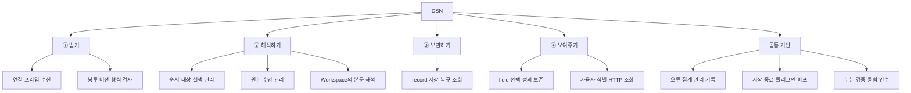
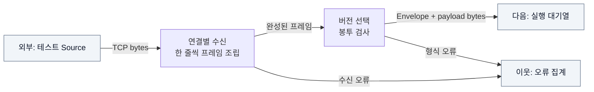
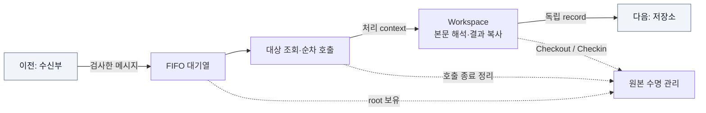
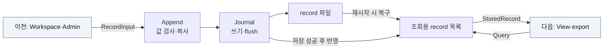
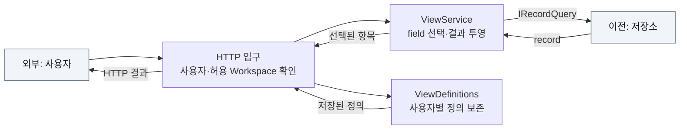
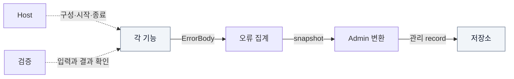

# 네 단계를 열어 보기

[전체로 ↑](README.md) · [다음: 작업 배분 →](02-work-division.md)

앞에서 본 DSN의 네 단계에, 모든 단계가 함께 쓰는 기반을 더한다. 아래는 역할 분해 그림이다. 연결선은 **포함 관계**이며 실행 순서가 아니다.

여기서부터는 한 덩어리씩 확대한다. 아래 상세 그림의 실선은 데이터 또는 호출, 점선은 관리 관계이며 라벨로 구분한다. 회색 상자는 해당 그림 바깥의 이웃이다.

## ① 받기: 다양한 입력을 한 가지 내부 표현으로 바꾼다

연결 관리와 봉투 검사를 분리하면 같은 decoder를 서버와 Mock에서 함께 쓸 수 있다. 수신 담당자는 TCP의 쪼개진 bytes를 조립하지만 업무 본문을 해석하지 않는다. 검사에 성공하면 실행 담당자에게 인계한다. 검사에 실패하면 오류를 남기고 규약에 따라 해당 메시지를 버리거나 연결을 닫는다.

**분해의 끝:** 연결·decoder·독립 Mock을 [W01 수신 담당](assignments/01-ingress.md)의 묶음으로 둔다. 이 묶음은 고정 RPC bytes와 가짜 수신 callback만으로 검증할 수 있다.

## ② 해석하기: 순서를 지키고 같은 원본을 안전하게 읽는다

순서·대상·실행은 “누구를 언제 부를 것인가”, 수명 관리는 “아직 읽는 사람이 있는가”, Workspace는 “본문이 무슨 뜻인가”를 맡는다. 서로 다른 질문이므로 독립 작업 단위로 나눈다.

원본을 Workspace마다 복제하지 않는다. 실행부는 전체 대상 호출이 끝날 때까지 root 참조를 보유한다. 각 Workspace는 필요한 값을 복사한 뒤 자기 lease를 반납하고 저장한다. 앞 Workspace가 반납해도 뒤 Workspace가 읽을 원본은 남아 있다.

**분해의 끝:** [W02 원본 수명](assignments/02-lifetime.md), [W03 실행](assignments/03-runtime.md), [W04 Workspace](assignments/04-workspace.md). 각 담당자는 가짜 이웃으로 자기 동작을 확인한 뒤 서로 연결한다.

## ③ 보관하기: 원본과 무관한 결과를 남긴다

Workspace는 저장소 구현을 몰라도 `IRecordStore`로 기록할 수 있다. View는 `IRecordQuery`로 읽는다. 저장 담당자는 그 사이에서 값 복사, 성공의 의미, 재시작 복구, 조회 순서를 책임진다. 따라서 업무 본문 형식이나 HTTP 인증을 구현할 필요가 없다.

**분해의 끝:** [W06 저장 담당](assignments/06-persistence.md). Memory 대역과 실제 Journal에 같은 record 예제를 넣어 결과를 비교한다.

## ④ 보여주기: 저장된 항목을 사용자별로 선택한다

사용자가 고르는 것은 저장된 field다. View가 Workspace를 직접 호출하지 않는다. 같은 record에 대해 사용자마다 다른 정의를 저장할 수 있다. 현재 조합은 여러 record를 동일 column 목록으로 보여주는 방식이고, record끼리 자동 join하지 않는다.

**분해의 끝:** [W07 View 담당](assignments/07-view.md). 조회 대역으로 field 결과를 먼저 확인하고, Host 담당자가 HTTP 조립부에 연결한다.

## 공통 기반: 오류를 남기고, 전체를 켜고, 함께 검증한다

오류를 모으는 일과 관리용 record를 만드는 일은 분리돼 있다. 현재는 가까운 기능이므로 [W05 오류·Admin 담당](assignments/05-diagnostics.md) 한 묶음으로 배분한다. 모듈 조립은 [W08 Host 담당](assignments/08-host.md), 전체 경계의 실제 동작 확인은 [W09 통합 검증 담당](assignments/09-verification.md)이 맡는다.

## 이 역할들은 실제 코드에서 어디에 있는가?

위 상자는 논리적 작업 단위다. 현재 assembly 배치는 아래와 같으며 상자 하나마다 프로젝트 하나가 존재하는 것은 아니다.

| 실제 프로젝트 | 들어 있는 작업 단위 |
| --- | --- |
| `Dsn.Contracts` | 모든 담당자가 공유하는 Workspace·lease·record·오류 계약 |
| `Dsn.Core` | W01 수신, W02 수명, W03 실행, W05 오류/Admin, W06 저장, W07 View, W08 plugin loader |
| `Dsn.Workspaces` | W04 본문 해석 예제 |
| `Dsn.Host` | W08 조립·설정·lifecycle + W07 HTTP 연결부 |
| `Dsn.Mock` | W01 독립 수신 Mock |
| `tests/Dsn.Tests`, `tests/Dsn.TestSource` | W09 통합 인수와 테스트 발행기 |

**다음 → [이 경계를 실제로 나눠 맡고 다시 합치기](02-work-division.md)**
