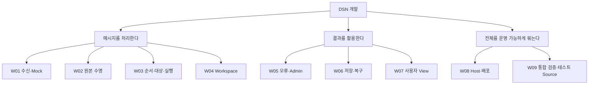

# 작업 배분과 다시 합치기

[전체로 ↑](README.md) · [기능 분해도로 ↑](01-system-breakdown.md)

앞 페이지의 상자를 **입력·출력·검증을 독립적으로 정할 수 있는 크기**로 나눈다. 담당자는 그 안에서 작업하고, 이웃과 합의한 입출력으로 다시 합친다. 역할 이름은 실제 담당자 배정을 위한 자리이며 9명 채용이나 9개 팀을 뜻하지 않는다.

## 1. 나눠 맡을 작업의 끝 단위

연결선은 업무의 포함 관계다. W 번호는 새 안내서의 작업 묶음 식별자이며 기존 F/I/R 등의 task 번호를 바꾸지 않는다.



이 크기에서 멈추는 이유는 각 묶음에 소유 코드가 있고, 실제 이웃 대신 대역을 넣어 기대 결과를 검증할 수 있기 때문이다. 예를 들어 Workspace 담당자는 가짜 context와 메모리 저장소로 개발하고, 실제 TCP 연결 완료를 기다리지 않는다.

## 담당 지시서 선택

| 역할 | 맡은 사람이 만들어 내는 결과 | 자기 부분의 지시서 |
| --- | --- | --- |
| W01 수신 | TCP bytes를 검증한 메시지로 인계, 독립 Mock 수신 | [수신·봉투 검사·Mock](assignments/01-ingress.md) |
| W02 수명 | 읽는 동안 원본 유지, 마지막 반납 때 한 번 회수 | [공유 원본과 lease](assignments/02-lifetime.md) |
| W03 실행 | 수용된 순서로 각 대상 호출, 실패 시 정리 | [대기열·등록·실행](assignments/03-runtime.md) |
| W04 Workspace | 자기 본문 규격을 record로 변환 | [본문 해석 플러그인](assignments/04-workspace.md) |
| W05 진단 | 같은 오류 집계, Admin record로 전달 | [오류와 관리 기록](assignments/05-diagnostics.md) |
| W06 저장 | record 영속 저장, 복구, 조회와 export | [저장소](assignments/06-persistence.md) |
| W07 View | 허용된 record의 field 선택, 사용자별 정의 | [사용자 View](assignments/07-view.md) |
| W08 Host | 구현 조립, plugin 로딩, 안전한 시작·종료와 배포 | [Host와 배포](assignments/08-host.md) |
| W09 검증 | 부분 결과를 실제 TCP·HTTP·파일 경계에서 확인 | [통합 인수](assignments/09-verification.md) |

부서 내 배정 시 아래 한 줄을 해당 지시서 또는 작업 이슈에 채운다. 실명은 아직 정하지 않는다.

```text
담당자: / 맡을 W 번호: / 이번 변경 목표: / 완료 증거 위치:
```

## 2. 동시에 진행하려면 먼저 무엇을 맞추는가?

전체 팀이 모든 내부 구조를 결정할 필요는 없다. 연결되는 두 담당자는 **주는 값, 받는 값, 실패 결과, 수명**을 먼저 맞춘다. 현재 계약과 코드가 있으므로 이를 출발점으로 삼는다.

| 연결 | 먼저 맞출 것 | 개발 중 사용할 대역 |
| --- | --- | --- |
| W01 → W03 | `DecodedMessage`, Submit 이후 payload 소유권, 수용 거부 | 메시지를 모으는 callback |
| W02 ↔ W03/W04 | Checkout/Checkin, context 종료, root와 lease 수명 | 가짜 Workspace·수명 ledger |
| W04/W05 → W06 | scalar record, Append 성공·실패·취소 의미 | `MemoryRecordStore` 또는 실패/지연 저장 대역 |
| W06 → W07 | Query 순서·페이지·field 목록·null | 고정 record를 반환하는 `IRecordQuery` |
| W07 ↔ W08 | 사용자 식별·scope·HTTP 입력/상태 코드 | HTTP 요청/응답 fixture |
| 전체 ↔ W08/W09 | 시작 준비 시점·종료·실행 명령 | 동적 포트·임시 저장 디렉터리 |

이 표는 의존 관계이지 착수 대기열이 아니다. 기존 계약을 유지하는 수정은 바로 진행한다. 공개 계약을 바꿀 때만 해당 이웃과 정상·오류 예제를 함께 고친다.

## 3. 같은 파일을 여러 담당자가 건드리는 지점

현재 구현에는 한 파일 안에 여러 역할이 모여 있는 곳이 있다. 아래 대표 편집 역할로 변경을 모아 병합한다. 역할 분담을 위해 이번 문서 작업에서 코드를 임의로 옮기지는 않는다.

| 공유 파일 | 대표 편집 역할 | 나머지 담당자가 전달할 것 |
| --- | --- | --- |
| `Dsn.Contracts/Contracts.cs` | 바뀌는 계약의 제공자: lease W02, Workspace W04, record W06, error W05 | 영향을 받는 소비자의 정상·오류 fixture. 여러 계약 변경은 한 명을 편집자로 정함 |
| `Dsn.Host/DsnApplication.cs` | W08 | W07은 HTTP 계약·처리 변경안, W05는 Admin 호출 조건 |
| `Dsn.Host/Settings.cs` | W08 | 해당 기능 담당자가 키·기본값·허용 범위·오류 예제 |
| `tests/Dsn.Tests/Program.cs` | W09 | 각 담당자가 테스트 또는 재현 입력과 기대값 |
| 공통 빌드·배포 설정 | W08 | 의존 프로젝트·실행 조건의 변경안 |

서로 다른 역할이 같은 파일을 동시에 독립 수정해야 한다면 작업 시작 때 한 명이 최종 편집을 맡거나 파일 분리를 별도 변경으로 잡는다.

## 4. 다시 합치는 순서

다음 그림은 **통합 검증 순서**다. 앞 단계가 끝나기 전에도 각 담당자는 대역으로 자기 개발을 진행할 수 있다.


| 통합 지점 | 참여 역할 | 연결되었다고 판단할 증거 |
| --- | --- | --- |
| 1. 입력 경계 | W01, W09 | 분할·병합 프레임, 같은 RPC 계약으로 Mock hex 출력 |
| 2. 내부 처리 | W02, W03, W04 | FIFO, 실패한 대상 뒤 계속 처리, 최종 참조 0 |
| 3. 결과 경계 | W04, W05, W06, W07 | 원본 반납 후에도 record 유지, 사용자별 다른 조회 결과 |
| 4. 실행 프로세스 | W01–W09의 해당 변경 담당 | 실제 TCP→record→HTTP, 재시작 복구, 종료/rollback |
| 5. 배포 | W08, W09 | Linux Docker build/run, volume 재시작, 호스트 입력과 View 조회 |

현재 1–4 관련 Termux 기능 검증은 13개 그룹이 통과했다. 5는 실행 검증이 남아 있다. 문서가 새로 정리됐다는 이유로 인수 상태를 바꾸지 않는다. [검증 근거](../implementation/verification.md)

## 5. 담당자에게 전달할 지시서의 사용법

각 지시서는 **역할 한 문장 → 이웃을 포함한 부분 그림 → 입력/출력 → 소유 코드 → 작업 순서 → 사례별 완료 조건 → 인계물** 순서다. 현재 기능은 이미 구현돼 있으므로, 작업 순서는 처음부터 다시 만들라는 뜻이 아니라 맡은 부분을 이해하고 수정·확장할 때 따르는 순서다.

한 작업을 끝냈다면 변경 코드와 함께 “어떤 입력이 어떤 결과가 됐는가”를 전달한다. 상대 담당자가 대역을 실제 구현으로 교체해 같은 결과를 얻으면 해당 경계의 통합을 마친다.

옛 task 번호가 필요한 경우 각 지시서 끝의 추적 링크만 사용한다. 처음부터 35개 task와 모든 계약 문서를 읽는 것은 공통 선행 과제가 아니다.
