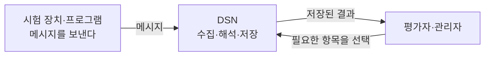
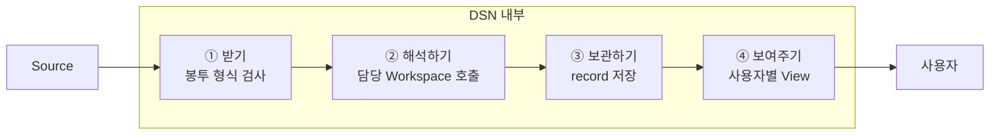
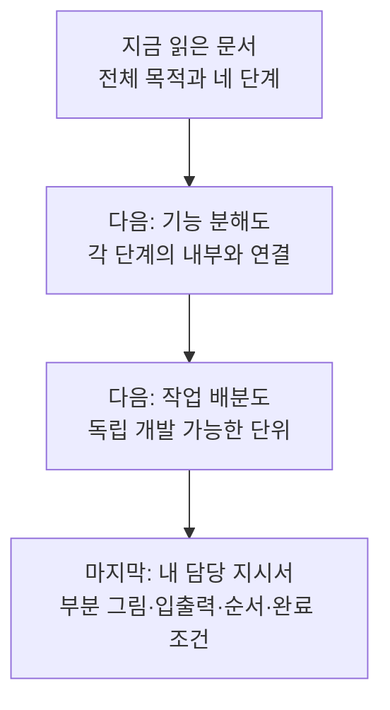

# DSN 개발 안내 — 전체에서 내 작업까지

DSN은 여러 시험 장치와 프로그램에서 오는 메시지를 모아, 사람이 필요한 항목만 골라 확인할 수 있게 하는 서버다. **메시지를 받는 일, 내용을 해석하는 일, 결과를 저장하는 일, 사용자에게 보여주는 일을 나누어 개발한다.**

이 문서는 부서원의 공통 출발점이다. 여기서 전체를 이해한 뒤 기능을 한 단계씩 확대하고, 마지막에 자기 담당 지시서로 이동한다. 현재 C# 구현을 기준으로 설명한다.

## 1. 사용자는 무엇을 하려는가?

시험 중 이상이 생겼을 때 “어느 장치에서 언제 무슨 일이 있었는가”를 확인하려고 한다. 시험 진행 상태를 확인하는 데도 같은 시스템을 쓴다. 발행 장치는 데이터를 보내고 자기 일을 계속하며, 사용자는 나중에 저장된 결과를 조회한다.

**이 그림에서 기억할 것:** DSN의 두 상대는 메시지를 보내는 Source와 결과를 조회하는 사용자다. Source가 보내는 본문 형식은 다양하므로, DSN 안에서도 내용을 아는 부분을 따로 둔다.

현재 저장소에는 DSN 본체와 시험용 발행기만 구현한다. 실제 C++ 앱·driver/eBPF의 내부 발행 코드는 해당 Source 담당자의 영역이다. Docker 배포 구성은 있으며 컨테이너 실행 검증은 남아 있다.

## 2. DSN 안에서는 어떤 일이 일어나는가?

위 그림의 **DSN 상자만** 열어 보면 다음 네 단계가 나온다. 실선은 데이터가 이동하는 방향이다.

①은 메시지의 겉모양과 전달 대상을 확인한다. ②의 Workspace가 본문을 읽어 저장할 항목을 만든다. ③이 그 결과를 보관한다. ④는 저장된 항목 중 사용자가 원하는 것만 보여준다. 그림의 ③→④는 결과 데이터 흐름이며, 실제 조회 요청은 View가 저장소에 보낸다.

예를 들어 시험용 Source가 `hello`를 `echo`와 `hex` 두 Workspace에 보내면, echo는 `payload_utf8 = hello`, hex는 `payload_hex = 68656c6c6f`라는 서로 다른 record를 만든다. 사용자는 View에서 두 항목을 선택한다. 한 입력에서 나온 두 record에는 같은 `message_id`가 들어간다.

## 3. 처음 보는 용어는 이 정도만 알면 된다

| 용어 | 이 시스템에서 하는 일 |
| --- | --- |
| Source | 메시지를 보내는 장치나 프로그램. 이 저장소에서는 테스트 발행기 제공 |
| Envelope / 봉투 | 발신자·시각·전달 대상 등 메시지 겉에 붙는 정보 |
| Payload / 본문 | 실제 데이터 bytes. 해당 Workspace가 의미를 해석 |
| Workspace | 본문을 해석해서 저장할 항목을 만드는 처리기 |
| Record | 해석이 끝나 저장할 수 있는 이름·값 묶음 |
| View | 저장된 record에서 사용자가 고른 항목을 보여주는 정의와 조회 기능 |
| Lease / 참조 이용권 | Workspace가 공유 원본을 읽는 동안 빌리고, 읽은 뒤 반납하는 권리 |

세부 클래스명과 오류 코드는 담당 지시서에서 다룬다.

## 4. 이제 어디로 내려가는가?

| 읽는 단계 | 문서 | 읽고 나면 답할 수 있는 질문 |
| --- | --- | --- |
| 전체 | 이 페이지 | DSN을 왜 만들고 메시지는 어디로 가는가? |
| 기능 분해 | [네 단계를 열어 보기](01-system-breakdown.md) | 안에서 누가 무엇을 맡고 서로 무엇을 넘기는가? |
| 업무 분해 | [작업 배분과 다시 합치기](02-work-division.md) | 어디까지가 내 일이고 누구와 연결하는가? |
| 담당 작업 | [담당별 지시서 목록](02-work-division.md#담당-지시서-선택) | 어떤 파일에서 무엇을 확인·수정하고 무엇으로 완료를 증명하는가? |

공통으로 읽는 범위는 여기부터 작업 배분도까지다. 그 뒤에는 자기 지시서와 연결되는 계약만 읽는다. 역할은 작업 묶음이며 인원수 지정이 아니다. 한 사람이 여러 역할을 맡아도 경계와 인수 기준은 유지한다.

**다음 → [네 단계를 열어 보기](01-system-breakdown.md)**

실행만 해 보려면 [실행 안내](../../README.md), 정확한 값·API가 필요하면 [현재 구현 계약](../implementation/contracts.md), 과거 설계 판단을 찾으려면 [설계 참조 목록](../arch/reference-index.md)을 사용한다. 현재 검증 상태는 [검증 보고서](../implementation/verification.md)에 기록한다.
