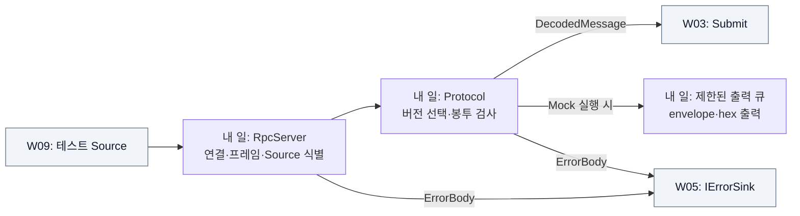

# W01 지시서 — 메시지를 받아 내부로 넘긴다

[전체 목적 ↑](../README.md) · [상위: 받기 ↑](../01-system-breakdown.md#receive) · [작업 배분 ↑](../02-work-division.md)

**당신의 결과물:** TCP에서 받은 bytes를 검사해 실행부가 받을 수 있는 메시지로 넘기고, 같은 입력을 독립 Mock에서도 확인할 수 있게 한다.

## 내 부분만 확대

실선은 데이터/호출, 회색은 다른 담당자의 영역이다. Mock은 실제 DSN의 대체 목적지다.

TCP 수신 경계에서는 메시지 하나가 여러 번에 나뉘어 오거나, 여러 메시지가 한 번에 올 수 있다. 먼저 LF로 프레임을 완성하고 그 뒤 봉투를 검사한다. 업무 payload의 뜻은 W04가 해석한다.

## 입력과 넘겨줄 결과

| 경계 | 약속 |
| --- | --- |
| 받는 것 | `dsn.publish` JSON notification + LF. 기본 frame 64 KiB / payload 16 KiB |
| 성공 출력 | `DecodedMessage(Envelope, byte[])`. Submit 이후 payload를 수정하지 않음 |
| 형식 실패 | version/envelope 오류는 폐기·집계, 연결 유지. RPC/framing 오류는 해당 session 종료 |
| 연결 식별 | 첫 정상 envelope로 source_id 고정. 한 Source에 활성 연결 하나 |
| Mock 출력 | envelope, 앞 256 bytes hex, 전체 크기, 잘림 여부 |

정확한 wire 예제·최대값·오류 의미는 [RPC 구현 계약](../../implementation/contracts.md#rpc--dsn-rpc1)을 사용한다. Source의 원 프로젝트 내부 발행 API는 이 작업에 포함되지 않는다.

## 내가 관리할 코드

- [RpcServer.cs](../../../src/Dsn.Core/RpcServer.cs): 수신·session·선택적 연결 종료.
- [Protocol.cs](../../../src/Dsn.Core/Protocol.cs): notification 검사·decoder·내부 메시지 표현.
- [Mock Program.cs](../../../src/Dsn.Mock/Program.cs): 독립 출력 경로.

## 작업 순서

1. 정상 notification 한 개와 payload 기대 bytes를 먼저 만든다. Source 담당 언어와 무관하게 비교할 수 있어야 한다.
2. decoder만 호출해 정상·빈 payload·미지원 버전·잘못된 base64 결과를 고정한다.
3. RpcServer에 메시지를 모으는 callback을 연결하고 split/coalesced 프레임과 Source 연결 규칙을 확인한다.
4. W03의 Submit으로 callback을 바꾸고 수용 거부 시 재전송하거나 ACK를 추가하지 않는다.
5. 같은 Protocol/RpcServer를 Mock으로 실행하여 DSN 없이도 입력을 확인한다.

## 완료를 판단할 사례

| 넣어 볼 상황 | 기대 결과 |
| --- | --- |
| `hello` 정상 프레임을 여러 조각으로 전송 | 한 번만 인계, bytes는 `68656c6c6f` |
| 잘못된 버전 뒤 정상 프레임 | 오류 기록 후 정상 메시지 계속 인계 |
| Source A 중복 접속 / A의 ID 변경 | 해당 신규/변경 session 종료, Source B 유지 |
| LF 없는 초과 프레임 / 출력 큐 포화 | 해당 입력/출력 거부, 다른 정상 경로 유지 |

기존 검증 그룹: `version, envelope`, `real TCP split/coalesced`, `invalid RPC`. [테스트 코드](../../../tests/Dsn.Tests/Program.cs)

## 넘겨줄 것과 연결 상대

W03에는 정상 `DecodedMessage`와 실패 입력 결과, W09에는 실제 전송 fixture와 Mock 실행 예제를 준다. wire/session 규약 변경은 W03·W09 및 실제 외부 연동 소비자와 맞춘다. 오류 코드 변경은 W05, endpoint/한도 변경은 W08과 맞춘다.

추적: [기존 I track](../../arch/planning/track-i.md), [Source 경계](../../arch/03-source-and-mock.md).
