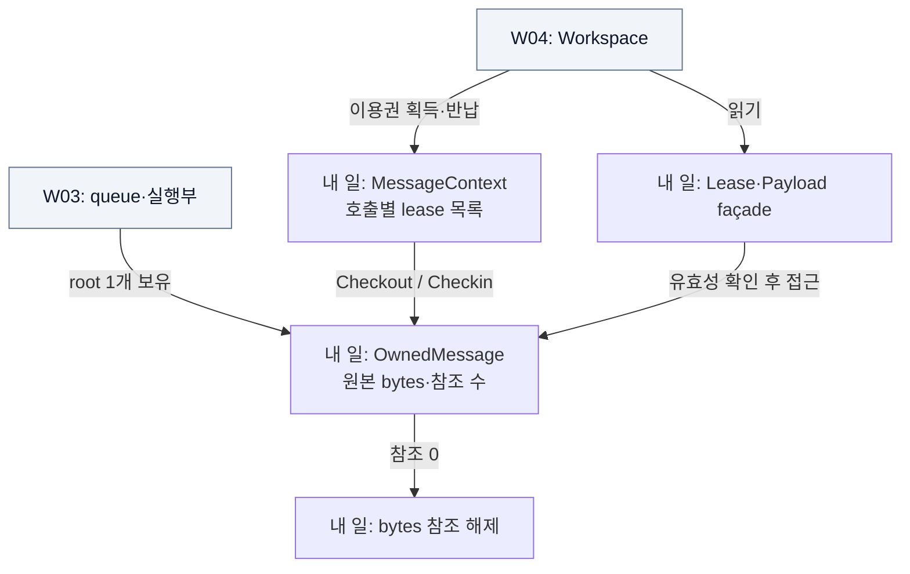
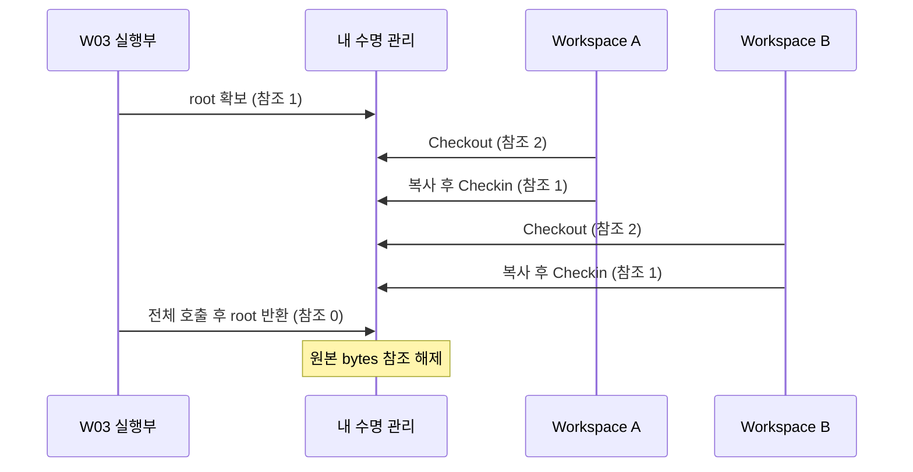

# W02 지시서 — 읽는 동안 원본을 지킨다

[전체 목적 ↑](../README.md) · [상위: 해석하기 ↑](../01-system-breakdown.md#process) · [작업 배분 ↑](../02-work-division.md)

**당신의 결과물:** 여러 Workspace가 하나의 원본을 안전하게 읽고, 마지막 이용권 반납 때 원본을 한 번만 회수하게 한다.

## 내 부분만 확대

화살표는 원본에 대한 보유·이용 관계다. 회색은 이웃이다.

원본 보관과 이용권은 다르다. 실행부의 root는 뒤 Workspace를 위해 남고, Workspace의 lease는 읽기가 끝나면 먼저 반납한다. 모든 반환을 count 감소 한 번으로 연결하는 것이 핵심이다.

## 시간 순서로 다시 보기

## 입력과 넘겨줄 결과

| 경계 | 약속 |
| --- | --- |
| 받는 것 | 검사된 Envelope와 소유권을 인계받은 payload bytes |
| W03에 제공 | 원본 생성/반환, 호출 context, 수용 한도, 수명 통계 |
| W04에 제공 | `IMessageContext`, `IPayloadLease`, 유효성 검사하는 읽기 façade |
| 정상 반환 | Checkin 한 번당 한 lease 반환. 중복 반환은 false |
| 잘못된 접근 | 반납 후 접근/종료 context의 Checkout 거부. foreign lease 거부 |

## 내가 관리할 코드

[Lifetime.cs](../../../src/Dsn.Core/Lifetime.cs)가 주 작업 파일이다. [Contracts.cs](../../../src/Dsn.Contracts/Contracts.cs)의 lease/context/payload 계약 변경은 W03·W04와 같이 확인한다. 원본 강제 회수 API를 Workspace 공개 표면에 넣지 않는다.

## 작업 순서

1. root 1개와 lease 2개를 가진 사례를 그려 각 순간의 기대 count를 적는다.
2. `Lifetime` 수용 한도와 `OwnedMessage` 참조 증감을 검증한다.
3. `Lease`의 읽기/반납 동시 호출과 반납 후 접근을 검증한다.
4. context 정상 종료·예외 종료가 남은 lease를 정리하는지 W03의 실패 Workspace와 연결한다.
5. 종료 timeout 중에도 실행 중인 Workspace가 원본을 읽을 수 있고, 실제 반환 후에 회수되는지 확인한다.

## 완료를 판단할 사례

| 넣어 볼 상황 | 기대 결과 |
| --- | --- |
| 같은 lease를 32개 동시 호출로 Checkin | true 1개, count 감소 1회 |
| Workspace가 lease를 잊고 예외 발생 | 호출 종료 정리 후 남은 lease 없음 |
| 앞 Workspace가 반납, 뒤 Workspace가 읽기 | 원본 유지 |
| 종료 timeout이 발생했지만 호출은 실행 중 | 원본 유지; 호출 종료 뒤 최종 참조 0 |

기존 그룹: `shared original`, `queue saturation and shutdown`, `memory/journal adapter parity`. [테스트 코드](../../../tests/Dsn.Tests/Program.cs)

## 넘겨줄 것과 연결 상대

W03·W04에 정상/실패 시 참조 변화표와 공개 API를 넘긴다. 완료 증거에 `created + checkouts - checkins = references`와 최종 0을 포함한다. 실행 중 강제 반환, 비동기 원본 인계, 풀 재사용을 도입하려면 해당 두 담당자와 수명 계약부터 변경한다.

추적: [기존 R track](../../arch/planning/track-r.md), [수명 설계](../../arch/02-contracts.md).
