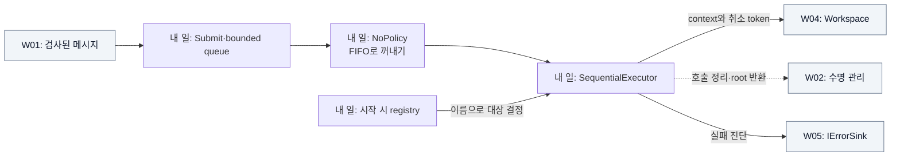

# W03 지시서 — 받은 순서로 담당자를 호출한다

[전체 목적 ↑](../README.md) · [상위: 해석하기 ↑](../01-system-breakdown.md#process) · [작업 배분 ↑](../02-work-division.md)

**당신의 결과물:** 수용한 메시지를 FIFO로 꺼내 대상 Workspace를 순차 호출하고, 실패·종료 경로에서도 소유 참조를 정리한다.

## 내 부분만 확대

실선은 데이터/호출, 점선은 원본 관리, 회색은 이웃이다.

queue policy는 꺼낼 순서를 정하고 executor는 호출 방법을 정한다. 지금은 FIFO와 순차 호출이다. 둘을 구분해 두면 나중에 실행 방식을 바꾸더라도 순서 계약을 별도로 검토할 수 있다.

## 입력과 넘겨줄 결과

| 경계 | 약속 |
| --- | --- |
| 등록 입력 | Host가 시작 전에 등록한 `IWorkspace`, 이름 하나당 하나 |
| 메시지 입력 | W01의 `DecodedMessage`, 성공 시 원본 소유권 인계 |
| 실행 출력 | 대상별 `ProcessAsync(context, token)` 호출 |
| 목적지 규칙 | 배열 순서 유지, 중복은 한 번, 없는 이름은 기록하고 다음 대상 진행 |
| 수용/종료 | queue·memory 한도 초과는 신규 거부. 종료 시 접수 중단·drain·timeout 대기분 폐기 |

## 내가 관리할 코드

[Runtime.cs](../../../src/Dsn.Core/Runtime.cs)의 `DsnRuntime`, registry, `IQueuePolicy/NoPolicy`, `IWorkspaceExecutor/SequentialExecutor`를 관리한다. ref count 내부 구현은 W02, 실제 payload 변환은 W04가 맡는다.

## 작업 순서

1. 가짜 Workspace로 호출 이름과 payload 순서를 기록해 등록·대상 규칙을 고정한다.
2. Submit 성공/거부의 소유권을 W01·W02와 확인한다. 거부한 원본이나 대기분이 남지 않게 한다.
3. FIFO 소비와 대상 순차 호출을 구현·수정한다. Source 시각이나 urgent 값으로 재정렬하지 않는다.
4. 예외 Workspace와 미반납 Workspace를 끼워 넣어 다음 대상 호출 및 context 정리를 검증한다.
5. 느린 Workspace를 이용해 drain/timeout/늦은 완료를 검증하고 W08의 종료 흐름에 연결한다.

## 완료를 판단할 사례

| 넣어 볼 상황 | 기대 결과 |
| --- | --- |
| 메시지 0–19를 차례로 수용 | Workspace에서 0–19 순서로 관찰 |
| 목적지 `unknown, broken, good, good` | 오류 둘 기록, good 한 번 처리 |
| 같은 이름 재등록 / 시작 뒤 등록 | 후발 거부 / registry 변경 거부 |
| active 1개와 queue 포화 후 종료 | 대기 root 정리, active 원본 유지, 늦은 완료 후 참조 0 |

기존 그룹: `FIFO, distinct targets`, `queue saturation and shutdown`, `lifetime admission`. [테스트 코드](../../../tests/Dsn.Tests/Program.cs)

## 넘겨줄 것과 연결 상대

W01에는 Submit 수용/거부 예제, W04에는 호출 순서·예외 후 정리 계약, W08에는 Start/Drain/Stop 완료와 미완료 사례를 넘긴다. 병렬 실행·재정렬·timeout 의미 변경은 W02·W04·W08과 연결 사례를 함께 바꾼다.

추적: [기존 R track](../../arch/planning/track-r.md), [실행 시퀀스 참조](../../arch/08-sequences.md).
