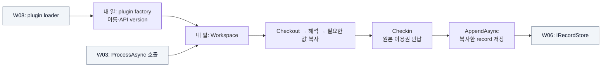

# W04 지시서 — 내 본문을 저장할 값으로 바꾼다

[전체 목적 ↑](../README.md) · [상위: 해석하기 ↑](../01-system-breakdown.md#process) · [작업 배분 ↑](../02-work-division.md)

**당신의 결과물:** 담당 payload 형식을 해석해 원본과 독립된 record를 만드는 Workspace plugin이다. 업무별로 여러 사람이 이 역할을 맡을 수 있다.

## 내 부분만 확대

실선은 호출/데이터, 회색은 이웃이다.

저장 대기는 원본을 읽는 작업보다 오래 걸릴 수 있다. 필요한 값을 복사했으면 먼저 이용권을 반납한다. 다른 Workspace의 실행 결과에 의존하지 않고 자기 payload만으로 record를 만든다.

## 입력과 넘겨줄 결과

| 경계 | 약속 |
| --- | --- |
| 받는 것 | `IMessageContext`와 취소 token. 내용은 Source와 합의한 bytes |
| 내보내는 것 | `RecordInput`: 내 Workspace 이름과 scalar field 값 |
| plugin 계약 | public 기본 생성자의 `IWorkspacePlugin`, `ApiVersion = 1`, `Create(WorkspaceServices)` |
| 수명 | 읽기·복사 후 Checkin, 저장 record에 원본/lease를 보관하지 않음 |
| 실패 | 파싱·저장 실패를 executor가 진단하고 미반납 lease를 정리. 내 코드도 finally로 조기 반납 |

## 내가 관리할 코드

[Workspaces.cs](../../../src/Dsn.Workspaces/Workspaces.cs)의 echo/hex를 예제로 삼는다. 공통 API는 [Contracts.cs](../../../src/Dsn.Contracts/Contracts.cs), 대역은 [MemoryRecordStore.cs](../../../src/Dsn.Core/MemoryRecordStore.cs)다. 테스트 프로젝트에서 대역을 쓰더라도 배포 plugin의 의존성은 Contracts 중심으로 유지한다.

## 작업 순서

1. 담당 Source와 payload 예제 및 기대 field를 적는다. 새 업무 형식이면 정상·빈 입력·잘못된 입력을 포함한다.
2. 자기 등록 이름과 field 이름·타입·null 의미를 정한다. 다른 Workspace 이름/field로 덮어쓰지 않는다.
3. context에서 Checkout하고 파싱·복사한 뒤 finally에서 Checkin한다. 그 다음 AppendAsync를 호출한다.
4. 메모리/실패/지연 저장 대역으로 값과 반납 시점을 검증한다.
5. factory가 포함된 DLL을 W08에게 넘겨 실제 동적 로딩 후 같은 fixture를 실행한다.

## 완료를 판단할 사례

| 넣어 볼 상황 | 기대 결과 |
| --- | --- |
| echo에 `hello` | `payload_utf8 = hello` |
| hex에 bytes `00 ff 0a` | `payload_hex = 00ff0a` |
| 저장소가 오래 대기 | Workspace lease는 이미 반납, record 값은 유지 |
| 내가 파싱 중 실패 | 원본을 계속 붙잡지 않고 다음 Workspace 처리 가능 |

업무별 추가 plugin은 그 업무의 입력/기대 field 사례를 별도로 제출한다. 기존 echo/hex가 모든 업무 형식을 검증하는 것은 아니다. 기존 그룹: `memory/journal adapter parity`, `DLL plugin discovery`. [테스트 코드](../../../tests/Dsn.Tests/Program.cs)

## 넘겨줄 것과 연결 상대

W08에 DLL·의존 파일·등록 이름, W06/W07에 field 예제, W09에 payload/기대 record fixture를 준다. payload 스키마 변경은 해당 Source와, record 계약 변경은 W06·W07과, lease 사용 변경은 W02·W03과 맞춘다.

추적: [기존 R track의 Workspace 부분](../../arch/planning/track-r.md), [공개 SDK 계약](../../implementation/contracts.md#runtime-및-공개-sdk).
