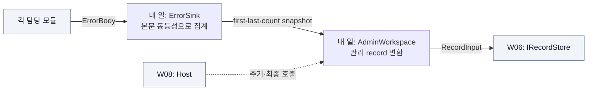

# W05 지시서 — 오류를 모아 관리 기록으로 만든다

[전체 목적 ↑](../README.md) · [상위: 공통 기반 ↑](../01-system-breakdown.md#foundation) · [작업 배분 ↑](../02-work-division.md)

**당신의 결과물:** 같은 오류를 하나의 집계로 관리하고 그 결과를 Admin record로 보관하게 한다.

## 내 부분만 확대

실선은 데이터/호출, 점선은 주기 관리, 회색은 이웃이다.

오류 접수는 Admin 저장 성공을 기다리지 않는다. ErrorSink가 집계 상태를 소유하고 Admin은 그 값을 record로 바꾼다. 현재 Admin은 일반 payload 처리 plugin 경로가 아니라 Host가 snapshot 변환을 호출하는 별도 구성 요소다.

## 입력과 넘겨줄 결과

| 경계 | 약속 |
| --- | --- |
| 받는 것 | `ErrorBody(Code, Component, SourceId?, Workspace?, Detail?)` |
| 동일성 | 발생시각을 뺀 본문 전체 값이 같을 때만 합침 |
| 집계 출력 | 최초·최근 시각, count. 한도 도달 시 기존 종류는 갱신하고 신규 종류 dropped |
| Admin 출력 | `admin` record와 snapshot_revision. 본문 원본 첨부 없음 |
| 호출 시점 | Host가 1초마다 변경 여부 확인, 종료 때 최종 호출 |

## 내가 관리할 코드

[Diagnostics.cs](../../../src/Dsn.Core/Diagnostics.cs)를 관리한다. [Contracts.cs](../../../src/Dsn.Contracts/Contracts.cs)의 오류 모델/`IErrorSink`가 공유 경계다. Host의 Admin timer 변경안은 W08에게 전달한다.

## 작업 순서

1. 본문이 같은 오류 둘, source_id만 다른 오류 하나로 기대 집계를 만든다.
2. 접수·count·first/last·집계 용량 한도를 저장소 없이 검증한다.
3. snapshot을 scalar Admin record로 바꾸고 revision이 같으면 중복 투영하지 않는지 확인한다.
4. 실제 저장소가 실패해도 오류를 다시 저장하려는 재귀 호출이 생기지 않게 검증한다.
5. W08과 주기·종료 호출을 연결하고 W07에서 Admin field를 조회한다.

## 완료를 판단할 사례

| 넣어 볼 상황 | 기대 결과 |
| --- | --- |
| 본문 동일 오류 두 번 | 집계 한 개, count 2 |
| source_id가 다른 오류 | 별도 집계 |
| snapshot 변경 없이 두 번 Publish | 같은 revision의 record를 다시 추가하지 않음 |
| revision 변경 후 Publish | 새 snapshot 이력이 추가되고 이전 이력도 유지 |

snapshot count는 해당 집계의 누적값이다. View에서 서로 다른 snapshot의 count를 합산하면 중복 계산이 되므로, 결과 설명에 snapshot 이력임을 명시한다. 기존 그룹: `error identity and Admin snapshot`. [테스트 코드](../../../tests/Dsn.Tests/Program.cs)

## 넘겨줄 것과 연결 상대

각 모듈 담당자에게 오류 본문 예제, W06/W07에 Admin record 예제, W08에 Publish 호출·실패 의미를 넘긴다. 해당 Source 연결을 끊는 실제 동작은 W01의 `DisconnectSource`와 연결한다. 자동 심각도 판정·운영 임계값·상세 monitoring은 후속 범위다.

추적: [기존 E track](../../arch/planning/track-e.md), [A track](../../arch/planning/track-a.md).
