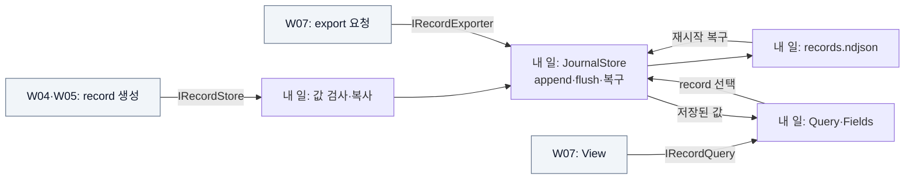

# W06 지시서 — 결과를 저장하고 다시 읽게 한다

[전체 목적 ↑](../README.md) · [상위: 보관하기 ↑](../01-system-breakdown.md#persist) · [작업 배분 ↑](../02-work-division.md)

**당신의 결과물:** Workspace와 Admin의 record를 영속 저장하고, 재시작 후에도 View와 export가 같은 값을 읽게 한다.

## 내 부분만 확대

실선은 호출/데이터, 회색은 이웃이다.

저장소가 받는 값은 원본 bytes와 독립된 scalar record다. 성공 반환은 flush 완료와 조회 가시성을 뜻한다. 단순 메모리 대역의 성공과 실제 영속 저장의 성공은 구별해서 검증한다.

## 입력과 넘겨줄 결과

| 경계 | 약속 |
| --- | --- |
| Append 입력 | Workspace 이름과 string/number/bool/null field, 입력 값 복사 |
| 저장 출력 | 증가하는 `id`가 붙은 `StoredRecord`, 중복 Append는 별도 record |
| Query 출력 | id 오름차순, `afterId` 초과, limit 1–1000, Workspace 필터 |
| Fields/Export | 저장된 field 목록 / 원래 record의 NDJSON |
| 포화·복구 | quota 초과는 새 저장 거부. 마지막 LF 없는 불완전 record만 제거, 완성된 손상 record는 시작 실패 |

정확한 크기·field 이름·취소 의미는 [현재 저장 계약](../../implementation/contracts.md#저장과-view)을 따른다.

## 내가 관리할 코드

- [Persistence.cs](../../../src/Dsn.Core/Persistence.cs): JournalStore와 공통 JSON 표현.
- [MemoryRecordStore.cs](../../../src/Dsn.Core/MemoryRecordStore.cs): 비영속 테스트 대역.
- [Contracts.cs](../../../src/Dsn.Contracts/Contracts.cs)의 Record/Query/Store/Exporter 부분: 제공 계약.

## 작업 순서

1. W04·W05가 만드는 정상/null/잘못된 field 예제를 받는다.
2. Memory와 Journal에 같은 예제를 넣고 저장·조회·export 결과를 비교한다.
3. Append 성공 뒤 입력 객체를 바꿔도 저장 값이 변하지 않는지 확인한다.
4. 파일을 닫고 다시 열어 값·id를 복구한다. 부분 마지막 frame, quota 초과, 잘못된 query도 검증한다.
5. W07의 View를 `IRecordQuery`에, W08의 종료를 저장소 수명에 연결한다.

## 완료를 판단할 사례

| 넣어 볼 상황 | 기대 결과 |
| --- | --- |
| 같은 fixture를 Memory/Journal에 저장 | Query·Export 동일 |
| Append 후 입력 값 변경 / 원본 lease 반납 | 기존 저장 값 유지 |
| 두 record 저장 후 재시작 | 같은 값·id·순서 복구 |
| 부분 마지막 record / 용량 초과 | 불완전 tail 복구 / 기존 record 보존하며 신규 거부 |

기존 그룹: `journal durable restart`, `memory/journal adapter parity`. [테스트 코드](../../../tests/Dsn.Tests/Program.cs)

## 넘겨줄 것과 연결 상대

W04·W05에 Append 성공/실패 예제, W07에 Query/Fields/Export fixture, W08에 저장 경로·용량·닫기 조건을 넘긴다. 실제 DB 교체도 이 계약으로 비교한다. 조회 가시성·보존 정책·record 형식을 바꾸면 소비자와 기대 결과를 함께 변경한다.

추적: [기존 P track](../../arch/planning/track-p.md).
