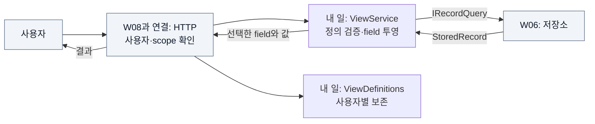

# W07 지시서 — 사용자에게 필요한 항목만 보여준다

[전체 목적 ↑](../README.md) · [상위: 보여주기 ↑](../01-system-breakdown.md#present) · [작업 배분 ↑](../02-work-division.md)

**당신의 결과물:** 사용자가 허용된 Workspace의 field를 선택해 조회하고, 자기 View 정의를 저장해 다시 사용할 수 있게 한다.

## 내 부분만 확대

실선은 호출/데이터, 회색은 이웃이다. HTTP 계약은 내 책임이고 현재 Host 파일 안의 연결 코드는 W08이 편집을 모은다.

View는 record를 해석해 다시 저장하는 기능이 아니다. 이미 저장된 record에서 field를 선택하고 결과를 만든다. 존재하는 field가 특정 row에만 없으면 null이고, 선택한 이름 자체를 모르면 입력 오류다.

## 입력과 넘겨줄 결과

| 경계 | 약속 |
| --- | --- |
| 정의 입력 | `ViewDefinition(Workspaces, Fields)`와 사용자 식별자 |
| 조회 입력 | 정의, `afterId`, `limit`, 허용된 Workspace 범위 |
| 조회 출력 | 선택한 field의 값. record별 투영이며 자동 cross-record join 없음 |
| 정의 보존 | 사용자별 이름 공간, temp flush 후 rename으로 파일 교체 |
| HTTP 결과 | 잘못된 입력 400, 인증 실패 401, scope 위반 403, 없는 사용자 정의 404 |

## 내가 관리할 코드

[Views.cs](../../../src/Dsn.Core/Views.cs)의 `ViewService`, `ViewDefinitions`를 관리한다. [DsnApplication.cs](../../../src/Dsn.Host/DsnApplication.cs)의 `/fields`, `/view`, `/export`, `/views` 및 인증/scope 연결 변경은 W08에게 코드 변경안과 HTTP fixture로 전달한다.

## 작업 순서

1. 같은 record에 대한 서로 다른 사용자 정의 두 개를 만든다. 예: 평가자는 echo 값, 관리자는 echo와 hex 값을 선택한다.
2. 고정 `IRecordQuery` 대역으로 field 검증, null, 페이지 결과를 확인한다.
3. 사용자별 정의를 저장·재시작하고 다른 사용자의 같은 이름 정의와 섞이지 않는지 확인한다.
4. W06의 실제 Query로 대역을 교체한다. 저장된 field 목록과 결과가 일치하는지 확인한다.
5. W08의 HTTP 경계에 연결하고 인증·scope·오류 코드까지 검증한다.

## 완료를 판단할 사례

| 넣어 볼 상황 | 기대 결과 |
| --- | --- |
| echo/hex에서 두 payload field 선택 | 두 row, 해당 row에 없는 field는 null |
| Alice의 `mine` 정의를 Bob이 조회 | Bob의 정의가 없으면 404 |
| echo 권한만 있는 Bob이 hex export | 403, hex 데이터 미노출 |
| 정의 저장 후 서버 재시작 | 자기 정의로 같은 저장 record 조회 |

현재 `/fields`는 저장된 record에서 목록을 얻는다. 최초 데이터가 없는 payload field 정의는 아직 검증할 수 없다. 이런 제약을 사용자 흐름/예제에서 숨기지 않는다. 기존 그룹: `HTTP View authorization`. [테스트 코드](../../../tests/Dsn.Tests/Program.cs)

## 넘겨줄 것과 연결 상대

W06에 query/field fixture, W08에 HTTP 입력·응답·상태 코드, W09에 사용자 두 명의 비교 시나리오를 넘긴다. join 도입, scope 변경, field 이름 변경은 각각 W06·W08·해당 record 생성 담당자와 맞춘다.

추적: [기존 V track](../../arch/planning/track-v.md), [현재 View 사용 예제](../../../README.md#view).
