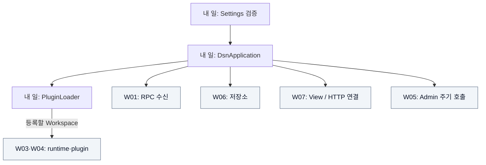
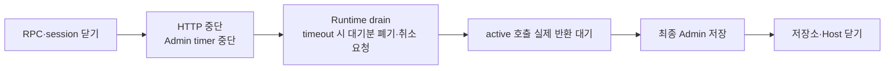

# W08 지시서 — 부품을 연결하고 안전하게 켜고 끈다

[전체 목적 ↑](../README.md) · [상위: 공통 기반 ↑](../01-system-breakdown.md#foundation) · [작업 배분 ↑](../02-work-division.md)

**당신의 결과물:** 설정과 plugin으로 실제 구현을 조립하고, 입력 준비·실행·종료·배포까지 재현 가능한 Host를 제공한다.

## 내 부분만 확대

화살표는 Host가 구성 요소를 생성/연결하는 관계다. 데이터 처리 순서와 다르다. 회색은 다른 담당자의 구현이다.

Host가 부품의 구체 구현을 알고 조립한다. Workspace 안에서 서버를 열거나 View 안에서 수신부를 생성하지 않는다. 준비에 실패한 경우 이미 확보한 자원을 닫아 같은 설정으로 재시도할 수 있게 한다.

## 종료 과정만 확대

실선은 종료 순서다. 미종료 호출을 기다리는 동안 저장소와 원본이 살아 있어야 한다.

## 입력과 넘겨줄 결과

| 경계 | 약속 |
| --- | --- |
| 입력 | JSON 설정, 필수 plugin DLL과 의존 파일, 저장 경로 |
| 시작 출력 | registry 완료 후 실제 RPC/HTTP endpoint와 ready 상태 |
| 시작 실패 | 잘못된 설정·필수 plugin 실패·포트 충돌은 시작 실패 및 확보 자원 정리 |
| 종료 | 신규 입력 차단, active 참조 강제 회수 없이 실제 반환까지 대기 |
| 배포 | Host/Mock publish 산출물, Docker/Compose 설정. 테스트 Source는 배포물에서 제외 |

## 내가 관리할 코드

[DsnApplication.cs](../../../src/Dsn.Host/DsnApplication.cs), [Settings.cs](../../../src/Dsn.Host/Settings.cs), [Host Program.cs](../../../src/Dsn.Host/Program.cs), [Plugins.cs](../../../src/Dsn.Core/Plugins.cs), [Dockerfile](../../../Dockerfile), [compose.yaml](../../../compose.yaml), [publish.sh](../../../scripts/publish.sh)를 관리한다.

공유 파일에서는 W07이 HTTP 계약, W05가 Admin 동작, 각 모듈 담당자가 설정 값의 의미를 제공한다. 기능의 내부 알고리즘까지 Host에서 다시 구현하지 않는다.

## 작업 순서

1. 설정 기본값·허용 범위·상대 경로 기준을 확인하고 잘못된 값은 자원 생성 전에 거부한다.
2. 진단·저장·runtime을 준비하고 필수 plugin을 로딩한다. 등록이 끝나기 전 입력을 받지 않는다.
3. W07의 HTTP 계약과 W01의 RPC 입력을 연결하고 동적 포트로 ready를 확인한다.
4. 정상 종료, 포트 충돌 rollback, 협력/비협력 Workspace 종료를 검증한다.
5. publish한 DLL을 별도 프로세스로 실행한다. 이어 Linux Docker에서 동일 입력·조회·volume 복구를 W09와 인수한다.

## 완료를 판단할 사례

| 넣어 볼 상황 | 기대 결과 |
| --- | --- |
| 필수 DLL 없음 / 같은 이름 등록 | 시작 실패, 입력 접수 전 진단 |
| RPC 포트를 다른 프로세스가 사용 | 시작 실패 후 저장소 다시 열기 가능 |
| SIGTERM 및 느린 Workspace | 접수 중단, 계약에 따른 drain·실제 완료 대기 |
| 컨테이너 재시작 | volume의 record와 View 정의 복구 |

기존 그룹: `DLL plugin discovery`, `startup rollback`, 별도 프로세스 SIGTERM 검증. **Docker 항목은 아직 실행 검증이 남아 있다.** [검증 보고서](../../implementation/verification.md)

## 넘겨줄 것과 연결 상대

W09에 실행 가능한 산출물·설정·ready/종료 기대값·배포 명령을 넘긴다. 새로운 설정 키, worker, 초기화/종료 순서는 해당 자원 소유 담당자와 조정한다. Docker 인수 전에는 Termux 통과를 컨테이너 통과로 표시하지 않는다.

추적: [기존 H track](../../arch/planning/track-h.md), [실행 안내](../../../README.md).
