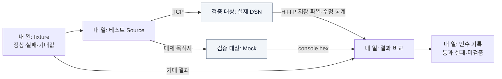

# W09 지시서 — 나눈 부품이 함께 동작하는지 증명한다

[전체 목적 ↑](../README.md) · [상위: 통합 순서 ↑](../02-work-division.md#4-다시-합치는-순서) · [작업 배분 ↑](../02-work-division.md)

**당신의 결과물:** 각 담당자가 넘긴 기대 결과를 실제 경계에서 확인하고, 통과와 미검증을 구분한 인수 기록이다. 테스트용 Source도 이 역할이 관리한다.

## 내 부분만 확대

실선은 시험 입력과 관측 결과다. 회색은 검증 대상이다.



단위 검증은 각 담당자가 자기 경계에서 수행한다. 통합 검증은 대역을 실제 구현으로 바꾸고도 같은 계약이 유지되는지 확인한다. 모든 기능 개발을 W09가 대신하지 않는다.

## 받는 것과 남길 결과

| 받는 것 | 남길 결과 |
| --- | --- |
| 각 담당자의 입력/기대값/실패 사례 | 재현 가능한 경계 테스트 |
| W08의 산출물·설정·실행 명령 | 실제 프로세스 실행/종료 결과 |
| RPC fixture와 Mock 계약 | 실제 TCP 입력·hex 비교 |
| 저장/View 계약 | 원본 반환 뒤 조회, 재시작 후 값·정의 비교 |
| 지원 환경 | 환경별 통과·실패·미실행 표 |

## 내가 관리할 코드와 기록

[TestSource Program.cs](../../../tests/Dsn.TestSource/Program.cs), [Tests Program.cs](../../../tests/Dsn.Tests/Program.cs), [check.sh](../../../scripts/check.sh), [검증 보고서](../../implementation/verification.md)를 관리한다. 테스트 Source는 await network write를 사용하는 시험 도구이며 production Source의 no-blocking 요구를 증명하지 않는다.

## 작업 순서

1. 담당자별 인계 fixture를 정상·실패·수명/복구 사례로 정리한다. 중복 테스트보다 빠진 경계를 먼저 확인한다.
2. [통합 순서](../02-work-division.md#4-다시-합치는-순서)에 따라 대역을 실제 구현으로 교체한다.
3. 실제 TCP의 split/coalesced·Source 재연결, 실제 저장/HTTP·사용자 scope를 확인한다.
4. 재시작과 시작 실패, 포화·늦은 완료에서 값과 참조를 확인한다. 포트는 동적 할당, 데이터는 임시 디렉터리를 사용한다.
5. publish한 Host/Mock에 별도 TestSource 프로세스로 입력하고 SIGTERM 종료를 확인한다.
6. Linux Docker가 준비되면 build/run·호스트 TCP 입력·volume 재시작·View 조회를 별도로 기록한다.

## 완료를 판단할 사례

| 연결 | 최소 기대 결과 |
| --- | --- |
| W01 ↔ Mock | 같은 wire 입력, 정확한 payload hex |
| W02 ↔ W03 ↔ W04 | FIFO, 실패 후 계속 처리, 최종 참조 0 |
| W04/W05 ↔ W06 ↔ W07 | 반납 이후 값 유지, Admin 조회, 사용자별 정의 분리 |
| W08 ↔ 실제 프로세스 | ready 이후 입력·조회, 종료 0 또는 계약상 미완료 표시 |
| W08 ↔ Docker | 문서 명령으로 이미지 실행·volume 복구 확인 |

현재 재현 명령은 저장소 루트에서 다음과 같다.

```bash
bash scripts/check.sh
bash scripts/publish.sh
```

첫 명령은 전체 Release 빌드와 13개 검증 그룹을 실행한다. 개별 담당자는 자기 그룹의 실패/기대값을 먼저 확인하고, 공통 계약 변경을 연결한 뒤 전체 검증을 수행한다.

## 인계 기록 형식

```text
변경 역할 / 연결한 경계:
실행 환경 / 명령:
입력 / 기대값 / 실제값:
통과·실패·미검증:
실패 재현 위치 / 해당 담당자:
남은 배포 인수:
```

현재 Termux 검증은 통과했으며 Docker 실행과 후속 부하/monitoring 평가는 남아 있다. 관측하지 않은 결과를 통과로 채우지 않는다.

추적: [기존 X track](../../arch/planning/track-x.md), [기존 QA 범위](../../arch/13-quality-attributes-and-risks.md).
