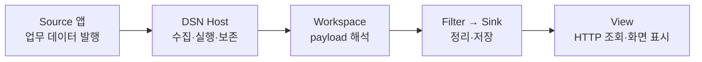

# 개발 가이드

현재 저장소의 구현을 기준으로, 만들려는 대상부터 선택한다. 명령은 별도 설명이 없으면 DSN 저장소 루트에서 실행한다. 설계 근거는 [아키텍처 문서](../README.md), 공통 환경은 [.NET 개발 환경](../development-environment.md)을 따른다.

| 내가 만드는 것 | 가이드 | DSN과 맞춰야 하는 부분 |
| --- | --- | --- |
| 수집·저장·실행 플랫폼 | [DSN 개발자](dsn.md) | 공개 계약, 기능 경계, Host 설정·배포 |
| 시험 앱·오케스트레이터의 데이터 발행부 | [Source 개발자](source.md) | SDK 전송 계약, Workspace와 payload 합의 |
| 데이터 해석·분석 로직 | [Workspace 개발자](workspace.md) | plugin 계약, payload 수명, 출력 field·배치 |
| 데이터 탐색·시각화 화면 | [View 개발자](view.md) | HTTP API, 조회 권한, 페이지 조회·Host 배포 |

Source 앱 자체의 빌드·설치·서비스 등록·실행 절차는 해당 앱이 소유한다. 여기서는 DSN 연동에 필요한 설정과 확인 방법만 다룬다. 실제 드라이버 구현·테스트는 포함하지 않는다.
