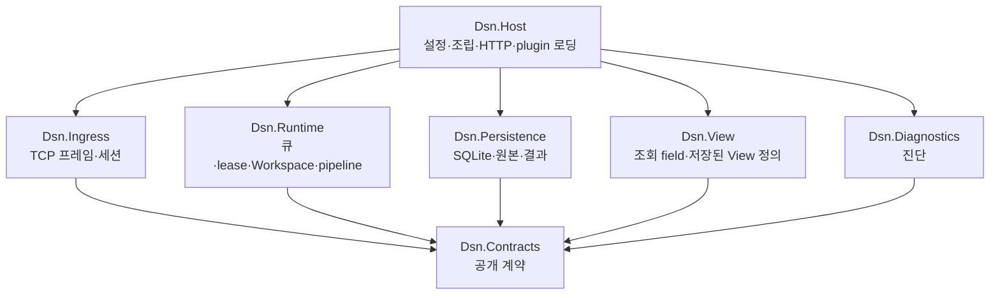

# DSN 개발자 가이드

수집·실행·보존·조회 기반을 수정하는 개발자를 위한 문서다. 업무 payload 해석은 [Workspace](workspace.md)에 둔다.

## 전체 구조에서 변경 위치 찾기



그림은 프로젝트 의존 방향이다. Host가 기능을 조립하며 기능 프로젝트 사이의 직접 참조는 금지한다. 자세한 요소와 근거는 [컴포넌트 설계](../05-component-design.md)를 따른다. 공개 계약을 바꿀 때는 Source protocol, plugin API, 업무 payload 버전을 서로 구분하고 기존 소비자 호환성을 확인한다.

## 버전

현재 제품 버전은 `0.1.0`이며 [Directory.Build.props](../../Directory.Build.props)의 `Version`이 모든 .NET 프로젝트와 Contracts NuGet에 적용된다. AssemblyVersion/FileVersion은 `0.1.0.0`으로 생성된다. Python SDK의 pyproject.toml과 C++ SDK의 CMakeLists.txt도 현재 `0.1.0`이다. 향후 제품 버전을 변경할 때 이 세 위치와 NuGet lock을 함께 확인한다. 기존 릴리즈 태그를 덮어쓰지 않으며 동일 버전 내 변경은 커밋으로 식별한다.

## 개발·검증

기본 도구는 .NET SDK 10.0 (10.0.100 이상), Bash, GNU Make다. Python/venv는 기본 C# 빌드·검사에 필요 없다. SDK 선택·NuGet lock·캐시는 [공통 환경](../development-environment.md)에서 관리한다.

```sh
make doctor
make build DSN_BUILD_JOBS=1
make check DSN_BUILD_JOBS=1
```

변경 영역에 맞는 검사를 추가한다. 수집·lease·저장·HTTP 변경은 `make check`, 파이프라인 변경은 `make pipeline-check`, SDK/공개 계약 변경은 `make sdk-check`를 사용한다. 뒤의 두 명령에는 Python 등이 필요하므로 [검사별 도구와 범위](../../tests/README.md)를 확인한다. 의존성 변경에만 `make deps-update`로 lock을 갱신한다.

합성 앱으로 화면까지 확인하려면 `make demo DSN_BUILD_JOBS=1`을 실행하고 출력된 `/demo?run=...` 주소를 연다. [데모 안내](../../samples/e2e/README.md)에 생성량·종료·재시작 방법이 있다.

## 배포·실행

```sh
make publish DSN_BUILD_JOBS=1
dotnet artifacts/host/Dsn.Host.dll settings.example.json
```

`artifacts/host` 전체가 Host 배포 단위다. DLL 하나만 복사하지 않는다. 대상 OS/CPU에 맞는 SQLite native 파일과 ASP.NET Core Runtime 10이 필요하며 런타임은 기본 publish에 포함되지 않는다. 현재 실행 검증은 Termux 기준이다. 배포할 설정 파일과 plugin도 함께 준비한다.

[설정 예제](../../settings.example.json)를 기반으로 웹 `bind/viewPort`, 입력 `ingressBind/rpcPort`, `dataDirectory`, `plugins`, `pipelines`, `users`를 정한다. 상대 파일 경로는 프로세스 실행 디렉터리 기준이다. 시작 시 출력되는 `status=ready`, 입력 포트, 웹 주소를 확인한다. 기본 웹은 `http://127.0.0.1:7071/`이다. Ctrl+C 또는 SIGTERM으로 정상 종료한 뒤 데이터 디렉터리 전체를 보관한다. 실행 중 DB 파일 하나만 복사하는 방법은 지원하지 않는다.

Docker 빌드는 온라인 환경을 전제로 한다.

```sh
make -f make/deploy.mk deploy
make -f make/deploy.mk logs
make -f make/deploy.mk down
```

최초 생성되는 `settings.docker.json`과 Compose의 데이터 volume을 사용한다. 기본 포트 공개는 호스트 loopback뿐이다. 업무 plugin은 별도 mount/설정이 필요하다. 이미지 배포 명령과 네트워크 설정은 [README의 Docker 안내](../../README.md#docker--ci)를 따른다. Docker 실행 자체는 현재 Termux 검증 범위에 포함되지 않는다.

## 운영에서 확인할 것

`publish` 접수와 서버 저장은 별개다. 원본과 결과도 별도 트랜잭션이며 다중 Sink 원자성을 가정하지 않는다. 용량 제한은 자동 보존 기간이나 자동 삭제 정책이 아니다. 저장 상한·진단·종료 시 처리 상태를 점검한다. 중앙 자동 복제와 DB만 반입하는 읽기 전용 Viewer는 아직 [후속 과제](../06-architecture-evaluation.md)다.
