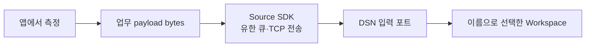

# Source 개발자 가이드

시험 앱·오케스트레이터 등의 데이터를 DSN으로 보내는 개발자를 위한 문서다. 앱 자체의 배포·실행 방법은 각 앱 문서에서 관리한다.



## 먼저 Workspace와 합의하기

| 합의 항목 | 예시 / 결정할 내용 |
| --- | --- |
| Workspace 이름 | `temperature`; Source의 목적지 배열과 plugin의 Name 일치 |
| payload schema | `temperature.v1`; JSON/binary 형식, 인코딩, 버전 호환 |
| 값의 의미 | 온도 단위·범위, 누락 값·오류 표현, 시간 기준 |
| 식별자 | PC/DUT/시험 실행 식별자를 필요한 payload field로 정의 |
| source_id | 동시에 접속하는 프로세스마다 고유하게 부여 |
| 실패 처리 | 큐 거부·전송 실패 때 앱이 기록/폐기/보관할 정책 |

DSN 공통 계층은 업무 payload를 해석하지 않는다. [온도 예제의 계약](../../samples/temperature/README.md#공유-계약-temperaturev1)을 시작점으로 사용한다. protocol version=1과 업무 schema 버전은 독립적이다.

## SDK 연결

DSN SDK 제공자가 준비한 Python wheel 또는 대상 OS/CPU용 C++ SDK를 사용한다. 산출물 생성은 [SDK 안내](../../sdk/README.md#빌드와-배포)를 따른다. Source 앱에 DSN Host나 C# 프로젝트 참조를 추가하지 않는다.

Python SDK는 표준 라이브러리만 사용하며 DSN이 venv를 요구하지 않는다. 앱에서 사용하는 Python에 wheel을 설치하거나 앱의 의존성 관리 방식에 포함한다.

```python
import json
from dsn_source import Source

payload = json.dumps({
    "schema": "temperature.v1", "sensor": "lab-01",
    "celsius": 23.5, "sequence": 1,
}).encode("utf-8")
with Source("pc01-dut01-test", host="127.0.0.1", port=7070) as source:
    accepted = source.publish(payload, ["temperature"])
    completed = source.flush(timeout=5)
    print(accepted, completed, source.stats)
```

C++은 설치 SDK prefix를 `CMAKE_PREFIX_PATH`에 넣고 다음처럼 연결한다. 실제 사용 예제는 [source.cpp](../../samples/temperature/source.cpp)다.

```cmake
find_package(dsn_source CONFIG REQUIRED)
target_link_libraries(your_app PRIVATE dsn::source)
```

C++ SDK의 현재 대상은 Linux/Termux이며 대상 toolchain으로 빌드해야 한다. 입력 주소는 숫자 IPv4/IPv6를 사용한다. SDK의 payload 상한은 16,384 bytes다. Source 이름·Workspace 이름·큐·timeout 등의 정확한 제약은 [Source API](../../sdk/README.md#source-api)에 모아 둔다.

## 접수와 전송을 구분하기

`publish`의 true는 로컬 큐 접수다. `flush`는 제한 시간 안에 로컬 전송 시도가 끝났는지 나타내며 실패한 시도도 완료에 포함된다. `stats.sent`도 socket write 완료 수이고 서버 저장 ACK가 아니다. 실패 frame의 자동 재전송·디스크 spool·중복 제거는 제공하지 않는다.

앱은 거부/실패 통계를 확인하고 필요한 정책을 결정한다. 종료 전 발행을 멈추고 필요하면 flush한 뒤 close한다. Python은 context manager 또는 명시적 close, C++은 producer thread 종료 후 소유자의 close/destructor를 사용한다. 프로세스 강제 종료에 대한 전달 보장은 없다.

## DSN 연동 확인

먼저 DSN 저장소에서 `make sample-host`로 temperature plugin을 포함한 Host를 실행한다. 같은 포트의 다른 Host는 종료한다. 예제 Source는 `make sample-python` 또는 `make sample-cpp`로 확인할 수 있다.

```sh
curl --noproxy '*' 'http://127.0.0.1:7071/view?workspaces=temperature&fields=id,source_id,sensor,celsius,sequence'
```

전송 직후 비어 있으면 처리를 기다린 뒤 다시 조회한다. Host 입력 포트·Workspace 등록·payload 버전·진단을 순서대로 확인한다. 토큰을 설정한 환경에서는 조회 요청에 Bearer 토큰이 필요하다. 실제 드라이버 연동과 앱의 서비스 등록·설치 절차는 이 가이드의 범위가 아니다.
