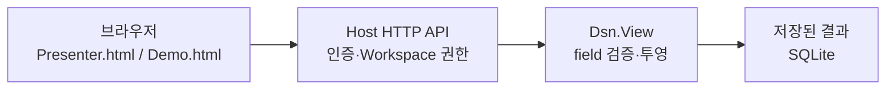

# View 개발자 가이드

Workspace가 저장한 결과를 탐색·시각화하는 개발자를 위한 문서다. 현재 View SDK나 View plugin 로더는 없다. 기본 개발 경로는 Host에 내장된 HTML/JavaScript 화면과 HTTP API를 확장하는 것이다.



## 변경 위치

| 변경 내용 | 파일 |
| --- | --- |
| 일반 탐색 화면 `/` | [Presenter.html](../../src/Dsn.Host/Http/Presenter.html) |
| 자동 데이터 화면 `/demo` | [Demo.html](../../src/Dsn.Host/Http/Demo.html) |
| 경로·인증·HTTP 응답 | [ViewEndpoints.cs](../../src/Dsn.Host/Http/ViewEndpoints.cs) |
| 조회 field와 저장된 View 정의 | [Views.cs](../../src/Dsn.View/Views.cs) |
| HTML 리소스 등록 | [Host 프로젝트](../../src/Dsn.Host/Dsn.Host.csproj) |

화면은 CDN 없이 동작하는 내장 리소스다. HTML을 수정해도 실행 중 파일을 직접 다시 읽지 않으므로 Host를 다시 빌드·시작해야 한다. 새 화면을 추가하면 EmbeddedResource 등록과 HTTP 경로도 추가한다. 별도 프런트엔드를 쓰려면 동일 origin reverse proxy 등을 별도로 구성해야 한다. 현재 Host에는 CORS 설정이 없다.

## 데이터 조회 규칙

먼저 Workspace 개발자에게 출력 field 이름·타입·단위를 받는다. 업무 field는 결과가 저장된 후 `/fields`에 나타나므로 아직 데이터가 없을 때를 처리한다.

| API | 화면에서의 용도 |
| --- | --- |
| `GET /workspaces` | 현재 등록되어 있고 조회 권한이 있는 Workspace |
| `GET /fields` | 권한 범위 안의 저장된 field 목록 |
| `GET /view?workspaces=...&fields=...&afterId=0&limit=100` | 지정한 field의 결과 배열 |
| `GET /pipelines` | 현재 pipeline revision·Filter·Sink 표시 |
| `GET /views`, `PUT /views/{name}`, `GET /views/{name}` | 사용자별 field/Workspace 선택 저장·조회 |
| `GET /export` | 지정 Workspace 결과 NDJSON 다운로드 |
| `GET /raw`, `POST /raw/{id}/replay` | 원본 확인·재처리; 별도 권한과 상태 처리 필요 |

일반 조회는 `id`를 fields에 포함하고, 받은 마지막 ID를 다음 `afterId`로 넘긴다. 일반 조회 limit는 1~1000이며 결과는 요청한 field만 포함하는 배열이다. 일부 행에 없는 field는 null이다. `/raw`의 limit는 1~100이다. 이 API는 일반 조회의 배열 형식과 달리 `{items, nextAfterId}`를 반환한다. 권한 필터 때문에 items가 비어도 커서가 진행될 수 있으므로 반환된 nextAfterId를 사용한다.

`users`가 설정되어 있으면 데이터 요청에 `Authorization: Bearer <token>`을 넣는다. 401은 토큰 누락/불일치, 403은 권한 부족, 400은 잘못된 조회, 503은 저장소 등 일시적 실패로 처리한다. `/`와 `/demo`는 인증 없는 빈 화면 껍데기일 뿐이며 데이터 권한을 우회하지 않는다. 토큰을 URL에 넣지 않는다. replay의 202는 큐 접수이지 처리 완료가 아니다. 원본 기능을 끈 경우 409 응답을 처리한다.

현재 서버는 시간 범위별 통계·전체 이력 집계 API를 제공하지 않는다. 페이지/화면 내 필터와 추세를 전체 DB 통계로 표시하지 않는다. 업무 불량 판정은 Workspace/Filter에서 계산하고 화면은 저장된 결과를 표시한다. 화면에 payload 문자열을 표시할 때는 HTML로 해석하지 말고 textContent 등을 사용한다.

## 개발·확인

```sh
make demo DSN_BUILD_JOBS=1
```

출력된 `/demo?run=...`에서 DUT 카드·추세·자동 갱신을 확인한다. 일반 화면은 같은 Host의 `/`에서 연다. 데모 Source는 일정 시간 뒤 끝나지만 화면과 저장 데이터는 남는다.

빈 데이터, field 누락, 페이지 이동, 토큰 오류, 권한 부족, 통신 실패·재연결, 갱신 정지·재개를 확인한다. HTTP/권한 변경은 `make check`, 데모 데이터 경로는 `make demo-check`로 검사한다. 선택적 Chromium 화면 검사는 [검사 안내](../../tests/README.md)와 [데모 검사](../../samples/e2e/README.md#자동-검증)를 따른다.

## 배포·실행

화면 변경은 `make publish`로 Host에 포함하여 [DSN 배포 절차](dsn.md)로 전달한다. 별도 Node 서버나 프런트엔드 배포 서비스는 기본 구성에 필요 없다. 온라인 Docker 빌드에도 동일 리소스가 포함된다.

기본 주소는 실행 PC의 `http://127.0.0.1:7071/`이다. 사무 PC에서 접속하려면 Host의 bind·사용자 권한과 네트워크/HTTPS 구성이 필요하다. 네트워크 차단 상태에서 DB만 옮기는 읽기 전용 Viewer는 아직 구현되지 않았다. 현재 View를 그 모드로 안내하지 않는다.
