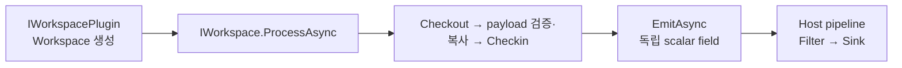

# Workspace 개발자 가이드

Source payload를 해석하여 조회 가능한 결과를 만드는 C# plugin 개발자를 위한 문서다. Workspace SDK는 `Dsn.Contracts`이며 Host·Runtime·Persistence 구현을 참조하지 않는다.



## 프로젝트 만들기

DSN 저장소에서 `make workspace-sdk`를 실행해 `artifacts/sdk/Dsn.Contracts.0.1.0.nupkg`를 준비한다. 새 .NET 10 class library에서 이 로컬 NuGet feed의 패키지를 참조한다. 프로젝트 설정, `EnableDynamicLoading`, Contracts runtime 제외 설정은 [Workspace SDK 안내](../../sdk/workspace/README.md#저장소-밖에서-시작하기)를 그대로 적용한다.

Source와 Workspace 이름·payload schema·단위·오류 표현을 먼저 합의한다. [BenchWorkspace.cs](../../samples/Dsn.Workspaces.Examples/BenchWorkspace.cs)는 검증 후 EmitAsync로 출력하는 실제 구현 예제다. [온도 예제](../../samples/temperature/README.md)는 C++와 Python Source가 같은 계약을 사용하는 예제이며 기존 직접 저장 API를 사용한다.

## 구현 순서와 수명

1. public 기본 생성자를 가진 `IWorkspacePlugin`을 구현하고 `ApiVersion=1`과 `Create`를 제공한다.
2. `IWorkspace.Name`에 고유 이름을 지정하고 `ProcessAsync`에서 payload를 검증한다.
3. Checkout한 lease는 예외 여부와 관계없이 finally에서 Checkin한다.
4. 원본 수명과 독립적인 scalar field를 만든 뒤 `await message.EmitAsync(fields, token)`으로 출력한다.

`JsonElement`를 JsonDocument 밖에서 쓰려면 Clone한다. lease나 context를 백그라운드 작업에 넘긴 채 반환하지 않는다. ProcessAsync 완료는 이 자원을 쓰는 모든 작업의 완료를 뜻한다. 현재 호출은 순차이며 병렬 실행 가능성을 가정하지 않는다.

field 이름·자료형·단위를 View 개발자에게 제공한다. 객체·배열 대신 조회 가능한 scalar 값을 출력한다. `message_id`, `source_id`, `time` 등의 시스템 예약 field는 Runtime이 부여하므로 업무 의미로 재사용하지 않는다. 전체 예약 이름과 Filter 구현 규칙은 [SDK의 수명·Filter 안내](../../sdk/workspace/README.md)에 있다. 해석 후 단위 변환·필드 선택은 기존 Filter로 처리할 수 있는지 먼저 확인한다.

## 검증

정상 payload 외에도 모르는 schema, 필수 값 누락, 범위 초과, 처리 예외, 취소에서 lease가 반환되는지 확인한다. 결과가 올바른 Workspace로 출력되는지, Filter 적용 후에도 원본 식별자가 유지되는지 확인한다. `tests/Dsn.UnitTests`의 Workspace 검사와 `make sdk-check`의 외부 NuGet 소비·plugin 로딩 검사가 참고 대상이다. 앱 Source만 사용하며 실제 드라이버 검사는 필요 없다.

## 배포·Host에서 실행

자신의 프로젝트에서 실행한다.

```sh
dotnet publish Acme.Workspace -c Release -o plugin
```

`plugin`의 주 DLL·deps.json·추가 의존 파일을 한 디렉터리로 배치한다. Contracts.dll은 Host가 공유한다. Host 설정의 `plugins`에 주 DLL을 지정한다. 아래는 기존 설정에 합칠 항목의 예이며 경로와 이름은 실제 plugin에 맞춘다.

```json
{
  "plugins": ["plugins/acme/Acme.Workspace.dll"],
  "pipelines": {"acme": {"filters": [], "sinks": ["sqlite"]}}
}
```

상대 경로는 Host 실행 디렉터리 기준이다. 비어 있지 않은 plugins 목록은 기본 예제 plugin 목록을 대체한다. Workspace는 단독 실행 파일이 아니므로 [DSN 가이드](dsn.md)에 따라 Host를 실행한 뒤 Source를 연결한다. 인증을 사용하는 Host에서는 `users`의 조회 가능 Workspace 목록에도 이름을 추가한다.

plugin 변경은 Host를 정상 종료하고 배포 파일을 교체한 뒤 재시작한다. hot reload는 제공하지 않는다. assembly 버전을 변경하여 결과의 processor version과 pipeline revision에 구현 변경을 반영한다. Docker에서는 plugin 디렉터리를 읽기 전용 mount하고 컨테이너 내부 DLL 경로를 설정한다. 기본 이미지는 업무 plugin을 자동으로 포함하지 않는다.
