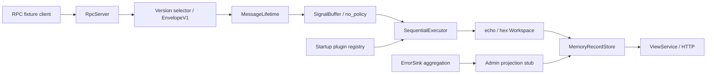

# DSN practice prototype

TypeScript 인터페이스와 echo stub을 실제 TCP/HTTP로 연결한 실행 모델이다. [아키텍처](../docs/arch/README.md)의 메시지 소유권, FIFO 실행, Workspace·Persistence·View 경계를 검증한다. Production의 C#·Docker 선택은 유지하며, 여기의 RPC 표현과 저장 방식은 practice 전용이다.

## 실행

검증 환경: Termux Android arm64, Node.js 26.4.0, npm 11.19.1, TypeScript 5.9.3. 의존성은 lockfile로 고정했다. Android에서 실행 가능한 JavaScript 컴파일러를 사용한다. 다른 Node 버전은 별도로 검증하지 않았다.

```bash
cd prototype
npm ci
npm run check
npm run demo
```

`check`는 strict 타입 검사와 Verification, Validation을 순서대로 실행한다. `demo`는 임시 포트에서 DSN을 시작하고 RPC 입력 → echo/hex → HTTP View 조회 → 참조 수 확인 → 종료까지 수행한다.

```bash
# DSN: RPC 7070, View 7071
npm start

# 별도 실행하는 Mock: RPC 7072, View 없음
npm run mock -- --rpc-port 7072
```

두 서버는 기본적으로 `127.0.0.1`에 바인딩한다. `--host`, `--rpc-port`, `--view-port`를 지정할 수 있으며 포트 0은 자동 할당이다. SIGINT/SIGTERM으로 종료한다. 준비 완료와 종료 결과는 JSON 한 줄로 출력된다.

다른 터미널에서 요청을 보낸다. 아래 도구는 연동 검증용이며 Source SDK가 아니다.

```bash
node --input-type=module -e 'import {connect,notification} from "./dist/src/client.js"; const s=await connect(7070); s.end(notification());'
curl 'http://127.0.0.1:7071/view?workspaces=echo,hex&fields=workspace,source_id,message_id,payload_utf8,payload_hex'
curl 'http://127.0.0.1:7071/export?workspaces=echo,hex'
```

RPC 처리는 응답이 없으므로 송신 종료가 Workspace 처리 완료를 의미하지 않는다. 수동 조회는 처리 후 실행한다. 자동화된 완료 확인은 `npm run demo`에 포함되어 있다. Mock 검증은 위 클라이언트의 목적지를 7072로 변경한다.

## 구성과 인터페이스



| 모듈 | 파일·계약 | 동작 |
| --- | --- | --- |
| 공개 플러그인 API | [contracts.ts](src/contracts.ts) | IWorkspace, Checkout/Checkin, 읽기 전용 payload, 저장·오류·echo 계약 |
| RPC / 버전 검증 | [rpc.ts](src/rpc.ts), [protocol.ts](src/protocol.ts) | LF framing, session, 버전별 decoder, opaque bytes |
| 원본 소유권 | [lifetime.ts](src/lifetime.ts) | 적재 시 root 인계, 호출별 lease, 최종 반환 시 내부 buffer 참조 해제 |
| 큐 / 라우팅 / 실행 | [runtime.ts](src/runtime.ts) | 정책 확장점, FIFO, 이름 registry, 단일 순차 실행 |
| Workspace stub | [echo.ts](src/plugins/echo.ts), [hex.ts](src/plugins/hex.ts) | 필요한 값을 복사하고 Checkin한 뒤 저장·출력 |
| 오류 / Admin | [diagnostics.ts](src/diagnostics.ts), [admin.ts](src/admin.ts) | 본문 동일성 집계와 record 변환 분리 |
| 저장 / View | [storage.ts](src/storage.ts), [view-http.ts](src/view-http.ts) | 메모리 record, export, 조회 계약을 통한 field 선택 |
| 실행 / Mock | [host.ts](src/host.ts), [mock.ts](src/mock.ts), [cli.ts](src/cli.ts) | 시작·종료, 독립 console Mock |

Workspace는 queue, socket, 다른 Workspace, 원본 할당·강제 회수 API를 받지 않는다. `Process`에서 필요한 데이터를 복사한 직후 `Checkin`한다. 반환 후 lease나 payload facade를 사용하면 접근이 거부된다. 반환하지 않은 lease는 `Process`의 반환·실패 후 정리된다. 종료 timeout으로 실행 중인 lease를 회수하지 않는다.

원본은 Ingress에서 한 번 소유 복사하고 Workspace마다 본문을 복제하지 않는다. 각 Workspace의 UTF-8/hex 변환과 record 생성은 명시적인 데이터 복사다. `references = created + checkouts - checkins`이며 checkins에는 root 반환도 포함된다. JavaScript GC의 실제 메모리 반환 시각과 C#의 동시 ref count는 검증 대상이 아니다.

## 플러그인

ES module이 `apiVersion = 1`과 `createWorkspace(services): IWorkspace`를 export한다. [echo 플러그인](src/plugins/echo.ts)을 예제로 사용한다.

```bash
npm start -- --plugin ./dist/src/plugins/echo.js --plugin ./dist/src/plugins/hex.js
```

`--plugin`을 지정하면 기본 echo/hex 목록을 대체한다. Admin stub은 Host가 등록한다. registry는 시작 시 닫히며 후발 중복 이름·부적합 버전은 오류를 남기고 건너뛴다. Hot reload와 플러그인 격리는 제공하지 않는다. 인터페이스 제한은 신뢰하는 로컬 플러그인의 계약이며 보안 sandbox가 아니다.

## practice 설정과 한계

| 항목 | 기본값 / 의미 |
| --- | --- |
| RPC 연결 | 32개, 연결별 미완성 frame 64 KiB |
| 디코딩 payload | 최대 16 KiB |
| SignalBuffer | 128건 또는 2 MiB; 초과 시 새 메시지 폐기 |
| 살아 있는 원본 | 256건 또는 4 MiB; 초과 시 생성 거부 |
| 저장 record | 256건 또는 2 MiB; 초과 시 오래된 record부터 제거 |
| 오류 본문 종류 | 128개; 기존 종류는 count 갱신, 새로운 종류는 폐기 계수 증가 |
| console 대기 출력 | 64 KiB; 초과 출력 폐기 |
| 종료 | 기본 drain, 1초 대기; 미완료 시 대기 메시지 폐기, 사용 중인 원본 유지 |

용량은 시험을 위한 작은 유한값이다. 무한한 메모리·수용량을 보장하지 않으며 입력을 계속 시도하고 수용 초과 시 버리는 동작을 구현했다. byte 한도는 메시지/record의 계산 크기이며 프로세스 RSS 상한이 아니다.

Admin stub은 시작, 테스트용 `Drain`, 정상 종료에서 집계 snapshot을 record로 투영한다. 실시간 전송·주기 갱신은 구현하지 않았다. Admin wire envelope·원본 첨부 계약은 계속 미정이다. Source별 시간 단위 발행량 집계·경고 및 일반적인 심각도 조치 정책도 후속 작업이다.

이 실행 모델은 lock-free, hard real-time, 접속·전송 지연 상한을 증명하지 않는다. TCP 흐름 제어, Node event loop, GC, console 출력의 영향을 받는다. 내부 계약 위반·설정 오류에는 예외를 사용하고 수신·Workspace 경계에서 처리한다. Source의 no blocking/no error/no exception 보장은 Source 구현에서 검증해야 한다. 동기적으로 멈춘 플러그인은 event loop와 종료 timer도 멈출 수 있다.

메모리 저장은 재시작 시 사라진다. View는 field 선택만 지원하며 사용자 인증·권한·저장된 View 정의·join은 stub 범위 밖이다. C# 프로젝트, Docker 이미지, native Source, kernel/eBPF, 운영 계측은 포함하지 않는다. Production task 완료 판정에 이 결과를 그대로 사용하지 않는다.

상세 규약은 [RPC 계약](docs/protocol.md), 검증 결과와 요구사항 추적은 [V&V 보고서](docs/validation-report.md)를 참고한다.
