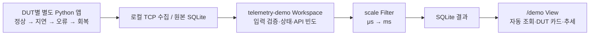

# 자동 End-to-End 데모



## 한 명령으로 실행

저장소 루트에서 `.NET 10 SDK`, Python 3.10+, Make가 설치된 환경으로 실행한다.

```sh
make demo DSN_BUILD_JOBS=1
```

출력되는 `http://127.0.0.1:7071/demo?run=...`을 브라우저로 연다. 서버 시작 → Source 프로세스 실행 → 원본/결과 보존 → 웹 자동 갱신이 이어진다. Python SDK는 저장소 경로에서 로딩하므로 pip 설치가 필요 없다. 인터넷/CDN·실제 DUT/드라이버는 사용하지 않는다.

기본은 **4 DUT, 각각 0.5초 간격 240건**, 약 2분 동안 총 960건이다. 이후 Source는 종료하고 웹은 계속 열어 둔다. Ctrl+C로 Host를 종료하며 `data/e2e/<시각-run>/store/dsn.db`와 설정·로그를 보존한다. 실행마다 새 디렉터리를 만들어 이전 데이터와 섞이지 않는다. Ctrl+C는 소유한 Source 자식 프로세스도 정리한다.

```sh
# 8 DUT, 5분, 웹 포트 변경
make demo DSN_BUILD_JOBS=1 DEMO_ARGS='--duts 8 --samples 600 --interval 0.5 --view-port 7081'
# 보존 데이터를 다시 열 때 (Source 없이 기존 Host 실행)
dotnet src/Dsn.Host/bin/Release/net10.0/Dsn.Host.dll data/e2e/<실행-directory>/settings.json
```

다시 연 Host도 일반 수집 Host다. 읽기 전용 Viewer는 아니다. 기존 릴리즈 v0.1.0에는 이 추가 데모가 없으므로 현재 소스에서 빌드한다.

## Source와 Workspace의 합의

[schema 구현](source.py)의 `dsn-demo.v1`은 이 예제만의 payload다. PC/DUT/run/sequence, 구간 이름, 측정 간격, 지연·IOPS·API 호출 수·구간 오류 수를 보낸다. DUT마다 독립 프로세스/source_id를 사용한다. 각 12샘플마다 다음 구간으로 넘어가며 48샘플 단위로 반복한다. 동일 DUT/sequence의 부하 값은 결정적이어서 검증할 수 있다.

| 생성 구간 | 입력 특성 | Workspace 판정 |
| --- | --- | --- |
| normal | 낮은 지연, 오류 0 | normal |
| latency | 지연 500μs 이상, 오류 0 | warning |
| errors | 지연 증가, 오류 1~3 | error |
| recovery | 지연 감소, 오류 0 | normal |

Workspace는 phase 문자열이 아니라 **지연과 오류 측정값**으로 판정하고 `api_calls × 1000 / interval_ms`로 초당 호출 수를 계산한다. scale Filter가 latency_ms를 추가한다. Workspace의 기준은 연결 확인용이며 제품 불량 판정 규칙이 아니다. sequence는 DUT별 순서이며 서로 다른 DUT 간 수신 순서는 고정하지 않는다. 측정값은 합성이고 실제 벽시계 스케줄 지터를 측정하지 않는다.

## View

`/demo`는 같은 DSN HTTP API로 **저장된 결과만** 읽는다. 1초 자동 갱신, DUT별 마지막 상태, 지연/Read·Write IOPS/API 빈도/오류 추세, 최근 표를 제공한다. 토큰이 설정된 Host에서는 telemetry-demo 조회 권한을 가진 토큰을 입력한다. 공개 HTML shell 자체에는 데이터가 없다.

최근 600건을 메모리에 유지하고 표는 최근 40건을 표시한다. 차트 x축은 sequence이며 선별 DUT로 분리한다. 이 화면의 결과 수는 읽은 결과 수이고 전체 DB 집계가 아니다. Source 종료 후에는 마지막 상태와 데이터가 남고 마지막 조회 시각만 갱신된다. `run` URL 인자가 현재 실행을 선택한다. 원본·재처리는 상단 일반 탐색 링크에서 telemetry-demo를 선택해 확인한다.

## 자동 검증

```sh
make demo-check DSN_BUILD_JOBS=1
# 8 DUT 조건도 확인
python samples/e2e/run.py --check --duts 8
```

빠른 검증은 DUT마다 48건/0.01초 간격으로 네 구간을 모두 만든다. 실제 프로세스와 TCP, Workspace 상태/빈도 계산, Filter 단위 변환, 결과/원본 ID 대응, HTTP 페이지 조회, Host 재시작 뒤 동일 결과를 검사한다. 파일은 `artifacts/e2e/`에 보존한다.

선택적 Chromium 검증은 [브라우저 준비](../../tests/README.md) 후 `python samples/e2e/run.py --check --browser`로 실행한다. 자동 조회·카드·차트·갱신 정지/재개·모바일 배치를 검사하고 `artifacts/e2e-desktop.png`, `artifacts/e2e-mobile.png`를 남긴다.
