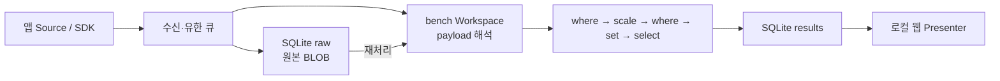

# 로컬 Source → Filter → Sink

## 실행

저장소 루트에서 `make pipeline-host DSN_BUILD_JOBS=1`, 다른 터미널에서 `make bench-sources`를 실행한다. `http://127.0.0.1:7071/`에서 연결 → bench → 처음 조회를 선택한다. 실제 장치/드라이버 없이 세 앱 프로세스가 합성 데이터를 보낸다. `data/pipeline/dsn.db`에 원본 30건, 필터를 통과한 결과 8건이 생긴다(새 데이터 디렉터리 기준).

[settings.json](settings.json)은 telemetry-app 기록만 골라 지연을 μs에서 ms로 변환하고, 0.09ms 이상인 기록에 표식을 붙여 선택 field를 저장한다. 원본 보존은 Filter보다 먼저 실행하므로 제외된 데이터도 재처리할 수 있다. 여기의 임계값·분류는 연결 예제이며 불량 판단 규칙이 아니다.

## 연결 규칙

Source의 `workspace`가 디코더/파이프라인을 선택한다. `pipelines`의 키는 등록된 Workspace 이름이다. 기존 SDK wire와 Workspace 이름을 유지하며, 설정이 없으면 `Workspace → sqlite`로 동작한다. 여러 Workspace 대상으로 발행하면 원본을 공유하고 각 파이프라인을 순차 실행한다.

하나의 파이프라인은 순서 있는 Filter 목록과 Sink 목록이다. Filter 한 단계는 scalar record 하나를 받아 하나 또는 null(제외)을 반환한다. 임의의 순환 그래프, 원본 binary 변환 Filter, 시간창 집계, 동시 실행은 이번 범위가 아니다. binary payload 해석은 첫 Workspace가 맡는다.

| Filter | options | 동작 |
| --- | --- | --- |
| where | field, op, value | eq/ne/gt/gte/lt/lte 비교. exists/not-exists는 value 불필요. 비교 대상 field가 없으면 제외 |
| scale | field, output, factor | 유한 숫자 곱셈. field 누락은 그대로 통과, 비숫자/overflow는 처리 실패 |
| set | field, value | scalar 추가/덮어쓰기 |
| select | fields | 지정 field와 시스템 provenance만 유지 |

`sqlite`는 영속 결과 저장, `console`은 stderr의 NDJSON 진단 출력, `discard`는 명시적 결과 폐기 Sink다. console/discard만 선택한 결과는 View에 보이지 않는다. Sink 배열은 순서대로 실행되며 SQLite 저장 후 console 실패 같은 부분 성공을 되돌리지 않는다. 같은 Sink 중복, 잘못된 field/option/타입, 미등록 Workspace는 시작 시 거부한다. 런타임 처리 실패는 PIPELINE_FAILED/WORKSPACE_FAILED로 진단하고 다음 입력으로 진행한다.

`IRecordFilter`/`IFilterPlugin`으로 사용자 Filter를 DLL에 추가할 수 있다. plugin은 Contracts만 참조하며 `Type`과 `Create(JsonElement options)`를 제공한다. 기존 IWorkspacePlugin과 같은 plugin 로더를 사용한다. 설정은 시작 시 고정하며 변경하려면 재시작한다. 모든 필터는 ProcessAsync 완료까지 작업을 끝내야 한다.

## 식별자와 재처리

Emit 방식은 Runtime이 message_id, processing_id, replay_id, source_id, time, event_type, processor_version을 붙인다. Filter는 이 값을 바꾸거나 제거할 수 없다. PipelineRouter는 설정 및 Filter 구현 타입/assembly 버전을 해시한 pipeline_revision을 붙이고, SQLite Sink가 node_id와 record_id를 부여한다. plugin 코드를 바꾸면 assembly 버전도 갱신해야 한다. 설정 속성 순서 변경도 revision을 바꿀 수 있다.

재처리는 같은 원본 ID와 새 실행/record ID로 **현재 설정**의 파이프라인을 실행한다. 이전 결과는 남는다. 새 조건으로 원본을 다시 처리한 결과는 replay_id/pipeline_revision으로 구분한다. 구형 직접 저장 Workspace도 WorkspaceServices.Records를 통하면 Filter/Sink 경로를 타지만, 처리 실행 provenance는 구형 plugin 자신이 출력해야 한다.

## SQLite 운영

한 DSN만 DB 파일을 소유하며 WAL + synchronous=FULL을 사용한다. 원본과 처리 결과는 별도 트랜잭션이라 원본만 남는 실패 상태가 가능하고, 이를 재처리할 수 있다. 저장 ACK가 Source까지 전달되는 것은 아니다. 현 버전은 record 단위 트랜잭션이며 여러 입력을 묶는 배치 writer는 후속 기능이다.

조회는 파일 전체를 메모리에 적재하지 않고 SQL 페이지 조회를 사용한다. `journalBytes`/`rawBytes`와 각 capacity는 논리 데이터의 누적 상한이다. DB 페이지·색인·WAL 오버헤드는 별도이므로 파일 크기 상한이 아니다. 용량/디스크 부족은 진단하며 자동 삭제·기간별 보존·중앙 동기화는 하지 않는다. DB를 공유 폴더에서 여러 DSN이 열지 않는다. 가동 중 DB 파일 하나만 복사해 백업하지 말고, Host를 정상 종료한 뒤 전체 데이터 디렉터리를 보관한다.

기존 records.ndjson/raw.ndjson/views.json은 최초 시작 시 한 트랜잭션으로 가져온다. 원본 파일은 수정·삭제하지 않는다. 완료한 import는 재시작해도 반복하지 않는다. 불완전한 마지막 NDJSON 행만 무시하고 나머지 손상/용량 초과는 전체 이전을 롤백한다. 기존 record/raw의 숫자 ID와 message_id·View 정의는 유지하고 새 node_id/record_id를 부여한다. 이전 뒤에는 SQLite가 기준 저장소다.

Termux는 설치된 libsqlite3, 일반 .NET 배포는 패키지의 e_sqlite3를 사용한다. Docker publish는 대상 아키텍처의 native library만 포함한다. 외부 DB 서버나 추가 대시보드 설치는 필요 없다.

검증: `make pipeline-check DSN_BUILD_JOBS=1`. 앱 SDK → 조건 처리 → SQLite BLOB/record → Host 재시작 → 조건 수정 후 제외 원본 재처리를 검사한다.
