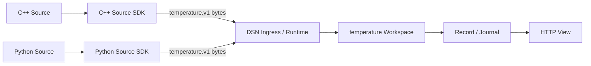

# Temperature: Source부터 Workspace까지

C++와 Python Source는 아래 payload 계약을 공유한다. C# Workspace는 Source의 구현 언어를 몰라도 같은 record를 생성한다. DSN 공통 계층은 payload의 내용을 해석하지 않는다.



## 공유 계약: temperature.v1

Envelope의 `workspace`는 `["temperature"]`, payload는 UTF-8 JSON이다. SDK가 이 bytes를 base64로 감싼다. 봉투의 protocol version=1과 payload schema 버전은 독립적이다.

```json
{"schema":"temperature.v1","sensor":"lab-01","celsius":23.5,"sequence":1}
```

| 필드 | 규칙 |
| --- | --- |
| schema | 정확히 `temperature.v1` |
| sensor | 공백만이 아닌 문자열, 최대 64 UTF-16 units |
| celsius | 섭씨 실수, 유한값, -273.15 이상 1000 이하 |
| sequence | Source가 부여한 0 이상 Int32 정수. 재전송·중복 제거 키가 아님 |

모든 필드는 필수이며 추가 필드는 무시한다. 모르는 schema 버전이나 잘못된 값은 Workspace 오류로 진단하고 저장하지 않는다. record에는 `schema`, `sensor`, `celsius`, `sequence`와 봉투의 `source_id`, `time`, DSN의 `message_id`를 저장한다.

## 실행

저장소 루트에서 실행한다. SDK 도구 설치는 [SDK 안내](../../sdk/README.md)에 있다.

```bash
# 터미널 1: Host와 temperature plugin 빌드·실행
make sample-host
# 터미널 2: 각 언어로 3개씩 전송
make sample-python
make sample-cpp
curl 'http://127.0.0.1:7071/view?workspaces=temperature&fields=source_id,sensor,celsius,sequence'
```

`temperature-python`과 `temperature-cpp`가 각각 sequence 1·2·3, celsius 20.5·21·21.5를 보낸다. 비어 있는 저장소에서는 총 6개 record가 생긴다. `data/temperature`는 재시작 후에도 남으므로 반복 실행하면 누적된다. socket write 직후에는 처리가 진행 중일 수 있으므로 View 결과가 보일 때까지 기다린다.

[settings.json](settings.json)은 loopback 7070/7071과 temperature plugin만 사용한다. 기본 echo/hex Host와 동시에 같은 포트로 실행하지 않는다. 다른 목적지는 `PYTHONPATH=sdk/source/python/src python samples/temperature/source.py --host 127.0.0.1 --port 7072`, C++은 `artifacts/source-cpp/temperature_source 127.0.0.1 7072 3`처럼 지정한다. Mock으로 보내면 envelope/hex만 확인하고 record는 저장하지 않는다.

개별 코드는 [Python Source](source.py), [C++ Source](source.cpp), [Workspace](Dsn.Workspaces.Temperature/TemperatureWorkspace.cs)다. `make sdk-check`는 패키징한 SDK를 별도 프로젝트에서 사용해 이 경로와 Host 재시작 후 저장 복구를 검증한다.
